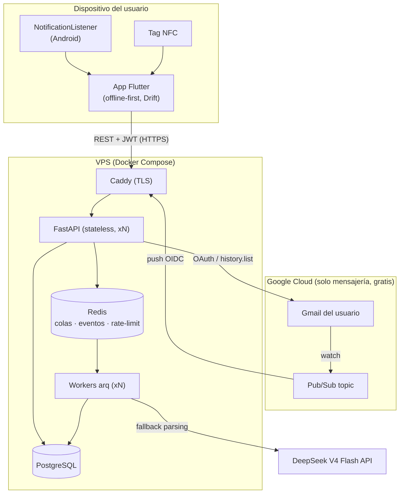
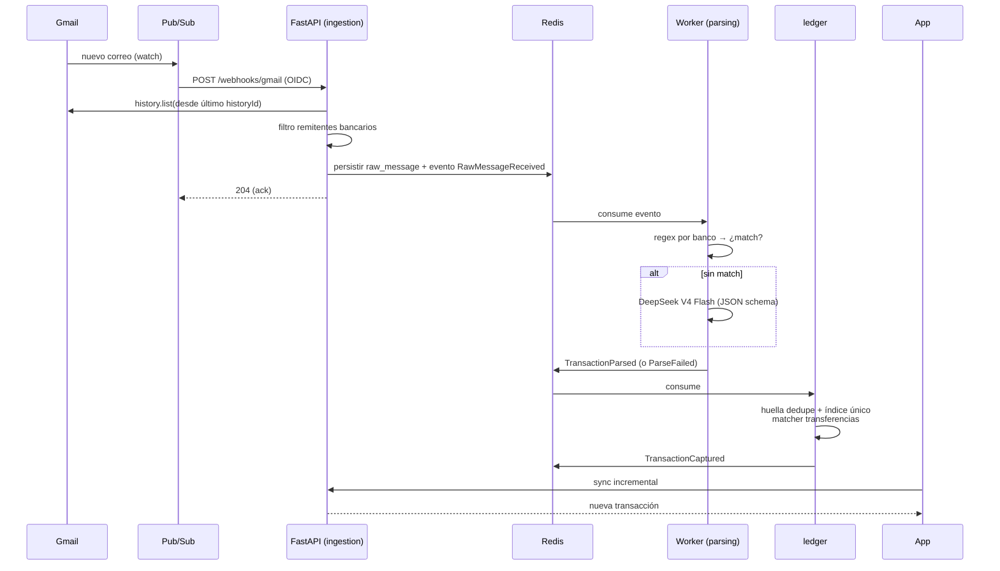

# Spec 003 — Arquitectura

## 1. Vista general



Decisión central: **monolito modular con arquitectura hexagonal** en el backend y **feature-first + Clean Architecture** en la app. Racional en los ADRs (§6).

## 2. Backend — monolito modular hexagonal

### 2.1 Módulos (bounded contexts)

```
backend/src/
├── shared/                # kernel: config, db (SQLAlchemy), seguridad, bus de eventos, errores
└── modules/
    ├── identity/          # Google Sign-In, JWT/refresh, usuarios, consentimientos, borrado de cuenta
    ├── ingestion/         # webhook Pub/Sub, endpoint de notificaciones, gestión de watches Gmail
    ├── parsing/           # plantillas por banco + adapter LLM; corre en workers
    ├── ledger/            # transacciones, dedupe, transferencias, categorías, cuentas vinculadas, revisión
    ├── fiscal/            # reglas 210, tablas UVT, generación de reportes
    └── insights/          # resúmenes mensuales, agregados del dashboard
```

### 2.2 Estructura hexagonal de cada módulo

```
modules/<nombre>/
├── domain/          # entidades + lógica pura (sin FastAPI/SQLAlchemy/red) — P3
├── application/     # casos de uso; dependen de ports (interfaces)
│   └── ports.py     # p. ej. TransactionRepositoryPort, LlmParserPort, EmailProviderPort
├── infrastructure/  # adapters: repos SQLAlchemy, clientes HTTP (Gmail, DeepSeek), publishers Redis
│   └── api/         # routers FastAPI del módulo (adapter de entrada)
└── events.py        # eventos de dominio que publica/consume
```

Reglas de dependencia (verificadas con **import-linter** en CI):
1. `domain` no importa nada fuera de sí mismo y de la stdlib.
2. `application` importa solo `domain` y sus propios ports.
3. `infrastructure` implementa ports; es el único lugar con SQLAlchemy/HTTP/Redis.
4. Un módulo NUNCA importa internals de otro: solo su API pública (`modules/x/public.py`) o sus eventos.

### 2.3 Comunicación entre módulos: eventos de dominio

Bus interno sobre **Redis Streams** (consumer groups → reintentos y at-least-once):

| Evento | Publica | Consume | Efecto |
|---|---|---|---|
| `RawMessageReceived` | ingestion | parsing | encola parseo del mensaje crudo |
| `TransactionParsed` | parsing | ledger | intenta insertar con dedupe |
| `TransactionCaptured` | ledger | insights, fiscal | actualiza agregados |
| `ParseFailed` | parsing | ledger | mueve a cola de revisión |
| `UserDeleted` | identity | todos | purga de datos del usuario |

Como los consumidores son at-least-once, **todo handler es idempotente** (P2).

### 2.4 Request path vs workers

- **API (request path)**: solo validar, persistir, encolar y responder. Nada de LLM ni parsing inline.
- **Workers (arq)**: parsing, llamadas a DeepSeek, generación de reportes Excel, purgas programadas, renovación de watches. Misma imagen Docker, proceso distinto → se escalan por separado.

### 2.5 Escalabilidad — camino de crecimiento

| Etapa | Infra | Cambio de código |
|---|---|---|
| MVP | 1 VPS: compose con API x1, worker x1 | — |
| Crecimiento | Mismo VPS o 2: API x3 tras Caddy, workers x3, Postgres con `pgbouncer` | 0 |
| Escala | Postgres gestionado + réplicas de lectura; particionar `transactions` por fecha; Redis gestionado | migraciones, 0 refactor |
| Extremo | Extraer `parsing` (el módulo con más carga externa) como servicio propio | mover carpeta + cambiar transporte del bus |

## 3. App Flutter — feature-first + Clean Architecture

```
app/lib/
├── core/                    # router (go_router), http (dio + interceptores JWT/refresh),
│                            # tema, errores, utilidades, db Drift compartida
└── features/
    ├── auth/
    ├── transactions/
    ├── capture/             # listener notificaciones, NFC, registro manual
    ├── review/
    ├── fiscal_report/
    └── settings/
        └── <cada feature>/
            ├── domain/        # entidades + contratos de repositorio (Dart puro)
            ├── data/          # impl. repos: API (dio) + local (Drift) + platform channels
            ├── application/   # Notifiers/Controllers Riverpod (casos de uso)
            └── presentation/  # pantallas + widgets
```

- **Offline-first (P4)**: la UI observa streams de Drift; los repositorios sincronizan contra la API (pull incremental por `updated_at` + push de operaciones pendientes en outbox local). Conflictos: gana el más reciente (`updated_at`), con excepción de correcciones manuales del usuario, que siempre ganan sobre datos automáticos.
- **Riverpod 3** provee estado e inyección de dependencias (repos como providers → mockeables en tests).
- El código de plataforma (notification listener, NFC) vive detrás de interfaces de `capture/domain`; el resto de la app no distingue el origen de una transacción.
- iOS compila la misma app: `capture` expone `NotificationCaptureService` con implementación no-op en iOS.

## 4. Flujo end-to-end (correo → transacción)



## 5. Stack fijado

| Capa | Tecnología | Nota |
|---|---|---|
| App | Flutter estable (≥3.35), Riverpod 3, Drift, dio, go_router, google_sign_in, nfc_manager, notification_listener_service | |
| API | Python 3.12+, FastAPI, Pydantic v2, SQLAlchemy 2 + Alembic | uv como gestor |
| Workers | arq (async, nativo Redis) | misma imagen |
| Datos | PostgreSQL 16, Redis 7 | |
| LLM | DeepSeek V4 Flash (API OpenAI-compatible, JSON mode) | detrás de `LlmParserPort` |
| Infra | Docker Compose, Caddy (TLS automático), VPS Hetzner/DO | GCP solo Pub/Sub+OAuth |
| CI | GitHub Actions: ruff, pyright, pytest, import-linter, pip-audit, gitleaks, flutter analyze/test | |

## 6. ADRs (decisiones registradas)

| # | Decisión | Alternativas | Racional |
|---|---|---|---|
| ADR-1 | Monolito modular hexagonal | Microservicios; monolito en capas | Equipo pequeño + ambición de escala: fronteras de microservicios sin su costo operativo; extraíble después (P7) |
| ADR-2 | Redis Streams como bus interno | RabbitMQ/Kafka; llamadas directas | Redis ya está para colas/rate-limit; Streams da consumer groups y reintentos sin otra pieza de infra |
| ADR-3 | DeepSeek V4 Flash como LLM | Claude Haiku, GPT-mini | Decisión del usuario; costo mínimo (~$0.14/M in) apto para uso masivo; aislado tras `LlmParserPort` para poder cambiarlo |
| ADR-4 | SMS vía notificación de Mensajes | Permiso READ_SMS | Google Play prohíbe READ_SMS a apps no-default-handler; la notificación del SMS es capturable con el listener ya requerido |
| ADR-5 | VPS + Compose para MVP | Cloud Run, k8s | Decisión del usuario; costo fijo bajo; el diseño stateless permite migrar sin refactor |
| ADR-6 | Offline-first con Drift como única fuente de la UI | UI contra API con caché ad-hoc | P4; UX instantánea y soporte real sin red |
| ADR-7 | Dedupe garantizado por índice único en Postgres | Dedupe solo en aplicación | P2; condición de carrera entre workers la resuelve la DB |
| ADR-8 | Google Sign-In como único método de auth en MVP | Email+password adicional | El producto requiere Gmail de todos modos; reduce superficie de ataque (sin contraseñas propias) |
