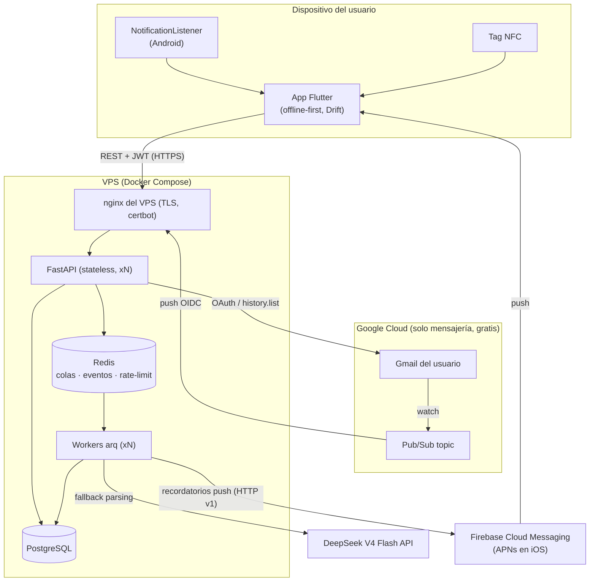
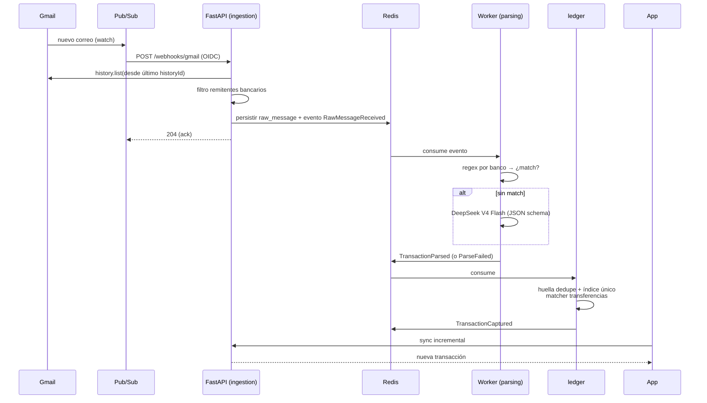

# Spec 003 — Arquitectura

## 1. Vista general



Decisión central: **monolito modular con arquitectura hexagonal** en el backend y **feature-first + Clean Architecture** en la app. Racional en los ADRs (§6).

## 2. Backend — monolito modular hexagonal

### 2.1 Módulos (bounded contexts)

```
backend/
├── src/luka/
│   ├── shared/             # kernel: config, db (SQLAlchemy), seguridad, bus de eventos, errores
│   ├── modules/
│   │   ├── identity/       # Google Sign-In, JWT/refresh, usuarios, consentimientos, borrado de cuenta
│   │   ├── ingestion/      # webhook Pub/Sub, endpoint de notificaciones, gestión de watches Gmail
│   │   ├── parsing/        # plantillas por banco + adapter LLM; corre en workers
│   │   ├── ledger/         # transacciones, dedupe, transferencias, categorías, cuentas vinculadas, revisión
│   │   ├── fiscal/         # reglas 210, tablas UVT, generación de reportes
│   │   ├── recurring/      # gastos fijos, ocurrencias mensuales, matcher de pagos (spec 011)
│   │   ├── notifications/  # tokens de dispositivo + envío push por FCM (spec 011 §6)
│   │   └── insights/       # resúmenes mensuales (vacío: el dashboard se calcula en la app, 008 §3.2)
│   ├── app.py              # FastAPI factory (composition root del API)
│   ├── main.py             # entrypoint ASGI
│   ├── worker.py           # entrypoint del worker arq
│   └── events_registry.py # composition root: registra los eventos de dominio conocidos
└── migrations/              # Alembic, fuera del paquete
```

### 2.2 Estructura hexagonal de cada módulo

```
modules/<nombre>/
├── domain/          # entidades + lógica pura (sin FastAPI/SQLAlchemy/red) — P3
├── application/     # casos de uso; dependen de ports (interfaces)
│   └── ports.py     # p. ej. TransactionRepositoryPort, LlmParserPort, EmailProviderPort
├── infrastructure/  # adapters: repos SQLAlchemy, clientes HTTP (Gmail, DeepSeek), publishers Redis
│   └── api/         # routers FastAPI del módulo (adapter de entrada)
└── events.py        # eventos de dominio que publica/consume
```

Reglas de dependencia (verificadas con **import-linter**, `just lint`):
1. `domain` no importa nada fuera de sí mismo y de la stdlib.
2. `application` importa solo `domain` y sus propios ports. `application` también puede importar el `events.py` del propio módulo; `events.py` es puro (solo stdlib).
3. `infrastructure` implementa ports; es el único lugar con SQLAlchemy/HTTP/Redis. `shared` es el kernel (usa SQLAlchemy/Redis) y nunca importa `modules`.
4. Un módulo NUNCA importa internals de otro: solo su API pública (`modules/x/public.py`) o sus eventos.

### 2.3 Comunicación entre módulos: eventos de dominio

Bus interno sobre **Redis Streams** (consumer groups → reintentos y at-least-once):

| Evento | Publica | Consume | Efecto |
|---|---|---|---|
| `RawMessageReceived` | ingestion | parsing | encola parseo del mensaje crudo |
| `TransactionParsed` | parsing | ledger | intenta insertar con dedupe |
| `TransactionCaptured` | ledger | insights, fiscal, recurring | actualiza agregados; `recurring` intenta emparejar el pago con un gasto fijo (spec 011 §4). Lleva `merchant` y `account_id` para el matcher |
| `TransactionDeleted` | ledger | recurring | la ocurrencia que pagaba vuelve a `pending` (spec 011 §4) |
| `PaymentDueSoon` | recurring | notifications | envía el recordatorio push de un gasto fijo (spec 011 §5) |
| `ParseFailed` | parsing | ledger | mueve a cola de revisión |
| `UserDeleted` | identity | todos | purga de datos del usuario |

Como los consumidores son at-least-once, **todo handler es idempotente** (P2).

Grupo de consumidores por evento (F2.2):

| Evento | Grupo |
|---|---|
| `RawMessageReceived` | `parsing` |
| `TransactionParsed` | `ledger` |
| `ParseFailed` | `ledger-review` |
| `TransactionCaptured` | `ledger-observer` |
| `TransactionCaptured` | `recurring` |
| `TransactionDeleted` | `recurring` |
| `PaymentDueSoon` | `notifications` |

Los grupos se crean (idempotente) tanto al arrancar la API como el worker, para que un evento publicado antes del primer arranque del worker no se pierda (`XGROUP CREATE ... $ MKSTREAM` ignora entradas previas si el grupo no existía aún). `event_id` es determinista por `raw_message_id` + resultado (D8): así la reentrega de un evento de parsing —incluida la de un reproceso tras un fallo de commit— es absorbida por el `IdempotentHandler`, aunque llegue en una entrada de stream distinta.

La implementación del bus vive en `shared/events/`: un codec de eventos (serialización/registro por `event_type`), un adapter de Redis Streams, un consumer con grupos de consumidores (`XREADGROUP`) que reclama pendientes abandonados con `XAUTOCLAIM` y envía a una DLQ (`luka:events:dlq`) los mensajes que superan el máximo de reintentos, y un handler idempotente que marca cada `event_id` procesado por grupo con un marcador de 7 días. Los consumers corren dentro del proceso worker arq, cada uno bajo un supervisor que los reinicia si terminan por una excepción inesperada. La publicación del evento ocurre después del commit de la transacción que lo origina, sin patrón outbox transaccional: se acepta como riesgo del MVP (§6 del plan de implementación); si un caso de uso futuro depende de no perder nunca el evento, se añade un outbox en Fase 2.

### 2.4 Request path vs workers

- **API (request path)**: solo validar, persistir, encolar y responder. Nada de LLM ni parsing inline.
- **Workers (arq)**: parsing, llamadas a DeepSeek, generación de reportes Excel, purgas programadas, renovación de watches, generación de ocurrencias de gastos fijos y envío de recordatorios push (spec 011 §3 y §5). Misma imagen Docker, proceso distinto → se escalan por separado.
- **Composition root** (`worker.py`, F2.2/F2.5/F2.9): el `on_startup` del worker arq ensambla y posee su propio engine SQLAlchemy (`session_factory`), su propio cliente `httpx.AsyncClient` (usado por el adapter DeepSeek) y su propio cliente Redis; nada de esto se comparte con el proceso API. Sobre esa base arranca 4 consumers de streams como tareas de fondo, cada uno bajo un supervisor que lo reinicia ante cualquier excepción inesperada (`_supervise`, delay fijo entre reinicios): `ingestion.RawMessageReceived` (grupo `parsing`) → `parsing.TransactionParsed` (grupo `ledger`) → `parsing.ParseFailed` (grupo `ledger-review`) → `ledger.TransactionCaptured` (grupo `ledger-observer`, F1.8, solo observa). Además registra 2 cron jobs arq: `purge_raw_message_bodies` (diario 03:00, spec 004 §6) y `requeue_pending_raw_messages` (cada 15 min, §2.3 arriba / spec 006 §4.4, riesgo 4). Con F7 suma los consumers `recurring` (de `TransactionCaptured` y `TransactionDeleted`) y `notifications` (de `PaymentDueSoon`, solo si `LUKA_FCM_CREDENTIALS_JSON` está definida), y los crons `ensure_recurring_occurrences` (diario 05:00) y `send_recurring_reminders` (diario 09:00), ambos en hora de Colombia (spec 011). `on_shutdown` cierra engine/httpx/redis y espera las 4 tareas de consumer con una cota dura (fail-soft: loguea y continúa si alguna no responde a tiempo).

### 2.5 Escalabilidad — camino de crecimiento

| Etapa | Infra | Cambio de código |
|---|---|---|
| MVP | 1 VPS: compose con API x1, worker x1 | — |
| Crecimiento | Mismo VPS o 2: API x3 tras el nginx, workers x3, Postgres con `pgbouncer` | 0 |
| Escala | Postgres gestionado + réplicas de lectura; particionar `transactions` por fecha; Redis gestionado | migraciones, 0 refactor |
| Extremo | Extraer `parsing` (el módulo con más carga externa) como servicio propio | mover carpeta + cambiar transporte del bus |

## 3. App Flutter — feature-first + Clean Architecture

```
app/lib/
├── app/                     # MaterialApp, router (go_router + session gate) y
│                            # raíz de composición (overrides de providers)
├── core/                    # config, http (dio + interceptor JWT/refresh), tema,
│                            # l10n, formato COP, db Drift compartida; no conoce features
└── features/
    ├── auth/
    ├── transactions/
    ├── capture/             # listener notificaciones, NFC, registro manual
    ├── review/
    ├── fiscal_report/
    ├── recurring/           # gastos fijos: lista del mes, tachado, hoja de edición (spec 008 §3.8)
    ├── push/                # firebase_messaging: permiso, token, apertura desde el aviso
    └── settings/
        └── <cada feature>/
            ├── domain/        # entidades + contratos de repositorio (Dart puro)
            ├── data/          # impl. repos: API (dio) + local (Drift) + platform channels
            ├── application/   # Notifiers/Controllers Riverpod (casos de uso)
            └── presentation/  # pantallas + widgets
```

- **Offline-first (P4)**: la UI observa streams de Drift; los repositorios sincronizan contra la API (pull incremental por `updated_at` + push de operaciones pendientes en outbox local). Conflictos: gana el más reciente (`updated_at`), con excepción de correcciones manuales del usuario, que siempre ganan sobre datos automáticos.
- **Riverpod 3** provee estado e inyección de dependencias (repos como providers → mockeables en tests). Los providers se escriben a mano (`Notifier`/`AsyncNotifier`), sin `riverpod_generator`: con Flutter 3.35 ninguna versión del generador resuelve junto a Riverpod 3.3 (conflicto de `meta`/`analyzer`).
- **Reglas de capas** (verificadas por `app/test/architecture_test.dart`, equivalente a import-linter): `domain` es Dart puro (sin Flutter, dio, Drift ni Riverpod); `application` no importa `data` ni `presentation`; `presentation` no importa `data`; `core` no importa features ni `app`. `application` declara sus puertos como providers que fallan si no se sobrescriben, y `lib/app/composition.dart` es el único lugar que los conecta con las implementaciones de `data`.
- **Red**: dos clientes dio. El público (`/v1/auth/*`) no tiene interceptor, así un refresh nunca dispara otro refresh. El autenticado usa `AuthInterceptor`, que añade el Bearer y, ante `401 token_expired`, hace un refresh single-flight y reintenta una vez. `core` define el puerto `SessionBridge` y la feature `auth` lo implementa (`SessionManager`).
- El código de plataforma (notification listener, NFC) vive detrás de interfaces de `capture/domain`; el resto de la app no distingue el origen de una transacción.
- iOS compila la misma app: `capture` expone el puerto `NotificationSource`, con `MethodChannelNotificationSource` (listener nativo en `android/app/src/main/kotlin/co/luka/luka/capture/`) en Android e `IosWalletNotificationSource` (cola de pagos con Apple Pay que llena la App Intent de `ios/Runner/`, spec 006 §3.3) en iOS; `readsNotifications` distingue las dos para la UI. `NoopNotificationSource` queda para las plataformas sin captura.

## 4. Flujo end-to-end (correo → transacción)



## 5. Stack fijado

| Capa | Tecnología | Nota |
|---|---|---|
| App | Flutter estable (≥3.35), Riverpod 3, Drift, dio, go_router, google_sign_in, nfc_manager, notification_listener_service, firebase_core + firebase_messaging | versiones de Firebase compatibles con Flutter 3.35 |
| API | Python 3.12+, FastAPI, Pydantic v2, SQLAlchemy 2 + Alembic | uv como gestor |
| Workers | arq (async, nativo Redis) | misma imagen |
| Datos | PostgreSQL 16, Redis 7 | |
| LLM | DeepSeek V4 Flash (API OpenAI-compatible, JSON mode) | detrás de `LlmParserPort` |
| Infra | Docker Compose en un VPS compartido (Hostinger), detrás del nginx del servidor con certbot (red `proxy`) | GCP solo Pub/Sub+OAuth+FCM; `backend/deploy/` |
| Push | Firebase Cloud Messaging (API HTTP v1; APNs en iOS) | proyecto GCP `luka-510204`; spec 011 §6 |
| CI/CD | GitHub Actions solo despliega el backend: pip-audit + gitleaks, imagen en GHCR con SBOM y procedencia, despliegue por SSH fijado por digest. Lint y tests (ruff, pyright, pytest, import-linter, flutter analyze/test) en local; iOS en Codemagic | |

## 6. ADRs (decisiones registradas)

| # | Decisión | Alternativas | Racional |
|---|---|---|---|
| ADR-1 | Monolito modular hexagonal | Microservicios; monolito en capas | Equipo pequeño + ambición de escala: fronteras de microservicios sin su costo operativo; extraíble después (P7) |
| ADR-2 | Redis Streams como bus interno | RabbitMQ/Kafka; llamadas directas | Redis ya está para colas/rate-limit; Streams da consumer groups y reintentos sin otra pieza de infra |
| ADR-3 | DeepSeek V4 Flash como LLM | Claude Haiku, GPT-mini | Decisión del usuario; costo mínimo (~$0.14/M in) apto para uso masivo; aislado tras `LlmParserPort` para poder cambiarlo |
| ADR-4 | SMS vía notificación de Mensajes | Permiso READ_SMS | Google Play prohíbe READ_SMS a apps no-default-handler; la notificación del SMS es capturable con el listener ya requerido |
| ADR-5 | VPS + Compose para MVP | Cloud Run, k8s | Decisión del usuario; costo fijo bajo; el diseño stateless permite migrar sin refactor |
| ADR-6 | Offline-first con Drift como única fuente de la UI | UI contra API con caché ad-hoc | P4; UX instantánea y soporte real sin red |
| ADR-7 | Dedupe garantizado por índice único en Postgres | Dedupe solo en aplicación | P2; condición de carrera entre workers la resuelve la DB |
| ADR-8 | Google Sign-In como único método de auth en MVP | Email+password adicional | El producto requiere Gmail de todos modos; reduce superficie de ataque (sin contraseñas propias) |
| ADR-9 | Recordatorios de gastos fijos por push desde el servidor con Firebase Cloud Messaging | Notificaciones locales programadas en el teléfono (`flutter_local_notifications`); OneSignal u otro proveedor push | Decisión del usuario. El pago se detecta casi siempre en el servidor (Gmail), así que solo el servidor sabe a tiempo si ya se pagó y el aviso sobra, aunque la app lleve días cerrada. FCM es gratis, es el transporte nativo de Android, entrega a iOS por APNs y vive en el mismo proyecto GCP. Costo aceptado: un tercero más que recibe el nombre y el monto del aviso (spec 010 §4) |
