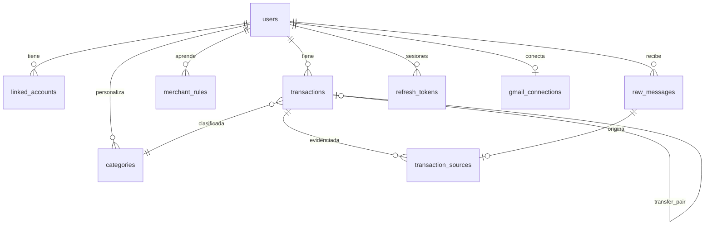

# Spec 004 — Modelo de datos

## 1. Diagrama entidad-relación (PostgreSQL)



## 2. Tablas

Convenciones: PK `id UUID DEFAULT gen_random_uuid()`; timestamps `TIMESTAMPTZ`; todas las tablas de usuario llevan `user_id` con FK `ON DELETE CASCADE` (soporta RF-11.3); `created_at`/`updated_at` en todas (el sync de la app usa `updated_at`).

### 2.1 `users` (módulo identity)

| Columna | Tipo | Notas |
|---|---|---|
| id | UUID PK | |
| google_sub | TEXT UNIQUE NOT NULL | `sub` del id_token de Google (identidad estable) |
| email | CITEXT UNIQUE NOT NULL | |
| display_name | TEXT | |
| photo_url | TEXT | |
| status | TEXT | `active` / `deletion_pending` |
| consents | JSONB | privacidad, gmail, notificaciones: `{tipo: timestamp}` |
| created_at / updated_at | TIMESTAMPTZ | |

### 2.2 `refresh_tokens` (identity)

| Columna | Tipo | Notas |
|---|---|---|
| id | UUID PK | |
| user_id | UUID FK | |
| token_hash | TEXT UNIQUE | SHA-256 del token; el token en claro nunca se guarda |
| family_id | UUID | rotación: detecta reuso de un token ya rotado → revoca familia |
| expires_at | TIMESTAMPTZ | |
| revoked_at | TIMESTAMPTZ NULL | |
| device_info | TEXT | descripción del dispositivo |
| created_at / updated_at | TIMESTAMPTZ | |

### 2.3 `gmail_connections` (ingestion)

| Columna | Tipo | Notas |
|---|---|---|
| user_id | UUID PK/FK | 1:1 con users |
| email | TEXT NOT NULL | cuenta Gmail conectada (puede diferir del email de `users`) |
| refresh_token_enc | BYTEA | cifrado AES-256-GCM: `nonce (12 B) \|\| ciphertext+tag` (spec 009 §3, `shared/crypto/aesgcm.py`) |
| history_id | BIGINT NULL | cursor de `history.list` |
| watch_expires_at | TIMESTAMPTZ NULL | cron renueva si < 48 h |
| status | TEXT | `active` / `revoked` / `error`; `CHECK` |
| last_sync_at | TIMESTAMPTZ NULL | |
| created_at / updated_at | TIMESTAMPTZ | reconectar (upsert) conserva `created_at` |

Índice `ix_gmail_connections_email` (migración 0006): el webhook push resuelve el usuario por la cuenta Gmail (spec 005 §4).

### 2.4 `linked_accounts` (ledger) — cuentas/tarjetas propias

| Columna | Tipo | Notas |
|---|---|---|
| id | UUID PK | |
| user_id | UUID FK | |
| bank | TEXT | enum de bancos soportados + `other` |
| kind | TEXT | `savings` / `checking` / `credit_card` / `wallet` |
| last4 | TEXT NULL | últimos dígitos que aparecen en correos/notifs; `CHECK (last4 ~ '^[0-9]{1,4}$')` |
| alias | TEXT | nombre que le da el usuario |
| UNIQUE NULLS NOT DISTINCT | (user_id, bank, last4) | dos cuentas del mismo banco sin `last4` conocido cuentan como duplicado |

### 2.5 `transactions` (ledger)

| Columna | Tipo | Notas |
|---|---|---|
| id | UUID PK | |
| user_id | UUID FK | |
| amount | NUMERIC(14,2) NOT NULL | siempre positivo |
| currency | TEXT DEFAULT 'COP' | |
| direction | TEXT NOT NULL | `debit` (sale) / `credit` (entra) |
| kind | TEXT NOT NULL | `expense` / `income` / `transfer` |
| occurred_at | TIMESTAMPTZ NOT NULL | fecha del movimiento |
| merchant | TEXT | comercio/contraparte normalizado |
| description | TEXT | |
| bank | TEXT | |
| account_id | UUID FK NULL | linked_account si se identificó; `ON DELETE SET NULL` |
| category_id | UUID FK NOT NULL | `ON DELETE RESTRICT`; default `sin_categoria` (spec 004 §2.8.1) |
| fiscal_tag | TEXT NOT NULL | denormalizado de la categoría al momento (auditable): `'transferencia'` si `kind='transfer'`, si no `categoria.fiscal_tag` |
| transfer_pair_id | UUID FK NULL | la otra pata de la transferencia (RF-6); `ON DELETE SET NULL` |
| transfer_auto | BOOLEAN DEFAULT false | true si la emparejó el matcher |
| transfer_exclusions | JSONB NOT NULL DEFAULT '[]' | pares `transfer_pair_id` desmarcados manualmente (AC-6.3), para que el matcher no los reempareje |
| dedupe_key | TEXT NOT NULL | huella (ver §3) |
| parsed_by | TEXT | `rule:<banco>:<plantilla>` / `llm` / `manual` |
| confidence | REAL NULL | confianza del LLM |
| notes | TEXT | |
| created_at / updated_at | TIMESTAMPTZ | |

**Índices**:
- `UNIQUE (user_id, dedupe_key)` ← garantía de P2/RF-5.
- `(user_id, occurred_at DESC, id DESC)` ← historial y reportes, paginación por keyset.
- `(user_id, updated_at, id)` ← sync incremental de la app.
- `(user_id, category_id)`, `(user_id, kind)`, `(transfer_pair_id)`.

**Particionado** (RNF-2): tabla plana en el MVP (una sola tabla `transactions`, sin `PARTITION BY`). `PARTITION BY RANGE (occurred_at)` obligaría a incluir `occurred_at` en todo índice `UNIQUE`, y `UNIQUE (user_id, dedupe_key)` dejaría de garantizar P2: dos fuentes de la misma compra pueden traer un `occurred_at` ligeramente distinto entre sí, así que la unicidad ya no se podría exigir sin `occurred_at` en la clave; además rompería las FK que apuntan a `transactions(id)` (`transfer_pair_id`, `transaction_sources.transaction_id`), que Postgres no soporta contra tablas particionadas por rango sin duplicar la columna de partición en la FK. Camino de escalamiento futuro: `PARTITION BY HASH (user_id)`, que no tiene esa restricción. "Lista para particionar" en el MVP significa: `user_id` es la primera columna de todo índice, y los repositorios siempre filtran por `user_id`.

### 2.6 `transaction_sources` (ledger) — evidencias

| Columna | Tipo | Notas |
|---|---|---|
| id | UUID PK | |
| transaction_id | UUID FK | `ON DELETE CASCADE` |
| raw_message_id | UUID NULL FK | `→ raw_messages ON DELETE SET NULL` (la evidencia sobrevive; NULL si fuente manual/NFC o si el mensaje crudo se borró) |
| channel | TEXT | `email` / `notification` / `sms_notification` / `manual` / `nfc` |
| received_at | TIMESTAMPTZ | |
| UNIQUE parcial | `(transaction_id, raw_message_id) WHERE raw_message_id IS NOT NULL` | evita adjuntar la misma fuente dos veces; varias fuentes manuales/NFC (`raw_message_id IS NULL`) sí pueden coexistir |

### 2.7 `raw_messages` (ingestion)

| Columna | Tipo | Notas |
|---|---|---|
| id | UUID PK | |
| user_id | UUID FK | |
| channel | TEXT | `email` / `notification` / `sms_notification` |
| external_id | TEXT | Gmail message id, o hash del payload de notificación |
| UNIQUE | (user_id, channel, external_id) | idempotencia de ingesta (AC-5.2) |
| sender | TEXT | remitente / paquete Android |
| bank | TEXT NULL | banco resuelto por el filtro de remitente al ingerir (`bancolombia` / `nequi` / `davivienda` / `daviplata` / `bbva` / `banco_bogota` / `other`); evita recalcular y sirve a métricas/revisión |
| body | TEXT NULL | contenido relevante; el job de purga lo pone en NULL a los 90 días (RF-11.4) |
| status | TEXT | `pending` / `parsed` / `failed` / `discarded` / `reviewed` |
| received_at | TIMESTAMPTZ | |
| purge_after | TIMESTAMPTZ | `received_at + 90 días`; job de purga pone `body` en NULL |
| requeue_attempts | INT NOT NULL DEFAULT 0 | veces que el cron de reencolado republicó `RawMessageReceived` para esta fila; al superar 5 la fila pasa a `failed` en vez de volver a encolarse (corta el ciclo cron → DLQ → sigue `pending` → cron) |
| Índices | `(user_id, status)`; `(purge_after) WHERE body IS NOT NULL` | el segundo es parcial: solo filas con `body` aún presente |

### 2.8 `categories` (ledger)

| Columna | Tipo | Notas |
|---|---|---|
| id | UUID PK | en las categorías del sistema, `uuid5(NAMESPACE_URL, "https://finanzia.app/categories/{slug}")` (determinístico, ver §2.8.1) |
| user_id | UUID FK NULL | NULL = categoría del sistema (RF-7.4) |
| slug | TEXT NULL UNIQUE | solo en categorías del sistema; `CHECK ((user_id IS NULL) = (slug IS NOT NULL))` |
| name | TEXT | |
| icon / color | TEXT | |
| fiscal_tag | TEXT NOT NULL | ver spec 007 §2 |
| UNIQUE NULLS NOT DISTINCT | (user_id, name) | dos categorías del sistema (`user_id NULL`) no pueden compartir nombre |

#### 2.8.1 Categorías del sistema

Seed insertado por la migración `0002_ledger_core` (24 filas, `user_id NULL`), espejado en `ledger/domain/system_categories.py` (`SYSTEM_CATEGORIES`):

| slug | name | fiscal_tag |
|---|---|---|
| sin_categoria | Sin categoría | no_deducible |
| mercado | Mercado y supermercado | no_deducible |
| restaurantes | Restaurantes y domicilios | no_deducible |
| transporte | Transporte y movilidad | no_deducible |
| servicios_publicos | Servicios públicos e internet | no_deducible |
| arriendo | Arriendo y administración | no_deducible |
| compras | Compras y ropa | no_deducible |
| entretenimiento | Entretenimiento y suscripciones | no_deducible |
| salud | Salud y farmacia | no_deducible |
| educacion | Educación | no_deducible |
| impuestos_comisiones | Impuestos, comisiones y cuotas de manejo | no_deducible |
| efectivo | Retiros de efectivo | no_deducible |
| medicina_prepagada | Medicina prepagada y seguros de salud | deducible_salud |
| credito_vivienda | Cuota crédito de vivienda | deducible_vivienda |
| pension_voluntaria | Aportes voluntarios a pensión | aporte_pension_voluntaria |
| afc | Ahorro AFC | aporte_afc |
| seguridad_social | Salud y pensión obligatorias (PILA) | aporte_obligatorio |
| donaciones | Donaciones | donacion |
| nomina | Nómina y salario | ingreso_laboral |
| honorarios | Honorarios y servicios independientes | ingreso_honorarios |
| rendimientos | Rendimientos, intereses y arriendos recibidos | ingreso_capital |
| pension_recibida | Mesada pensional | ingreso_pension |
| otros_ingresos | Otros ingresos | ingreso_no_laboral |
| transferencias | Transferencias entre cuentas propias | transferencia |

### 2.9 `merchant_rules` (ledger) — aprendizaje de correcciones (AC-7.2)

| Columna | Tipo | Notas |
|---|---|---|
| id | UUID PK | |
| user_id | UUID FK | |
| merchant_pattern | TEXT | match normalizado (exacto o prefijo) |
| category_id | UUID FK | |
| UNIQUE | (user_id, merchant_pattern) | última corrección gana |

### 2.10 `review_queue` (ledger)

Tabla propia (no una vista lógica): mensajes crudos con `status='failed'` que
requieren revisión manual, más lo que el parseo sí logró extraer. Dueña: ledger
(el dueño de la resolución `convert`/`discard`); `user_id` va denormalizado para
filtrar por usuario sin join cross-módulo hacia `raw_messages` (ingestion).

| Columna | Tipo | Notas |
|---|---|---|
| raw_message_id | UUID PK/FK | `→ raw_messages ON DELETE CASCADE` |
| user_id | UUID FK | denormalizado; `→ users ON DELETE CASCADE` |
| reason | TEXT NOT NULL | `no_template` / `llm_disabled` / `llm_budget_exceeded` / `llm_invalid_json` / `llm_invalid_output` / `llm_low_confidence` / `llm_error` / `body_purged` |
| partial_extract | JSONB NOT NULL DEFAULT '{}' | lo que reglas/LLM sí extrajeron |
| created_at / updated_at | TIMESTAMPTZ | |
| resolved_at | TIMESTAMPTZ NULL | |
| resolution | TEXT NULL | `converted` / `discarded` |
| CHECK | `(resolved_at IS NULL) = (resolution IS NULL)` | consistencia de resolución |
| Índice parcial | `(user_id, created_at DESC, raw_message_id DESC) WHERE resolved_at IS NULL` | cola de pendientes por usuario, más recientes primero |

### 2.11 `fiscal_reports` (fiscal) — reportes generados (caché/auditoría)

| Columna | Tipo | Notas |
|---|---|---|
| id | UUID PK | |
| user_id | UUID FK | |
| tax_year | INT | |
| rules_version | TEXT | p. ej. `co-2025.1` (AC-10.5) |
| payload | JSONB | cifras por cédula/renglón |
| generated_at | TIMESTAMPTZ | |

## 3. Huella de dedupe (`dedupe_key`)

Definición canónica (implementada en `ledger/domain`, testeada sin DB):

```python
dedupe_key = sha256(
    f"{user_id}|{bank}|{amount:.2f}|{direction}|{bucket}|{last4 or '----'}"
)
bucket = int(occurred_at_utc.timestamp()) // 600  # floor a ventanas de 10 min
```

- El insert usa `ON CONFLICT (user_id, dedupe_key) DO NOTHING` + adjuntar la nueva fuente a la transacción existente (AC-5.1).
- Ventanas: para tolerar relojes distintos entre banco/correo/notificación, el matcher consulta bucket N y N±1 antes de insertar; el índice único usa el bucket canónico del primer insert. Los candidatos de los buckets N±1 solo se aceptan si además `|Δoccurred_at| ≤ 10 min` respecto al `occurred_at` original: sin esa condición, dos movimientos reales cercanos al borde de la ventana (p. ej. 14:01 y 14:19) podrían fusionarse por error, violando AC-5.3.
- Registro manual: `dedupe_key` aleatoria (no debe colisionar con capturas automáticas).

## 4. Matcher de transferencias (reglas de dominio, RF-6)

1. Candidatos: transacciones del mismo usuario, `direction` opuesta, mismo `amount`, `occurred_at` dentro de 48 h, cuentas (`account_id`) distintas y ambas vinculadas.
2. Si hay match único → marcar ambas `kind='transfer'`, `transfer_pair_id` cruzado, `transfer_auto=true`.
3. Ambigüedad (2+ candidatos) → no emparejar; sugerir en UI.
4. Desmarcado manual (AC-6.3) → set `kind` original, `transfer_pair_id=NULL` y registrar par en lista de exclusión (JSONB en la transacción) para no reemparejar.

## 5. Esquema local (Drift, app)

Espejo simplificado para offline-first; el servidor es la fuente de verdad.

| Tabla local | Contenido | Sync |
|---|---|---|
| `local_transactions` | proyección de transactions + flag `pending_push` | pull incremental por `updated_at`; push de cambios locales (outbox) |
| `local_categories` | categorías sistema+usuario | snapshot completo en cada sync |
| `local_accounts` | linked_accounts | snapshot completo en cada sync |
| `local_review` | cola de revisión | snapshot completo en cada sync; los ítems con una conversión o descarte aún pendiente en el outbox quedan fuera del reemplazo |
| `outbox` | operaciones offline: crear transacción, patch (categoría, tipo, notas, comercio), emparejar y desemparejar transferencia, borrar, convertir y descartar una revisión; guarda los ids en `target_id`/`related_id` (con índice), así que canjear un id local por el que asigna el servidor es reescribir esas columnas; `attempts` cuenta envíos y se marca antes de enviar | push FIFO con reintentos, releyendo la cola tras cada operación; estado `pending` o `rejected` (fallo no reintentable: se conserva para resolución manual, no cuenta como pendiente ni bloquea el pull de sus filas, y el `pending_push` de `local_transactions` solo refleja operaciones `pending`) |
| `sync_state` | cursor de transacciones (`transactions_cursor`), `last_synced_at` y `owner_user_id` (usuario dueño de la copia local) | — |

Conflictos: gana `updated_at` más reciente, excepto ediciones manuales del usuario, que siempre ganan sobre cambios automáticos del servidor (spec 003 §3).

## 6. Retención y purga

| Dato | Retención | Mecanismo |
|---|---|---|
| `raw_messages.body` | 90 días | job diario de purga (worker) |
| Transacciones y agregados | indefinida (dato del usuario) | borrado solo con la cuenta |
| Cuenta borrada | purga total ≤ 72 h | evento `UserDeleted` + CASCADE + job de verificación |
| Backups | 30 días | rotación de backups cifrados |

El job de purga (`purge_raw_message_bodies`, cron arq diario a las **08:00 UTC =
03:00 en Colombia**, F3.7 adelantado en F2 — Task 10) anula `raw_messages.body` (`UPDATE ... SET body =
NULL, updated_at = now()`) de las filas con `purge_after < now()` y `body`
aún no nulo; solo toca `body` y `updated_at` — `status` y el resto de columnas
quedan intactos —, y no loguea el cuerpo purgado (P6). Si una fila purgada ya está en
`review_queue` (revisión pendiente sin resolver, spec 005 §7), `GET /v1/review`
la sigue listando pero con `text: null` (la app muestra "contenido expirado").

`arq` agenda los crons contra el reloj del proceso y la imagen no define `TZ`, así
que el contenedor corre en UTC: la hora del cron se escribe convertida
(America/Bogotá es UTC−5 fijo, sin horario de verano).

**Los streams de Redis NO están cubiertos por esta retención.** Los eventos
`parsing.TransactionParsed` y `parsing.ParseFailed` llevan datos derivados del
mensaje (monto, comercio, `last4`, y en `partial_extract` lo que el LLM alcanzó a
extraer), y sus streams —igual que la DLQ— solo se acotan por `MAXLEN ~100000`
entradas, no por tiempo: al volumen actual eso equivale a conservarlos
indefinidamente. El job de purga solo toca `raw_messages.body` en Postgres. El
recorte por tiempo (`XTRIM ... MINID`) alineado con los 90 días queda para Fase 3;
mientras tanto, la mitigación es que Redis corre en la misma VPS cifrada y sin
exposición pública (spec 009 §1).
