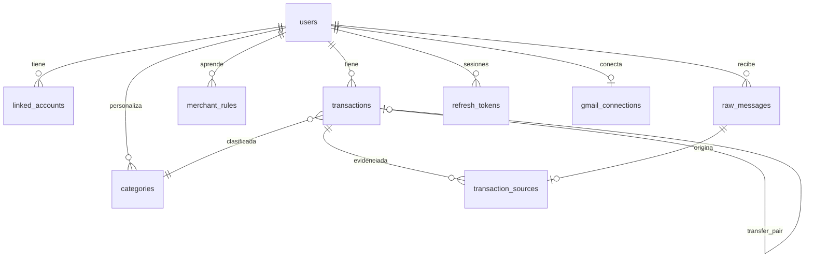

# Spec 004 — Modelo de datos

## 1. Diagrama entidad-relación (PostgreSQL)



## 2. Tablas

Convenciones: PK `id UUID DEFAULT gen_random_uuid()`; timestamps `TIMESTAMPTZ`; todas las tablas de usuario llevan `user_id` con FK `ON DELETE CASCADE` (soporta RF-11.3); `created_at`/`updated_at` en todas (el sync de la app usa `updated_at`).

### 2.1 `users` (módulo identity)

| Columna | Tipo | Notas |
|---|---|---|
| id | UUID PK | |
| google_sub | TEXT UNIQUE NOT NULL | `sub` del id_token de Google (identidad estable) |
| email | CITEXT UNIQUE NOT NULL | |
| display_name | TEXT | |
| photo_url | TEXT | |
| status | TEXT | `active` / `deletion_pending` |
| consents | JSONB | privacidad, gmail, notificaciones: `{tipo: timestamp}` |
| created_at / updated_at | TIMESTAMPTZ | |

### 2.2 `refresh_tokens` (identity)

| Columna | Tipo | Notas |
|---|---|---|
| id | UUID PK | |
| user_id | UUID FK | |
| token_hash | TEXT UNIQUE | SHA-256 del token; el token en claro nunca se guarda |
| family_id | UUID | rotación: detecta reuso de un token ya rotado → revoca familia |
| expires_at | TIMESTAMPTZ | |
| revoked_at | TIMESTAMPTZ NULL | |
| device_info | TEXT | descripción del dispositivo |

### 2.3 `gmail_connections` (ingestion)

| Columna | Tipo | Notas |
|---|---|---|
| user_id | UUID PK/FK | 1:1 con users |
| refresh_token_enc | BYTEA | cifrado AES-GCM (spec 009) |
| history_id | BIGINT | cursor de `history.list` |
| watch_expires_at | TIMESTAMPTZ | cron renueva si < 48 h |
| status | TEXT | `active` / `revoked` / `error` |
| last_sync_at | TIMESTAMPTZ | |

### 2.4 `linked_accounts` (ledger) — cuentas/tarjetas propias

| Columna | Tipo | Notas |
|---|---|---|
| id | UUID PK | |
| user_id | UUID FK | |
| bank | TEXT | enum de bancos soportados + `other` |
| kind | TEXT | `savings` / `checking` / `credit_card` / `wallet` |
| last4 | TEXT | últimos dígitos que aparecen en correos/notifs |
| alias | TEXT | nombre que le da el usuario |
| UNIQUE | (user_id, bank, last4) | |

### 2.5 `transactions` (ledger)

| Columna | Tipo | Notas |
|---|---|---|
| id | UUID PK | |
| user_id | UUID FK | |
| amount | NUMERIC(14,2) NOT NULL | siempre positivo |
| currency | TEXT DEFAULT 'COP' | |
| direction | TEXT NOT NULL | `debit` (sale) / `credit` (entra) |
| kind | TEXT NOT NULL | `expense` / `income` / `transfer` |
| occurred_at | TIMESTAMPTZ NOT NULL | fecha del movimiento |
| merchant | TEXT | comercio/contraparte normalizado |
| description | TEXT | |
| bank | TEXT | |
| account_id | UUID FK NULL | linked_account si se identificó |
| category_id | UUID FK | |
| fiscal_tag | TEXT | denormalizado de la categoría al momento (auditable) |
| transfer_pair_id | UUID FK NULL | la otra pata de la transferencia (RF-6) |
| transfer_auto | BOOLEAN DEFAULT false | true si la emparejó el matcher |
| dedupe_key | TEXT NOT NULL | huella (ver §3) |
| parsed_by | TEXT | `rule:<banco>:<plantilla>` / `llm` / `manual` |
| confidence | REAL NULL | confianza del LLM |
| notes | TEXT | |
| created_at / updated_at | TIMESTAMPTZ | |

**Índices**:
- `UNIQUE (user_id, dedupe_key)` ← garantía de P2/RF-5.
- `(user_id, occurred_at DESC)` ← historial y reportes.
- `(user_id, category_id)`, `(user_id, kind)`.

**Particionado futuro** (RNF-2): la tabla se crea lista para `PARTITION BY RANGE (occurred_at)`; en MVP una sola partición por defecto. Los índices incluyen `user_id` primero para que las consultas siempre poden por usuario.

### 2.6 `transaction_sources` (ledger) — evidencias

| Columna | Tipo | Notas |
|---|---|---|
| id | UUID PK | |
| transaction_id | UUID FK | |
| raw_message_id | UUID FK NULL | NULL si fuente manual/NFC |
| channel | TEXT | `email` / `notification` / `sms_notification` / `manual` / `nfc` |
| received_at | TIMESTAMPTZ | |

### 2.7 `raw_messages` (ingestion)

| Columna | Tipo | Notas |
|---|---|---|
| id | UUID PK | |
| user_id | UUID FK | |
| channel | TEXT | `email` / `notification` / `sms_notification` |
| external_id | TEXT | Gmail message id, o hash del payload de notificación |
| UNIQUE | (user_id, channel, external_id) | idempotencia de ingesta (AC-5.2) |
| sender | TEXT | remitente / paquete Android |
| body | TEXT | contenido relevante (se purga a 90 días, RF-11.4) |
| status | TEXT | `pending` / `parsed` / `failed` / `discarded` / `reviewed` |
| received_at | TIMESTAMPTZ | |
| purge_after | TIMESTAMPTZ | `received_at + 90 días`; job de purga borra `body` |

### 2.8 `categories` (ledger)

| Columna | Tipo | Notas |
|---|---|---|
| id | UUID PK | |
| user_id | UUID FK NULL | NULL = categoría del sistema (RF-7.4) |
| name | TEXT | |
| icon / color | TEXT | |
| fiscal_tag | TEXT NOT NULL | ver spec 007 §2 |
| UNIQUE | (user_id, name) | |

### 2.9 `merchant_rules` (ledger) — aprendizaje de correcciones (AC-7.2)

| Columna | Tipo | Notas |
|---|---|---|
| id | UUID PK | |
| user_id | UUID FK | |
| merchant_pattern | TEXT | match normalizado (exacto o prefijo) |
| category_id | UUID FK | |
| UNIQUE | (user_id, merchant_pattern) | última corrección gana |

### 2.10 `review_queue` (ledger)

Vista lógica sobre `raw_messages` con `status='failed'` + campos extraídos parciales:

| Columna | Tipo | Notas |
|---|---|---|
| raw_message_id | UUID PK/FK | |
| partial_extract | JSONB | lo que reglas/LLM sí extrajeron |
| resolved_at | TIMESTAMPTZ NULL | |
| resolution | TEXT NULL | `converted` / `discarded` |

### 2.11 `fiscal_reports` (fiscal) — reportes generados (caché/auditoría)

| Columna | Tipo | Notas |
|---|---|---|
| id | UUID PK | |
| user_id | UUID FK | |
| tax_year | INT | |
| rules_version | TEXT | p. ej. `co-2025.1` (AC-10.5) |
| payload | JSONB | cifras por cédula/renglón |
| generated_at | TIMESTAMPTZ | |

## 3. Huella de dedupe (`dedupe_key`)

Definición canónica (implementada en `ledger/domain`, testeada sin DB):

```
dedupe_key = sha256(
    user_id
  + bank_normalizado
  + amount (2 decimales)
  + direction
  + time_bucket(occurred_at, 10 min)   # floor a ventanas de 10 min; se prueba también la ventana adyacente
  + last4 (o "----" si no hay)
)
```

- El insert usa `ON CONFLICT (user_id, dedupe_key) DO NOTHING` + adjuntar la nueva fuente a la transacción existente (AC-5.1).
- Ventanas: para tolerar relojes distintos entre banco/correo/notificación, el matcher consulta bucket N y N±1 antes de insertar; el índice único usa el bucket canónico del primer insert.
- Registro manual: `dedupe_key` aleatoria (no debe colisionar con capturas automáticas).

## 4. Matcher de transferencias (reglas de dominio, RF-6)

1. Candidatos: transacciones del mismo usuario, `direction` opuesta, mismo `amount`, `occurred_at` dentro de 48 h, cuentas (`account_id`) distintas y ambas vinculadas.
2. Si hay match único → marcar ambas `kind='transfer'`, `transfer_pair_id` cruzado, `transfer_auto=true`.
3. Ambigüedad (2+ candidatos) → no emparejar; sugerir en UI.
4. Desmarcado manual (AC-6.3) → set `kind` original, `transfer_pair_id=NULL` y registrar par en lista de exclusión (JSONB en la transacción) para no reemparejar.

## 5. Esquema local (Drift, app)

Espejo simplificado para offline-first; el servidor es la fuente de verdad.

| Tabla local | Contenido | Sync |
|---|---|---|
| `local_transactions` | proyección de transactions + flag `pending_push` | pull incremental por `updated_at`; push de cambios locales (outbox) |
| `local_categories` | categorías sistema+usuario | pull |
| `local_accounts` | linked_accounts | pull/push |
| `local_review` | cola de revisión | pull/push de resoluciones |
| `outbox` | operaciones offline pendientes (crear manual, corregir categoría, marcar transfer) | push FIFO con reintentos |
| `sync_state` | cursores `updated_at` por tabla | — |

Conflictos: gana `updated_at` más reciente, excepto ediciones manuales del usuario, que siempre ganan sobre cambios automáticos del servidor (spec 003 §3).

## 6. Retención y purga

| Dato | Retención | Mecanismo |
|---|---|---|
| `raw_messages.body` | 90 días | job diario de purga (worker) |
| Transacciones y agregados | indefinida (dato del usuario) | borrado solo con la cuenta |
| Cuenta borrada | purga total ≤ 72 h | evento `UserDeleted` + CASCADE + job de verificación |
| Backups | 30 días | rotación de backups cifrados |
