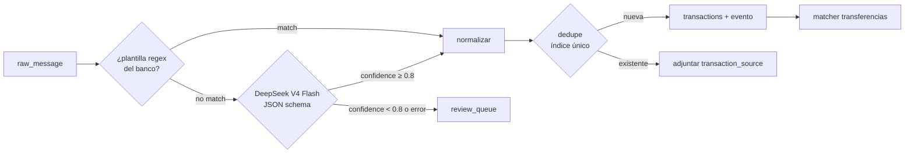

# Spec 006 — Captura y parsing

## 1. Canales de captura

| Canal | Plataforma | Latencia objetivo | Mecanismo |
|---|---|---|---|
| Correo Gmail | Ambas (server-side) | < 60 s p95 | Gmail watch → Pub/Sub → webhook |
| Notificación bancaria / Google Wallet | Android | < 10 s p95 | NotificationListenerService |
| SMS bancario | Android | < 10 s p95 | Notificación de la app de Mensajes (NO READ_SMS) |
| NFC tag | Android (+iOS foreground) | inmediato | nfc_manager → formulario rápido |
| Manual | Ambas | inmediato | formulario |

## 2. Gmail (server-side)

### 2.1 Ciclo del watch
1. Al conectar Gmail: `users.watch` con el topic Pub/Sub → guarda `history_id` inicial y `watch_expires_at` (7 días).
2. Cron diario (worker): renueva todo watch con `watch_expires_at < now()+48h`.
3. Push recibido: `history.list(startHistoryId=cursor)` → solo mensajes nuevos → avanza cursor. Si el cursor es muy viejo (404 de Gmail), resync con `messages.list` de los últimos 7 días.

### 2.2 Filtro de remitentes
Lista blanca de dominios/remitentes por banco (config versionada, `parsing/config/senders.yaml`,
`version: 1`, un mapa `banks:` con `verified`/`senders` por banco):

```yaml
version: 1
banks:
  bancolombia:  # verified: true — validado con fixture real (F2.3)
    verified: true
    senders: [alertasynotificaciones@an.notificacionesbancolombia.com,
              "@notificacionesbancolombia.com", "@bancolombia.com.co"]
  nequi:        {verified: false, senders: ["@nequi.com.co"]}
  davivienda:   {verified: false, senders: ["@davivienda.com"]}
  daviplata:    {verified: false, senders: ["@daviplata.com"]}
  bbva:         {verified: false, senders: ["@bbva.com.co"]}
  banco_bogota: {verified: false, senders: ["@bancodebogota.com.co"]}
```

Un correo cuyo `From` no matchea ningún patrón se descarta sin persistir el cuerpo (AC-2.4).
Matching (`parsing/domain/allowlist.py`): exacto case-insensitive sobre la dirección (sin el
display name), o sufijo de dominio si el patrón empieza por `@` (matchea el dominio exacto y
subdominios, nunca un dominio "hijo": `@bancolombia.com.co` NO matchea
`x@bancolombia.com.co.evil.com`). Solo Bancolombia está `verified: true` (fixture real, F2.3); los
otros cinco bancos quedan **sin verificar con fixture** — el filtro los acepta igual, pero al no
tener plantilla (F2.7, diferido) siempre caen al LLM genérico.

### 2.3 Extracción del cuerpo
- Preferir `text/plain`; si solo hay HTML, convertir a texto (strip de tags, conservar tablas como líneas).
- Truncar a 8 KB antes de persistir (los correos bancarios relevantes son cortos; evita almacenar adjuntos/branding).
- El cuerpo se compone como `título\n\ntexto` para notificaciones/SMS (correos no tienen título propio, solo `texto`); truncado a 8 KB en frontera de carácter (nunca parte un carácter multibyte). `bank` se resuelve al ingerir (filtro de remitente/paquete) y queda guardado en la fila, no se recalcula después.

## 3. Notificaciones Android (app)

### 3.1 Paquetes soportados (config remota)
La lista de paquetes se descarga del backend (`/config/capture`) para poder ampliarla sin release.
Vive en `parsing/config/capture.yaml` (`version: 1`, D6) y se sirve tal cual (más un mapa
`email_senders` derivado de `senders.yaml`) por `GET /v1/config/capture` (ingestion):

```yaml
version: 1
banking_apps:
  - com.bancolombia.app          # Bancolombia
  - com.nequi.MobileApp          # Nequi
  - com.davivienda.daviviendaapp # Davivienda
  - com.daviplata.app            # DaviPlata
  - com.bbva.bbvacolombia        # BBVA CO
  - com.bancodebogota.bancamovil # Banco de Bogotá
  - com.google.android.apps.walletnfcrel  # Google Wallet
messages_apps:                    # para SMS-vía-notificación
  - com.google.android.apps.messaging
  - com.samsung.android.messaging
sms_sender_patterns:              # aplicados al título de la notificación de Mensajes
  - "^(87400|85540|891888|...)$"  # códigos cortos bancarios (se completan con fixtures)
  - "(?i)bancolombia|nequi|davivienda|bbva"
```

### 3.2 Comportamiento del listener
1. Notificación posted → ¿paquete en `banking_apps`? → capturar `title+text+bigText`.
2. ¿Paquete en `messages_apps`? → aplicar `sms_sender_patterns` al título (remitente del SMS); si no matchea, **ignorar sin leer el resto** (AC-3.3, privacidad).
3. Pre-filtro local barato: la notificación debe contener un signo de moneda/monto (`$`, `COP`, dígitos con separador de miles); si no, se ignora.
4. Encolar en Drift (`outbox`) con `client_hash = sha256(package + posted_at_bucket + text)` → batch a `/ingest/notifications` (funciona offline).
5. El texto de notificaciones ignoradas jamás se persiste ni se transmite.

## 4. Pipeline de parsing (workers)



### 4.1 Plantillas por banco
- Una plantilla = regex nombrada + post-proceso (`parsing/config/templates/<banco>.yaml`), con: patrón, campos capturados (`amount`, `merchant`, `last4`, `datetime`, `direction`), formato de fecha y reglas de normalización de monto (`$1.234.567,89` → `1234567.89`).
- Cada plantilla se versiona y referencia en `parsed_by` (`rule:<banco>:<template_id>:v<version>`, p. ej. `rule:bancolombia:compra_tdeb:v1`).
- **Regla de oro**: ninguna plantilla entra sin fixture de mensaje real anonimizado + test.
- Esquema del YAML de plantillas de un banco (`parsing/config/templates/<banco>.yaml`):

```yaml
bank: <banco>              # str, debe coincidir con una clave de senders.yaml
version: 1                 # int, referenciado en parsed_by
relevant_line_prefix: "Bancolombia:"  # str | null — prefijo de la(s) linea(s) util(es)
                                       # del cuerpo (extracto para plantillas y LLM, RNF-5)
templates:
  - id: compra_tdeb         # str, unico dentro del banco
    direction: debit        # debit | credit
    pattern: '...'          # regex con grupos nombrados (amount, date, time obligatorios;
                             # merchant, last4 segun el mensaje)
    date_format: "%d/%m/%Y" # formato strptime de <date>; <time> siempre es %H:%M
    suggested_category: nomina  # opcional
```

- `relevant_line_prefix` reduce el cuerpo a las líneas que empiezan por ese prefijo antes de
  matchear plantillas o llamar al LLM (`extract_excerpt`, `parsing/domain/excerpt.py`); sin
  match cae a un fallback (líneas no vacías sin URLs/teléfonos, truncado a 1500 caracteres).

### 4.2 Fallback LLM — contrato DeepSeek

- Modelo: `deepseek-v4-flash`, API OpenAI-compatible, `response_format: json_object`, `temperature: 0`.
- El adapter implementa `LlmParserPort` (cambiar de proveedor = nuevo adapter).
- Sin `deepseek_api_key` configurada, el puerto se resuelve al adapter `DisabledLlmParser`
  (`enabled = False`) y todo mensaje que llegue al LLM se marca `llm_disabled` sin llamada de red
  (arranque típico de dev; el worker loguea `worker_llm_status` con el adapter elegido).
- Al LLM solo se le envía el **extracto** (`relevant_line_prefix`/fallback de §4.1, recortado a
  `max_excerpt_chars`) y la **fecha de recepción** (`received_on`, solo fecha, no hora): nunca
  `user_id`, remitente, `raw_message_id` ni el cuerpo completo (P1, spec 009 §1). El system prompt
  es fijo y cacheable (no lleva datos variables por request, control de costo).

**System prompt (fijo, cacheable)**: instruye extraer campos de mensajes de bancos colombianos; formato de montos colombiano; devolver `null` en campos ausentes; nunca inventar.

**Esquema de salida requerido**:

```json
{
  "is_transaction": true,
  "amount": "45900.00",
  "currency": "COP",
  "direction": "debit",
  "merchant": "RAPPI",
  "occurred_at": "2026-08-05T14:30:00-05:00",
  "bank": "bancolombia",
  "last4": "1234",
  "suggested_category": "restaurantes",
  "confidence": 0.93
}
```

**Validación post-LLM**: monto > 0, fecha plausible (±7 días del recibido), banco en el enum de
`senders.yaml`, `confidence ≥ 0.8` (umbral configurable), `is_transaction=false` → descartar (no es
error, ver `_discard`); JSON inválido o esquema inválido → **un solo reintento** (misma llamada, sin
backoff) → si el segundo intento también falla, `review_queue` con motivo `llm_invalid_json`; la
validación semántica que sí produjo JSON pero no pasa las reglas anteriores (monto ≤ 0, fecha fuera
de rango, banco desconocido) usa el motivo separado `llm_invalid_output` (D12).

**Lista cerrada de motivos** (`ParseFailureReason`, `parsing/domain/enums.py`, 8 valores, sin
comodín — un motivo nuevo exige un ruling explícito): `no_template` (el extracto no contiene ni
siquiera un monto, no se gasta LLM), `llm_disabled` (sin API key configurada), `llm_budget_exceeded`,
`llm_invalid_json` (JSON/esquema inválido tras el reintento), `llm_invalid_output` (JSON válido pero
la validación semántica falla), `llm_low_confidence` (`confidence` bajo umbral), `llm_error`
(`LlmUnavailable`: timeout/5xx/red — se manda **directo** a revisión, D11, sin usar el reintento del
consumer de Redis Streams, para mantener visibilidad sobre latencia; una caída corta de DeepSeek
manda mensajes a revisión, riesgo aceptado — revisar con métricas tras Fase 3), `body_purged`
(el cuerpo ya fue purgado por retención antes de procesarse).

**Control de costos (RNF-5)**: contador mensual de tokens por usuario en Redis, clave
`llm:budget:{user_id}:{YYYYMM}` (mes en curso), incrementado tras cada llamada (incluida la del
reintento) con `EXPIRE ... NX` a 40 días (para no extender artificialmente un mes ya vencido si el
proceso reintenta tarde). El presupuesto se comprueba (`used < limit`) **antes** de llamar al LLM y
se suma **después**: una sola llamada puede exceder el límite en hasta ~1K tokens (aceptable para
MVP, riesgo §4.8 del plan). Superado el presupuesto → directo a `review_queue` con motivo
`llm_budget_exceeded`, sin llamar al LLM.

### 4.3 Normalización
- Comercio: uppercase → strip de sufijos de pasarela (`*`, códigos), colapso de espacios; se usa para `merchant_rules`. Esta normalización completa vive en **ledger** (`_resolve_category`, F1); `parsing` solo limpia el texto capturado por la plantilla (`clean_text`: strip, colapso de espacios, quita puntuación final) — no duplica el normalizador de comercio (D3).
- Categoría automática: 1º regla del usuario (`merchant_rules`), 2º sugerencia del parser/LLM, 3º `sin_categoria`.

### 4.4 Dedupe e idempotencia
- Idempotencia de ingesta: `UNIQUE(user_id, channel, external_id)` en `raw_messages` — el mismo push/notificación repetido no reprocesa (AC-5.2).
- Si la ingesta encuentra un duplicado (`INSERT … ON CONFLICT DO NOTHING` no insertó) cuya fila sigue `pending`, re-publica `RawMessageReceived` (D9): mitiga la falta de outbox cuando el publish original falló tras el commit.
- Vocabulario de resultado de una ingesta: `accepted` (fila nueva, evento publicado), `duplicate` (fila ya existía; republica el evento solo si seguía `pending`) o `discarded` (remitente/paquete no soportado, nada se persiste, AC-2.4).
- Orden publish/commit en parsing (D8): el resultado (`TransactionParsed`/`ParseFailed`) se **publica antes** del commit que marca el `raw_message` como `parsed`/`failed`/`discarded`. Si el commit del estado falla, el mensaje sigue `pending` y se reprocesa; el reproceso produce un segundo evento con el **mismo `event_id`** (determinista: `uuid5(NAMESPACE_URL, f"finanzia:parsing:{outcome}:{raw_message_id}")`, `parsing/events.py::deterministic_event_id`), así que `IdempotentHandler` aguas abajo (ledger) lo absorbe aunque llegue en una entrada de stream distinta. El caso inverso (commit del estado ok, publish falla) se cierra con el cron de abajo.
- Dedupe de transacciones: huella de spec 004 §3 con `ON CONFLICT DO NOTHING`; si conflicto → adjuntar `transaction_source` a la existente (AC-5.1).
- El matcher de transferencias corre tras cada inserción (spec 004 §4).
- Mitigación adicional a la falta de outbox (riesgo 4, F3.7 adelantado en F2 — Task 10): el cron `requeue_pending_raw_messages` corre cada 15 min (`minute={0,15,30,45}`) y republica `RawMessageReceived` para toda fila `raw_messages` que siga `status='pending'` con `updated_at` de más de 10 min (cubre el caso "commit ok, publish falló" incluso sin una ingesta duplicada que lo dispare). Cada fila reencolada se "toca" (`updated_at = now()`) para no volver a republicarse en la misma ventana. Es idempotente: `ParseRawMessage` (F2.2) descarta con `Skipped(not_pending)` cualquier evento cuyo `raw_message_id` ya no esté `pending` al momento de procesarlo, así que una reentrega tras un procesamiento exitoso no duplica nada.

## 5. NFC (app)

- Tags NDEF con payload propio: `finanzia://quick-add?tag=<uuid>`; el uuid se asocia en la app a una plantilla (categoría + cuenta + nota por defecto).
- Android: intent-filter NDEF → abre la app directo en el formulario rápido incluso cerrada. iOS: lectura en foreground (Core NFC) desde la pantalla de registro.
- Escritura de tags: pantalla en Ajustes (Android) usando `nfc_manager`; un tag puede reescribirse.
- El formulario rápido solo pide monto (categoría/cuenta vienen del tag) → guardar offline → outbox (AC-4.2).

## 6. Métricas del pipeline (observabilidad)

Un único evento de log estructurado (`structlog`) `parsing_metric` por resultado, nunca con datos
crudos del mensaje (P1/P6). Se emite desde dos módulos con formas distintas del mismo nombre:

- **`parsing`** (`parsing/infrastructure/metrics.py::StructlogMetrics`, implementa `MetricsPort`):
  `parsing_metric outcome=<parsed_by_rule|parsed_by_llm|sent_to_review|discarded> bank=<banco|None>
  channel=<canal> template_id=<id|None> reason=<ParseFailureReason|None> llm_tokens=<int|None>`.
  `template_id` solo se rellena en `parsed_by_rule`; `llm_tokens` solo cuando hubo llamada al LLM;
  `reason` solo en `sent_to_review`.
- **`ingestion`** (`ingestion/infrastructure/logging.py::log_ingest_outcome`):
  `parsing_metric outcome=<accepted|duplicate|discarded> channel=<canal> bank=<banco|None>
  reason=<motivo de descarte|None> republished=<bool, solo en duplicate>`. `bank` está presente en
  `accepted`/`duplicate` y ausente en `discarded` (el mensaje se descartó antes de resolver banco).

Meta de salud: ≥ 80% de mensajes de bancos soportados parseados por regla (`parsed_by_rule`; las
reglas son gratis, el LLM es la red de seguridad). No hay agregación en base de datos ni dashboard
en Fase 2: los contadores se calculan por grep/agregación de logs (deuda conocida, ver README).
