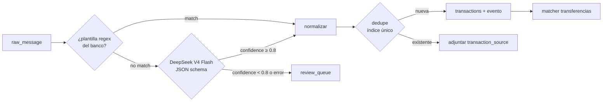

# Spec 006 — Captura y parsing

## 1. Canales de captura

| Canal | Plataforma | Latencia objetivo | Mecanismo |
|---|---|---|---|
| Correo Gmail | Ambas (server-side) | < 60 s p95 | Gmail watch → Pub/Sub → webhook |
| Notificación bancaria / Google Wallet / Samsung Wallet | Android | < 10 s p95 | NotificationListenerService |
| SMS bancario | Android | < 10 s p95 | Notificación de la app de Mensajes (NO READ_SMS) |
| Pago con Apple Pay | iOS 17+ | al abrir la app | Automatización "Transacción" de Atajos → App Intent → cola nativa (§3.3) |
| Manual | Ambas | inmediato | formulario |

## 2. Gmail (server-side)

Alcance: la captura es solo de **INBOX** (watch, `history.list` y resync filtran por esa etiqueta, ver el cliente al final de §2.1). Un correo del banco que un filtro del usuario archiva o manda a otra etiqueta sin pasar por la bandeja de entrada no se captura. Es una decisión consciente (menos ruido y menos correo leído); la app no lo explica en pantalla, solo esta spec y la guía del backend.

### 2.1 Ciclo del watch
1. Al conectar Gmail: `users.watch` con el topic Pub/Sub → guarda `history_id` inicial y `watch_expires_at` (7 días). Si es una reconexión de la **misma** cuenta y ya había cursor, se conserva ese cursor (no el del watch): el próximo sync sigue desde ahí y, si venció, el 404 de `history.list` cae al resync de 7 días. Si el watch falla, la conexión queda `error` con `watch_expires_at = null` (spec 005 §3) y el cron del paso 2 la recupera.
2. Cron diario (worker): renueva todo watch `active` con `watch_expires_at < now()+48h` y reintenta las conexiones `error` sin watch o por vencer.
3. Push recibido: `history.list(startHistoryId=cursor)` → solo mensajes nuevos → avanza cursor. Si el cursor es muy viejo (404 de Gmail), resync con `messages.list` de los últimos 7 días, con tope de 500 mensajes (Gmail los lista del más nuevo al más viejo, así que se conservan los 500 más recientes; un buzón con más correo de 7 días pierde los más viejos, que igual quedan fuera de la ventana útil de un aviso de compra).

Renovación (cron arq `renew_gmail_watches`, F3.5; `ingestion/application/use_cases/renew_gmail_watches.py`, registrado en `luka.worker.WorkerSettings.cron_jobs` a las 08:00 UTC = 03:00 Bogotá, el mismo horario que la purga de cuerpos, spec 004 §6): selecciona las conexiones `active` con `watch_expires_at < now()+48h` (`ClockPort`) y las `error` con `watch_expires_at` nulo o `< now()+48h` (el cron es la vía de recuperación de `error`); `revoked` nunca se toca. Por cada una descifra el refresh token, pide un access token y llama `watch(topic)`. Con éxito, `watch_expires_at` toma el valor que devuelve Google y la conexión queda `active` (guarda por email). El cursor **no** se adelanta: `users.watch` devuelve el `historyId` actual del buzón, y adoptarlo saltaría los correos aún no sincronizados (un aviso encolado antes de la renovación se perdería). Solo siembra un cursor nulo: `history_id = COALESCE(actual, nuevo)`. `last_sync_at` no se toca (no es una pasada de sincronización). Un fallo en una conexión nunca corta las demás: `GmailTransientError` (red, 5xx, 429, cuota) no cambia el estado, porque la ventana de 48 h da otro intento al día siguiente; token guardado que no descifra o rechazo permanente (`GmailRequestRejected`) → `error`; `GmailAuthRevoked` → `revoked`. Devuelve solo contadores (`renewed`/`revoked`/`errored`/`deferred`, este último los transitorios) que el cron loguea (`gmail_watches_renewed`); nunca el email de la cuenta ni el refresh token.

Sincronización (job arq `sync_gmail(user_id, history_id)`, F3.4; `ingestion/application/use_cases/gmail_sync.py` y `ingestion/infrastructure/gmail_sync.py`):

- **Timeout y lock:** el job lleva su propio timeout en arq, 900 s (`SYNC_GMAIL_TIMEOUT_S`; el global del worker es 300 s), porque un resync de 7 días hace hasta 500 `messages.get` y hasta 3 pasadas. El lock por usuario en Redis (`gmail_sync:lock:<user_id>`, `SET NX EX 930`, liberado solo por su dueño) dura 30 s más que el timeout, así que no vence con el job vivo. Cada job marca primero `gmail_sync:pending:<user_id>` y luego intenta el lock; si otro job lo tiene, sale sin hacer nada. El dueño borra la marca al empezar y, al soltar el lock, si la encuentra de nuevo (llegó un aviso durante su pasada, después de su `history.list`) hace otra pasada, hasta 3. Si agota las 3 pasadas, o su lock venció a mitad de una (el release no lo encontró), con la marca aún puesta, reencola un `sync_gmail(user_id, None)` diferido 30 s (`_defer_by`) en vez de perder el aviso; el log `gmail_sync_requeued` lleva `reason` `round_cap` o `lock_lost`. No se usa `_job_id` de arq: arq rechaza un job con el mismo id mientras exista su resultado guardado (1 h), lo que tiraría los avisos posteriores.
- **Una pasada:** lee la conexión y cierra la transacción antes de llamar a Google. Si no está `active`, no hace nada. Si el `historyId` del aviso es ≤ al cursor guardado (reentrega de Pub/Sub), tampoco. Pide un access token, lista `history.list` desde el cursor (o resync si da 404 o no hay cursor: primero `users.getProfile` para el `historyId` nuevo, luego `messages.list`) y por cada id hace `messages.get` e ingiere con `IngestRawMessage`: `channel=email`, `external_id` = id del mensaje de Gmail, `sender` = dirección del `From` en minúsculas (sin display name; vacía si no hay una dirección inequívoca), `received_at` = `internalDate`, cuerpo según §2.3. El filtro de remitentes (§2.2) descarta sin persistir y la idempotencia por `external_id` (§4.4) absorbe repeticiones. Solo se saltan (contados en `skipped`) un id que Gmail ya no devuelve (404, o 400 por id inválido: borrado entre `history.list` y `messages.get`, `GmailMessageNotFound`) y una respuesta 2xx ilegible (no JSON, sin `payload`/`internalDate`, base64 roto: `GmailMessageUnreadable`, que reintentar no arregla y bloquearía el cursor para siempre; se loguea `gmail_message_skipped` con solo `reason="unreadable"`, sin id ni contenido). Un 403 de `messages.get` (cuota por usuario, `userRateLimitExceeded`) es `GmailTransientError`: el job se reintenta sin avanzar el cursor y la idempotencia absorbe la repetición. Cualquier otro rechazo de `messages.get` corta la pasada sin avanzar el cursor ni cambiar el estado.
- **Cursor:** al final, `history_id = GREATEST(actual, nuevo)` y `last_sync_at = now()`, solo si la conexión sigue siendo de la misma cuenta (una reconexión con otra cuenta durante el sync no se pisa); nunca retrocede.
- **Errores:** `GmailAuthRevoked` (refresh token revocado) → conexión `revoked`; token guardado que no descifra → `error`; `GmailTransientError` → el job lanza `Retry` de arq (backoff 30 s × intento, hasta 5 intentos) sin tocar el cursor; `GmailRequestRejected` permanente al pedir el access token o en `history.list` (p. ej. `invalid_client`) → conexión `error` sin propagar (nada que arq pueda arreglar reintentando); el cron de renovación la reintenta cuando su watch entra en la ventana de 48 h y, si el watch sale bien, vuelve a `active`.
- **Logs:** `gmail_sync_finished` con `status` y contadores (`fetched`, `accepted`, `duplicates`, `discarded`, `skipped`), más `parsing_metric` por mensaje (§5); nunca la cuenta, remitentes, asuntos ni cuerpos.

Cliente (`GmailClientPort`, adaptador httpx `ingestion/infrastructure/gmail_client.py`): el `serverAuthCode` se canjea en `oauth2.googleapis.com/token` con `redirect_uri=""` (códigos de Android) y el email de la cuenta sale de `users.getProfile` (si el `scope` del grant no trae lectura de Gmail, el adaptador devuelve `scope_granted=False` sin llamar al perfil; un 403 del perfil con el scope concedido es cuota o API sin habilitar, `GmailTransientError`, nunca permiso denegado); el `watch` es sobre `labelIds: ["INBOX"]` (sin `labelFilterBehavior`), `history.list` filtra `labelId=INBOX` y el resync usa `q=in:inbox newer_than:7d`. Errores de dominio: `invalid_grant` → `GmailAuthRevoked` (no se reintenta; la conexión pasa a `revoked`), 404 de `history.list` → `GmailHistoryExpired` (resync), timeout/red/5xx/429, 401 de la Gmail API (access token vencido a mitad del job) y 403 de cuota (`error.errors[].reason` `userRateLimitExceeded`/`rateLimitExceeded`/`dailyLimitExceeded`/`quotaExceeded` o `status: RESOURCE_EXHAUSTED`; la Gmail API devuelve la cuota por usuario como 403, no 429) → `GmailTransientError` (reintentable; el reintento pide un token nuevo), cualquier otro 4xx o respuesta ilegible → `GmailRequestRejected`. `revoke` es idempotente (un 400 de token ya inválido no es error) y manda el token en el cuerpo, nunca en la URL. Logs: solo `gmail_request` con `operation`, `status_code` y `latency_ms`; los loggers `httpx`/`httpcore` van en WARNING porque en INFO loguean la URL cruda (ids de mensaje, cursores, `q`).

### 2.2 Filtro de remitentes
Lista blanca de dominios/remitentes por banco (config versionada, `parsing/config/senders.yaml`,
`version: 1`, un mapa `banks:` con `verified`/`senders` por banco):

```yaml
version: 1
banks:
  bancolombia:  # verified: true — validado con fixture real (F2.3)
    verified: true
    senders: [alertasynotificaciones@an.notificacionesbancolombia.com,
              "@notificacionesbancolombia.com", "@bancolombia.com.co"]
  nequi:        {verified: true, senders: ["@nequi.com.co"]}  # fixture real (F2.7)
  davivienda:   {verified: false, senders: ["@davivienda.com"]}
  daviplata:    {verified: false, senders: ["@daviplata.com"]}
  bbva:         {verified: false, senders: ["@bbva.com.co"]}
  banco_bogota: {verified: false, senders: ["@bancodebogota.com.co"]}
```

Un correo cuyo `From` no matchea ningún patrón se descarta sin persistir el cuerpo (AC-2.4).
Matching (`parsing/domain/allowlist.py`): exacto case-insensitive sobre la dirección (sin el
display name), o sufijo de dominio si el patrón empieza por `@` (matchea el dominio exacto y
subdominios, nunca un dominio "hijo": `@bancolombia.com.co` NO matchea
`x@bancolombia.com.co.evil.com`). Bancolombia (F2.3) y Nequi (F2.7) están `verified: true` (fixture
real); los otros cuatro bancos quedan **sin verificar con fixture** — el filtro los acepta igual,
pero al no tener plantilla (F2.7, diferido) siempre caen al LLM genérico.

### 2.3 Extracción del cuerpo
- Preferir `text/plain`; si solo hay HTML, convertir a texto (strip de tags, conservar tablas como líneas). Implementado en `ingestion/domain/gmail_message.py` (stdlib `html.parser`): se toma la primera parte `text/plain` no vacía (recorrido en profundidad) y si no hay, la primera `text/html`; las partes con `filename` (adjuntos) nunca son cuerpo; se decodifica con el `charset` de la parte (UTF-8 con reemplazo si falta o es desconocido). En el HTML, los tags de bloque (`p`, `div`, `br`, `tr`, `li`, `h1`–`h6`, …) cortan línea, las celdas de una fila se unen con un espacio (cada fila de tabla es una línea), se descartan `head`/`script`/`style` y comentarios, y se colapsan espacios y líneas vacías.
- Truncar a 8 KB antes de persistir (los correos bancarios relevantes son cortos; evita almacenar adjuntos/branding).
- El cuerpo se compone como `título\n\ntexto` para notificaciones/SMS (correos no tienen título propio, solo `texto`); truncado a 8 KB en frontera de carácter (nunca parte un carácter multibyte). `bank` se resuelve al ingerir (filtro de remitente/paquete) y queda guardado en la fila, no se recalcula después.

## 3. Notificaciones Android (app)

### 3.1 Paquetes soportados (config remota)
La lista de paquetes se descarga del backend (`/config/capture`) para poder ampliarla sin release.
Vive en `parsing/config/capture.yaml` (`version: 1`, D6) y la sirve `GET /v1/config/capture`
(ingestion), más un mapa `email_senders` derivado de `senders.yaml`.

Cada entrada de `banking_apps`/`sms_sender_patterns` lleva el banco que le corresponde, porque el
backend necesita ese `bank` al ingerir (queda en `raw_messages.bank`):

```yaml
version: 1
banking_apps:
  - package: com.bancolombia.app
    bank: bancolombia
  - package: com.nequi.MobileApp
    bank: nequi
  - package: com.davivienda.daviviendaapp
    bank: davivienda
  - package: com.daviplata.app
    bank: daviplata
  - package: com.bbva.bbvacolombia
    bank: bbva
  - package: com.bancodebogota.bancamovil
    bank: banco_bogota
  - package: com.google.android.apps.walletnfcrel   # Google Wallet: sin banco ni plantilla (LLM)
    bank: null
  - package: com.samsung.android.spay              # Samsung Wallet: sin banco ni plantilla (LLM)
    bank: null
messages_apps:                    # para SMS-vía-notificación
  - com.google.android.apps.messaging
  - com.samsung.android.messaging
sms_sender_patterns:              # aplicados al título de la notificación de Mensajes
  - pattern: "(?i)bancolombia"
    bank: bancolombia
  - pattern: "(?i)nequi"
    bank: nequi
```

La respuesta de la API es una **proyección aplanada** de ese YAML, no el YAML tal cual:
`banking_apps` y `sms_sender_patterns` se sirven como listas de strings (paquetes y patrones) y el
`bank` de cada entrada se omite a propósito — el cliente Android no lo necesita (lo resuelve el
backend) y exponerlo obligaría a `ingestion` a importar `ledger.domain.enums.Bank`, que R4 prohíbe.
Ver el ejemplo de respuesta real en spec 005 §5.

### 3.2 Comportamiento del listener
El listener es código nativo (`NotificationListenerService` en Kotlin) y filtra antes de guardar nada:

1. Notificación posted (se ignoran los resúmenes de grupo) → ¿paquete en `banking_apps`? → canal `notification`.
2. ¿Paquete en `messages_apps`? → aplicar `sms_sender_patterns` al título (remitente del SMS); si no matchea, **ignorar sin leer el resto** (AC-3.3, privacidad). Si matchea, canal `sms_notification` y el título (el remitente) viaja en `title`, porque el backend re-valida el patrón sobre él.
3. El texto es `bigText` si la notificación lo trae y, si no, `text` (la API solo tiene `title` y `text`). Se recortan a 500 y 8192 caracteres.
4. Pre-filtro local barato: el texto debe contener un signo de moneda/monto (`$`, `COP`, dígitos con separador de miles); si no, se ignora.
5. Encolar en la **cola nativa** (SQLite propio del listener, tope de 5.000 filas): es el outbox de este canal y sobrevive a que maten la app. Se guardan paquete, canal, `posted_at` (instante + zona del teléfono), título y texto.
6. La app, cuando corre (al abrir, al volver a primer plano, cada 15 min visible y al recuperar la red), vacía la cola en lotes de hasta 50 a `/ingest/notifications` con `client_hash = sha256("paquete|minuto|texto")`, donde `minuto` es `floor(posted_at_epoch_s / 60)` en UTC: una notificación re-publicada en el mismo minuto da el mismo hash. Sin `Idempotency-Key`: el lote ya es idempotente por `client_hash`. Un lote rechazado con 4xx se reintenta ítem por ítem una vez y los ítems inválidos se descartan; red, 429, 5xx y 401 dejan todo en la cola. Lo capturado con la app cerrada llega cuando se abre (sin envío en segundo plano en el MVP), así que la meta de < 10 s de §1 solo se cumple con la app abierta.
7. La config de §3.1 la baja la app (se refresca cada hora) y la guarda para el listener; sin config no se captura nada. Al cerrar sesión se borran la cola y la config (P6); si entra otro usuario, lo capturado para el anterior se borra.
8. El texto de notificaciones ignoradas jamás se persiste ni se transmite.

### 3.3 Pagos con Apple Pay (iOS, F4.3b)
iOS no deja leer notificaciones de otras apps. La única fuente automática es la automatización personal **"Transacción"** de Atajos (iOS 17+): corre al pagar con una tarjeta de Wallet y entrega tarjeta, comercio y monto.

1. El usuario crea la automatización con la guía de la app (spec 008 §3.1): para sus tarjetas, "Ejecutar inmediatamente", con la acción **"Registrar pago en luka"** (App Intent `RegistrarPagoWallet`, parámetros tarjeta, comercio y monto).
2. La intent corre en el proceso de la app, sin abrirla, y encola el pago con su instante en una cola nativa (archivo JSON en el sandbox). No hay extensión ni App Group: SideStore con Apple ID gratuito no los garantiza.
3. Al abrir la app, `IosWalletNotificationSource` (el `NotificationSource` de iOS, mismo `MethodChannel("co.luka/capture")`) entrega la cola al `CaptureFlusher`, que la envía a `/ingest/notifications` igual que en Android (§3.2 paso 6), con canal `notification` y paquete sintético `com.apple.wallet`.
4. El ítem es texto fijo que arma la app: título = nombre de la tarjeta; texto = `Apple Pay: Compraste $12.500,00 con <tarjeta> en <comercio> el 29/09/2026 a las 14:05` (hora local del teléfono). Lo parsea la plantilla genérica `apple_wallet` (§4.1), sin LLM.
5. Banco: `com.apple.wallet` tiene `bank: null` y `bank_from_title: true` en `capture.yaml`, así que el backend busca el banco en el nombre de la tarjeta con `sms_sender_patterns`; si no aparece queda `other`. Si el nombre termina en 4 cifras, son el `last4`.
6. Dedupe (spec 004 §3): el pago y el correo del banco de la misma compra se unen solo si coinciden banco y `last4`. Por eso la guía pide que la tarjeta se llame con el banco y sus últimos 4 dígitos (p. ej. "Bancolombia 1234"), escribiéndolo en el parámetro tarjeta si el nombre de Wallet no los trae. Si no, quedan dos movimientos y se documenta como límite conocido.

## 4. Pipeline de parsing (workers)



### 4.1 Plantillas por banco
- Una plantilla = regex nombrada + post-proceso (`parsing/config/templates/<banco>.yaml`), con: patrón, campos capturados (`amount`, `merchant`, `last4`, `datetime`, `direction`), formato de fecha y reglas de normalización de monto (`$1.234.567,89` → `1234567.89`).
- Cada plantilla se versiona y referencia en `parsed_by` (`rule:<banco>:<template_id>:v<version>`, p. ej. `rule:bancolombia:compra_tdeb:v1`).
- **Regla de oro**: ninguna plantilla entra sin fixture de mensaje real anonimizado + test.
- Esquema del YAML de plantillas de un banco (`parsing/config/templates/<banco>.yaml`):

```yaml
bank: <banco>              # str, debe coincidir con una clave de senders.yaml
version: 1                 # int, referenciado en parsed_by
relevant_line_prefix: "Bancolombia:"  # str | null — prefijo de la(s) linea(s) util(es)
                                       # del cuerpo (extracto para plantillas y LLM, RNF-5)
templates:
  - id: compra_tdeb         # str, unico dentro del banco
    direction: debit        # debit | credit
    pattern: '...'          # regex con grupos nombrados (amount, date, time obligatorios;
                             # merchant, last4 segun el mensaje)
    date_format: "%d/%m/%Y" # formato strptime de <date>; un mes en espanol
                             # ("septiembre") se cambia antes por su numero (usar %m)
    suggested_category: nomina  # opcional
    counterparty: true       # opcional (default false): <merchant> es una persona
                             # (envio o recibo entre personas), no un comercio
```

- Una config con `generic: true` (`apple_wallet.yaml`, §3.3, y `pse.yaml`) no es de un banco: su
  `bank` es solo el nombre que va en `parsed_by` (`rule:apple_wallet:compra:v1`, `rule:pse:pago:v1`).
  Sus plantillas se prueban después de las del banco del mensaje y el movimiento toma ese banco, o
  `other` si no se conoce. No cuenta en `known_banks()`. El contrato de `apple_wallet` es el texto
  que arma la app, así que el test lleva los ejemplos en lugar de un fixture de correo.
- `time_from_received: true` (opcional, default `false`): el mensaje trae la fecha pero no la hora,
  así que `<time>` deja de ser obligatorio y la hora es la de llegada (`received_at`) en hora de
  Colombia, con la fecha del mensaje. Sigue la validación de ±7 días.

- `<time>` es `HH:MM` de 24 horas, o de 12 horas con meridiano ("11:21 a.m", "1:05 p. m.",
  "9:00 AM"), que se pasa a 24 horas antes de parsear.
- `counterparty: true` marca que el `merchant` capturado es la contraparte de una transferencia
  entre personas. Viaja en `TransactionParsed.merchant_is_person` y ledger lo compara con el
  nombre del titular para detectar transferencias propias (spec 004 §4.1).

- `relevant_line_prefix` reduce el cuerpo al fragmento útil antes de matchear plantillas o llamar
  al LLM (`extract_excerpt`, `parsing/domain/excerpt.py`): el cuerpo se parte en párrafos
  (separados por líneas vacías), cada párrafo se desenvuelve (sus líneas físicas se unen en una
  sola, por espacio) y se busca el prefijo en **cualquier posición** de cada párrafo desenvuelto,
  no solo al inicio de línea — así se reconoce el correo que el proveedor corta a ~76 caracteres y
  cuya frase útil empieza a mitad de línea (p. ej. tras "¡Listo! Todo salió bien con tus
  movimientos"). El extracto arranca en el prefijo. Lo que sigue a la hora `HH:MM` (o `HH:MM:SS`) de la transacción
  (el boilerplate: "Dudas al `<teléfono>`", imágenes tipo `Icon 1 [https://...]`, el inicio del pie
  de seguridad) se recorta en la primera URL o el primer `[`, lo que aparezca antes, y además se le
  quitan secuencias tipo teléfono completas (3-3-4, 3-3-3-3 espaciada o gratuita pegada
  `01[89]000` + 6 dígitos, con prefijo de país opcional `+57`/`57` y sin dígitos vecinos: nunca
  queda un resto como `45` ni un `+57` suelto); el texto **antes** de la hora (monto, llave/last4, comerciante)
  nunca se toca, porque ahí puede vivir una llave Bre-B puramente numérica (formato de teléfono) que
  la plantilla necesita capturar intacta. Sin match en ningún párrafo cae a un fallback (líneas no
  vacías sin URLs, sin teléfonos y sin corridas de 10 o más dígitos (`\d{10,}`: referencias o
  cuentas completas no llegan al LLM, RNF-5), truncado a 1500 caracteres).
- Plantillas Bancolombia vigentes (`parsing/config/templates/bancolombia.yaml`, v1): `compra_tdeb`,
  `transferencia_llave` (Bre-B saliente, `direction: debit`), `transferencia_llave_recibida`
  (Bre-B entrante, `direction: credit`, fixture `transferencia_llave_recibida_wrap.txt`), `nomina`
  y `pago_qr` ("<TITULAR> pagaste $<monto en-US> por codigo QR desde tu cuenta *<last4> a la llave
  <n> el DD/MM/YYYY a las HH:MM"; `direction: debit`, fixtures `pago_qr.txt` y `pago_qr_wrap.txt`),
  `pago_producto` ("Pagaste $<monto en-US> a <COMERCIO> desde tu producto <last4> el DD/MM/YYYY
  HH:MM:SS"; `direction: debit`, el producto va sin asterisco y los segundos se ignoran, fixtures
  `pago_producto.txt` y `pago_producto_2.txt`) y `transferencia_cuenta` ("Transferiste $<monto
  en-US> desde tu cuenta *<last4> a la cuenta *<n> el DD/MM/YY a las HH:MM"; `direction: debit`,
  fixture `transferencia_cuenta_wrap.txt`).
  Las de transferencia llevan `counterparty: true`. El correo QR no nombra el comercio (solo
  una llave numérica), así que `pago_qr` declara `default_merchant: Pago QR`: una plantilla puede
  fijar el comercio cuando su regex no tiene grupo `merchant` (o no lo captura); nunca se usa la
  llave como comercio. Igual con `transferencia_cuenta`, que solo trae el número de la cuenta
  destino: `default_merchant: Transferencia`.
- PSE (`parsing/config/templates/pse.yaml`, genérica, v1): el remitente
  `serviciopse@achcolombia.com.co` está en `senders.yaml` bajo `other` (PSE no es un banco y
  `raw_messages.bank` solo acepta el enum), así que el movimiento queda con `bank = other` y sin
  `last4`. La plantilla `pago` (`direction: debit`, `time_from_received: true`) toma "Valor: $
  523.034,00", "Empresa: <COMERCIO>" (el comercio; si falta queda sin comercio) y "Fecha de la
  transacción: dd/mm/aaaa", con lookaheads que no dependen del orden ni de si cada valor va en su
  propia línea. Exige además "CUS:" o "Empresa:" para no atrapar avisos de otros bancos. Sin
  `relevant_line_prefix`: usa el extracto de respaldo. Fixtures `pse/pago_aprobado.txt` y
  `pse/pago_aprobado_celdas.txt`. Si el mismo pago llega también por el correo del banco, queda
  una sola transacción (004 §3, regla de origen).
- Plantillas Nequi vigentes (`parsing/config/templates/nequi.yaml`, v1, F2.7): `breb_recibida`
  ("Recibiste 2.600 de <persona> el 26 de septiembre de 2026 a las 11:21 a.m, desde el banco
  <banco>"; `direction: credit`, `counterparty: true`, fixture `nequi/breb_recibida.txt`). El
  monto llega sin `$` y el cuerpo es un solo párrafo; `relevant_line_prefix: "Recibiste "`.

### 4.2 Fallback LLM — contrato DeepSeek

- Modelo: `deepseek-v4-flash`, API OpenAI-compatible, `response_format: json_object`, `temperature: 0`.
- El adapter implementa `LlmParserPort` (cambiar de proveedor = nuevo adapter).
- Sin `deepseek_api_key` configurada, el puerto se resuelve al adapter `DisabledLlmParser`
  (`enabled = False`) y todo mensaje que llegue al LLM se marca `llm_disabled` sin llamada de red
  (arranque típico de dev; el worker loguea `worker_llm_status` con el adapter elegido).
- Al LLM solo se le envía el **extracto** (`relevant_line_prefix`/fallback de §4.1, recortado a
  `max_excerpt_chars`) y la **fecha de recepción** (`received_on`, solo fecha, no hora): nunca
  `user_id`, remitente, `raw_message_id` ni el cuerpo completo (P1, spec 009 §1). El system prompt
  es fijo y cacheable (no lleva datos variables por request, control de costo).

**System prompt (fijo, cacheable)**: instruye extraer campos de mensajes de bancos colombianos; formato de montos colombiano; devolver `null` en campos ausentes; nunca inventar.

**Esquema de salida requerido**:

```json
{
  "is_transaction": true,
  "amount": "45900.00",
  "currency": "COP",
  "direction": "debit",
  "merchant": "RAPPI",
  "occurred_at": "2026-08-05T14:30:00-05:00",
  "bank": "bancolombia",
  "last4": "1234",
  "suggested_category": "restaurantes",
  "confidence": 0.93
}
```

**Validación post-LLM**: monto > 0, fecha plausible (±7 días del recibido), banco en el enum de
`senders.yaml`, `confidence ≥ 0.8` (umbral configurable), `is_transaction=false` → descartar (no es
error, ver `_discard`); JSON inválido o esquema inválido → **un solo reintento** (misma llamada, sin
backoff) → si el segundo intento también falla, `review_queue` con motivo `llm_invalid_json`; la
validación semántica que sí produjo JSON pero no pasa las reglas anteriores (monto ≤ 0, fecha fuera
de rango, banco desconocido) usa el motivo separado `llm_invalid_output` (D12).

**Lista cerrada de motivos** (`ParseFailureReason`, `parsing/domain/enums.py`, 8 valores, sin
comodín — un motivo nuevo exige un ruling explícito): `no_template` (el extracto no contiene ni
siquiera un monto, no se gasta LLM), `llm_disabled` (sin API key configurada), `llm_budget_exceeded`,
`llm_invalid_json` (JSON/esquema inválido tras el reintento), `llm_invalid_output` (JSON válido pero
la validación semántica falla), `llm_low_confidence` (`confidence` bajo umbral), `llm_error`
(`LlmUnavailable`: timeout/5xx/red — se manda **directo** a revisión, D11, sin usar el reintento del
consumer de Redis Streams, para mantener visibilidad sobre latencia; una caída corta de DeepSeek
manda mensajes a revisión, riesgo aceptado — revisar con métricas tras Fase 3), `body_purged`
(el cuerpo ya fue purgado por retención antes de procesarse).

**Control de costos (RNF-5)**: contador mensual de tokens por usuario en Redis, clave
`llm:budget:{user_id}:{YYYYMM}` (mes en curso), incrementado tras cada llamada (incluida la del
reintento) con `EXPIRE ... NX` a 40 días (para no extender artificialmente un mes ya vencido si el
proceso reintenta tarde). El presupuesto se comprueba (`used < limit`) **antes** de llamar al LLM y
se suma **después**: una sola llamada puede exceder el límite en hasta ~1K tokens (aceptable para
MVP, riesgo §4.8 del plan). Superado el presupuesto → directo a `review_queue` con motivo
`llm_budget_exceeded`, sin llamar al LLM.

### 4.3 Normalización
- Comercio: uppercase → strip de sufijos de pasarela (`*`, códigos), colapso de espacios; se usa para `merchant_rules`. Esta normalización completa vive en **ledger** (`_resolve_category`, F1); `parsing` solo limpia el texto capturado por la plantilla (`clean_text`: strip, colapso de espacios, quita puntuación final) — no duplica el normalizador de comercio (D3).
- Categoría automática: 1º regla del usuario (`merchant_rules`), 2º sugerencia del parser/LLM, 3º `sin_categoria`.

### 4.4 Dedupe e idempotencia
- Idempotencia de ingesta: `UNIQUE(user_id, channel, external_id)` en `raw_messages` — el mismo push/notificación repetido no reprocesa (AC-5.2).
- Si la ingesta encuentra un duplicado (`INSERT … ON CONFLICT DO NOTHING` no insertó) cuya fila sigue `pending`, re-publica `RawMessageReceived` (D9): mitiga la falta de outbox cuando el publish original falló tras el commit.
- Vocabulario de resultado de una ingesta: `accepted` (fila nueva, evento publicado), `duplicate` (fila ya existía; republica el evento solo si seguía `pending`) o `discarded` (remitente/paquete no soportado, nada se persiste, AC-2.4).
- Orden publish/commit en parsing (D8): el resultado (`TransactionParsed`/`ParseFailed`) se **publica antes** del commit que marca el `raw_message` como `parsed`/`failed`/`discarded`. Si el commit del estado falla, el mensaje sigue `pending` y se reprocesa; el reproceso produce un segundo evento con el **mismo `event_id`** (determinista: `uuid5(NAMESPACE_URL, f"luka:parsing:{outcome}:{raw_message_id}")`, `parsing/events.py::deterministic_event_id`), así que `IdempotentHandler` aguas abajo (ledger) lo absorbe aunque llegue en una entrada de stream distinta. El caso inverso (commit del estado ok, publish falla) se cierra con el cron de abajo.
- Dedupe de transacciones: huella de spec 004 §3 con `ON CONFLICT DO NOTHING`; si conflicto → adjuntar `transaction_source` a la existente (AC-5.1).
- El matcher de transferencias corre tras cada inserción (spec 004 §4).
- Mitigación adicional a la falta de outbox (riesgo 4, F3.7 adelantado en F2 — Task 10): el cron `requeue_pending_raw_messages` corre cada 15 min (`minute={0,15,30,45}`) y republica `RawMessageReceived` para toda fila `raw_messages` que siga `status='pending'` con `updated_at` de más de 10 min (cubre el caso "commit ok, publish falló" incluso sin una ingesta duplicada que lo dispare). Cada fila reencolada se "toca" (`updated_at = now()`) para no volver a republicarse en la misma ventana. Es idempotente: `ParseRawMessage` (F2.2) descarta con `Skipped(not_pending)` cualquier evento cuyo `raw_message_id` ya no esté `pending` al momento de procesarlo, así que una reentrega tras un procesamiento exitoso no duplica nada.
- Reproceso de fallidos (spec 005 §7, `luka.tools.reparse`): `ReparseFailedRawMessages` (ingestion) toma filas `status='failed'` con `body` no nulo, opcionalmente filtradas por usuario y por `received_at >= since`, y las pasa a `pending` con un UPDATE condicional (`WHERE status='failed'`), que además pone `requeue_attempts = 0`. Luego comitea y **después** publica `RawMessageReceived` por el mismo camino que el cron de reencolado. Es el orden inverso al del cron porque la fila tiene que estar `pending` cuando parsing lea el evento, o saldría `Skipped(not_pending)`. Si el publish falla tras el commit, el cron de arriba la republica. Del lado de ledger, `RecordCapturedTransaction` resuelve como `reparsed` el item de revisión abierto del `raw_message_id` (UPDATE condicional `resolved_at IS NULL`), tanto si crea la transacción como si cae en dedupe. Ese UPDATE va **antes** de cualquier otra escritura, así que toma el lock de la fila y se serializa contra convertir/descartar, que usan el mismo UPDATE condicional. Si no cierra nada porque el usuario ya dejó el item `converted` o `discarded` (convirtió entre el reparse y el parseo), la captura se rechaza (`CaptureAlreadyResolved`) sin escribir nada: la transacción convertida usa un `dedupe_key` manual aleatorio y el dedupe no la vería, así que registrarla la duplicaría. El consumer de `TransactionParsed` da el evento por atendido (sin reintento) y loguea `ledger_capture_skipped` con `reason`, `bank` y `channel`, sin ids ni montos. Un item ya `reparsed` (reentrega) sigue el dedupe normal.
- Limitaciones aceptadas del reproceso:
  - Si el mensaje vuelve a fallar, el item de revisión abierto conserva su primer motivo y su `partial_extract`.
  - Si el usuario convierte mientras un reparse está en vuelo, el `raw_message` puede quedar otra vez `failed`. Un `just reparse` posterior lo reintenta sin daño, porque `CaptureAlreadyResolved` impide el duplicado.

## 5. Métricas del pipeline (observabilidad)

Un único evento de log estructurado (`structlog`) `parsing_metric` por resultado, nunca con datos
crudos del mensaje (P1/P6). Se emite desde dos módulos con formas distintas del mismo nombre:

- **`parsing`** (`parsing/infrastructure/metrics.py::StructlogMetrics`, implementa `MetricsPort`):
  `parsing_metric outcome=<parsed_by_rule|parsed_by_llm|sent_to_review|discarded> bank=<banco|None>
  channel=<canal> template_id=<id|None> reason=<ParseFailureReason|None> llm_tokens=<int|None>`.
  `template_id` solo se rellena en `parsed_by_rule`; `llm_tokens` solo cuando hubo llamada al LLM;
  `reason` solo en `sent_to_review`.
- **`ingestion`** (`ingestion/infrastructure/logging.py::log_ingest_outcome`):
  `parsing_metric outcome=<accepted|duplicate|discarded> channel=<canal> bank=<banco|None>
  reason=<motivo de descarte|None> republished=<bool, solo en duplicate>`. `bank` está presente en
  `accepted`/`duplicate` y ausente en `discarded` (el mensaje se descartó antes de resolver banco).

Meta de salud: ≥ 80% de mensajes de bancos soportados parseados por regla (`parsed_by_rule`; las
reglas son gratis, el LLM es la red de seguridad). No hay agregación en base de datos ni dashboard
en Fase 2: los contadores se calculan por grep/agregación de logs (deuda conocida, ver README).
