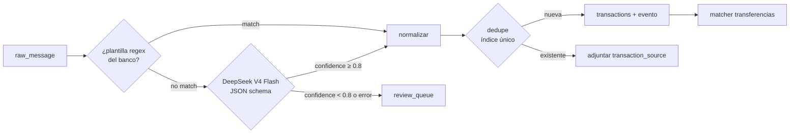

# Spec 006 — Captura y parsing

## 1. Canales de captura

| Canal | Plataforma | Latencia objetivo | Mecanismo |
|---|---|---|---|
| Correo Gmail | Ambas (server-side) | < 60 s p95 | Gmail watch → Pub/Sub → webhook |
| Notificación bancaria / Google Wallet | Android | < 10 s p95 | NotificationListenerService |
| SMS bancario | Android | < 10 s p95 | Notificación de la app de Mensajes (NO READ_SMS) |
| NFC tag | Android (+iOS foreground) | inmediato | nfc_manager → formulario rápido |
| Manual | Ambas | inmediato | formulario |

## 2. Gmail (server-side)

### 2.1 Ciclo del watch
1. Al conectar Gmail: `users.watch` con el topic Pub/Sub → guarda `history_id` inicial y `watch_expires_at` (7 días).
2. Cron diario (worker): renueva todo watch con `watch_expires_at < now()+48h`.
3. Push recibido: `history.list(startHistoryId=cursor)` → solo mensajes nuevos → avanza cursor. Si el cursor es muy viejo (404 de Gmail), resync con `messages.list` de los últimos 7 días.

### 2.2 Filtro de remitentes
Lista blanca de dominios/remitentes por banco (config versionada, `parsing/config/senders.yaml`):

```yaml
bancolombia:  [alertasynotificaciones@bancolombia.com.co, "@bancolombia.com.co"]
nequi:        ["@nequi.com.co"]
davivienda:   ["@davivienda.com"]
daviplata:    ["@daviplata.com"]
bbva:         ["@bbva.com.co"]
banco_bogota: ["@bancodebogota.com.co"]
```

Un correo cuyo `From` no matchea ningún patrón se descarta sin persistir el cuerpo (AC-2.4). El matching exacto de remitentes reales se valida con fixtures al implementar cada banco.

### 2.3 Extracción del cuerpo
- Preferir `text/plain`; si solo hay HTML, convertir a texto (strip de tags, conservar tablas como líneas).
- Truncar a 8 KB antes de persistir (los correos bancarios relevantes son cortos; evita almacenar adjuntos/branding).

## 3. Notificaciones Android (app)

### 3.1 Paquetes soportados (config remota)
La lista de paquetes se descarga del backend (`/config/capture`) para poder ampliarla sin release:

```yaml
banking_apps:
  - com.bancolombia.app          # Bancolombia
  - com.nequi.MobileApp          # Nequi
  - com.davivienda.daviviendaapp # Davivienda
  - com.daviplata.app            # DaviPlata
  - com.bbva.bbvacolombia        # BBVA CO
  - com.bancodebogota.bancamovil # Banco de Bogotá
  - com.google.android.apps.walletnfcrel  # Google Wallet
messages_apps:                    # para SMS-vía-notificación
  - com.google.android.apps.messaging
  - com.samsung.android.messaging
sms_sender_patterns:              # aplicados al título de la notificación de Mensajes
  - "^(87400|85540|891888|...)$"  # códigos cortos bancarios (se completan con fixtures)
  - "(?i)bancolombia|nequi|davivienda|bbva"
```

### 3.2 Comportamiento del listener
1. Notificación posted → ¿paquete en `banking_apps`? → capturar `title+text+bigText`.
2. ¿Paquete en `messages_apps`? → aplicar `sms_sender_patterns` al título (remitente del SMS); si no matchea, **ignorar sin leer el resto** (AC-3.3, privacidad).
3. Pre-filtro local barato: la notificación debe contener un signo de moneda/monto (`$`, `COP`, dígitos con separador de miles); si no, se ignora.
4. Encolar en Drift (`outbox`) con `client_hash = sha256(package + posted_at_bucket + text)` → batch a `/ingest/notifications` (funciona offline).
5. El texto de notificaciones ignoradas jamás se persiste ni se transmite.

## 4. Pipeline de parsing (workers)



### 4.1 Plantillas por banco
- Una plantilla = regex nombrada + post-proceso (`parsing/config/templates/<banco>.yaml`), con: patrón, campos capturados (`amount`, `merchant`, `last4`, `datetime`, `direction`), formato de fecha y reglas de normalización de monto (`$1.234.567,89` → `1234567.89`).
- Cada plantilla se versiona y referencia en `parsed_by` (`rule:bancolombia:compra_tc_v2`).
- **Regla de oro**: ninguna plantilla entra sin fixture de mensaje real anonimizado + test.

### 4.2 Fallback LLM — contrato DeepSeek

- Modelo: `deepseek-v4-flash`, API OpenAI-compatible, `response_format: json_object`, `temperature: 0`.
- El adapter implementa `LlmParserPort` (cambiar de proveedor = nuevo adapter).

**System prompt (fijo, cacheable)**: instruye extraer campos de mensajes de bancos colombianos; formato de montos colombiano; devolver `null` en campos ausentes; nunca inventar.

**Esquema de salida requerido**:

```json
{
  "is_transaction": true,
  "amount": "45900.00",
  "currency": "COP",
  "direction": "debit",
  "merchant": "RAPPI",
  "occurred_at": "2026-08-05T14:30:00-05:00",
  "bank": "bancolombia",
  "last4": "1234",
  "suggested_category": "restaurantes",
  "confidence": 0.93
}
```

**Validación post-LLM (Pydantic)**: monto > 0, fecha plausible (±7 días del recibido), banco en enum, `is_transaction=false` → descartar, JSON inválido → 1 reintento → review_queue.

**Control de costos (RNF-5)**: contador mensual de tokens por usuario en Redis; superado el presupuesto → directo a review_queue con motivo `llm_budget_exceeded`.

### 4.3 Normalización
- Comercio: uppercase → strip de sufijos de pasarela (`*`, códigos), colapso de espacios; se usa para `merchant_rules`.
- Categoría automática: 1º regla del usuario (`merchant_rules`), 2º sugerencia del parser/LLM, 3º `sin_categoria`.

### 4.4 Dedupe e idempotencia
- Idempotencia de ingesta: `UNIQUE(user_id, channel, external_id)` en `raw_messages` — el mismo push/notificación repetido no reprocesa (AC-5.2).
- Dedupe de transacciones: huella de spec 004 §3 con `ON CONFLICT DO NOTHING`; si conflicto → adjuntar `transaction_source` a la existente (AC-5.1).
- El matcher de transferencias corre tras cada inserción (spec 004 §4).

## 5. NFC (app)

- Tags NDEF con payload propio: `finanzia://quick-add?tag=<uuid>`; el uuid se asocia en la app a una plantilla (categoría + cuenta + nota por defecto).
- Android: intent-filter NDEF → abre la app directo en el formulario rápido incluso cerrada. iOS: lectura en foreground (Core NFC) desde la pantalla de registro.
- Escritura de tags: pantalla en Ajustes (Android) usando `nfc_manager`; un tag puede reescribirse.
- El formulario rápido solo pide monto (categoría/cuenta vienen del tag) → guardar offline → outbox (AC-4.2).

## 6. Métricas del pipeline (observabilidad)

Contadores por banco/canal exportados a logs estructurados: `parsed_by_rule`, `parsed_by_llm`, `sent_to_review`, `discarded`, `dedupe_hits`, `llm_cost_tokens`. Meta de salud: ≥ 80% de mensajes de bancos soportados parseados por regla (las reglas son gratis; el LLM es la red de seguridad).
