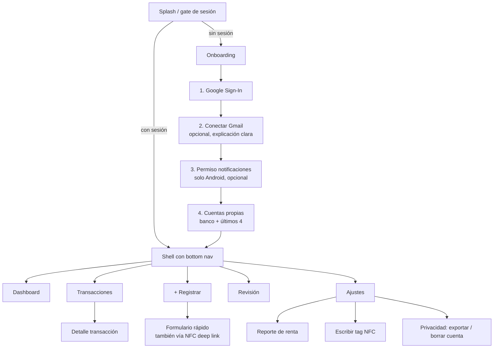

# Spec 008 — App Flutter

## 1. Estructura y stack

Arquitectura feature-first + Clean Architecture con Riverpod 3 (detalle y reglas de capas en spec 003 §3). Paquetes: `flutter_riverpod` (sin codegen, ver spec 003 §3), `freezed`/`json_serializable`, `flutter_secure_storage`, `flutter_svg`, `drift`, `dio`, `go_router`, `google_sign_in`, `nfc_manager`, `crypto` (`client_hash`), `intl` (formato COP); el listener de notificaciones es código nativo, sin plugin (§4.1).

## 2. Mapa de navegación

El shell (`HomeShell`, `StatefulShellRoute.indexedStack`) tiene las 5 pestañas fijas del diagrama con una barra inferior común. El detalle de una transacción (`/movimientos/:id`) se apila sobre el navegador raíz: se ve a pantalla completa, sin la barra, y al volver regresa a la lista. A la fecha, Inicio (F4.6), Transacciones (F4.2) y Revisión (F4.7) son reales; Registrar y Ajustes son marcadores ("Llega pronto") que completan F4.5 y F4.8. Ajustes ya adelantó el cierre de sesión y la fila de Gmail (F3.6, §3.7).

Session gate (`redirectFor` en `lib/app/router.dart`, función pura con tests). A la fecha (F3.6) el onboarding tiene solo el paso de Gmail (`/onboarding/gmail`); notificaciones y cuentas llegan en F4.4.
- Sin sesión, cualquier ruta va a `/login`; mientras se restaura la sesión, a `/splash`.
- Con sesión, al salir de `/splash` o de `/login` decide `gmailGateProvider` (feature `gmail`, capa de aplicación): si Gmail no está activo (nunca conectado, revocado o con error) y el usuario no eligió "Ahora no", va a `/onboarding/gmail`; si no, a Inicio.
- Mientras se lee el estado de Gmail la app espera en el splash en vez de abrir Inicio y luego saltar al onboarding (sin rebote). Si el "Ahora no" guardado ya se leyó de local, sigue a Inicio sin esperar el estado del backend. La espera tiene un tope de 4 s contados desde que la sesión queda autenticada (no desde la primera lectura, que puede caer mientras se restaura la sesión): con red lenta o sin red sigue a Inicio (P4), igual que si el estado falla, porque Gmail es opcional (AC-1.3). Cada sesión nueva rearma el tope. Si el estado llega después, no redirige.
- En cualquier otra ruta el gate de Gmail no redirige: sin bucles, desconectar Gmail en Ajustes no saca al usuario de ahí y el deep link a `/onboarding/gmail` funciona aunque no haya nada pendiente.
- El redirect lee la sesión y el gate en el momento (no una copia), así que justo después del login ve el gate ya en espera y no el "no preguntar" de la sesión cerrada.

## 3. Especificación por pantalla

### 3.1 Onboarding (RF-1)
- Paso Gmail: pantalla propia explicando qué se lee ("solo correos de tus bancos, nunca tu correo personal") antes del consent de Google; botón "ahora no" visible (AC-1.3). Usa autorización incremental: `google_sign_in` solicita `gmail.readonly` y envía el `serverAuthCode` a `/gmail/connect`.
  - Pantalla `/onboarding/gmail` con el lenguaje del login "Veta esmeralda" (hero esmeralda con la tarjeta "Solo alertas de tus bancos", titular Bricolage, sin oro): "Conecta tu Gmail"; **Lee** correos de alertas de tus bancos (Bancolombia, Nequi…); **Nunca lee** tu correo personal, contactos ni adjuntos; por qué: tus compras quedan registradas solas, sin duplicados. Botones "Conectar Gmail" y "Ahora no", y una nota: el permiso se quita cuando quieras desde Ajustes o desde la cuenta de Google.
  - "Conectar Gmail" abre el consentimiento y, si sale bien, lleva a Inicio. Si el backend responde 200 pero con `status` `error` o `revoked` (el watch falló, spec 005 §3), lleva a Inicio con el aviso "Conectado, pero no pudimos activar la captura; reintenta desde Ajustes." en vez de ir en silencio. "Ahora no" lo guarda y lleva a Inicio.
  - Estados: conectando (botones bloqueados, "Conectando Gmail…"); consentimiento cancelado (se queda en la página, sin aviso); sin red; rechazo del servidor (código inválido o sin refresh token: "Google no aceptó la autorización. Inténtalo de nuevo."); permiso desmarcado; Google no disponible (503); demasiados intentos (429). Con un fallo el botón dice "Reintentar". Si el estado no se pudo leer (deep link sin red), "Reintentar" vuelve a leerlo.
  - Goldens claro y oscuro en `test/features/gmail/presentation/goldens/`.
  - La autorización (`authorizeServer`) usa la misma instancia de `GoogleSignIn` que el login, inicializada una sola vez con el `serverClientId` (`core/google/google_sign_in_setup.dart`). En Android pide acceso offline con consentimiento forzado, así que cada canje trae refresh token.
  - Cancelar el consentimiento no es un error. Los tres 400 de `server_auth_code` (código inválido, sin refresh token, permiso no concedido) se distinguen por el `reason` del sobre de error (`invalid_code`, `refresh_token_missing`, `scope_not_granted`, spec 005 §1/§3); si falta o es desconocido, se cae al texto del mensaje; los dos primeros se arreglan volviendo a intentarlo.
  - "Ahora no" se guarda en `sync_state` con la clave `gmail_prompt_dismissed:<userId>`, así que restaurar la sesión no vuelve a preguntar. Cerrar sesión vacía `sync_state`, así que el "Ahora no" se pierde y la invitación reaparece en el siguiente login (decisión aceptada: es un aviso opcional y guardarlo fuera de `sync_state` no vale la complejidad).
- Paso notificaciones (Android): explica el uso (detectar pagos al instante), lista lo que se ignora; abre el ajuste del sistema de acceso a notificaciones. Detecta el estado al volver (AC-3.4).
- Paso cuentas: formulario simple banco + últimos 4 + alias, repetible; explica su uso (detectar transferencias propias).

### 3.2 Dashboard (RF-9)
Diseño A "Balance protagonista" del canvas F4.6 (https://claude.ai/artifact/2stoe8zQwaXFhUPz8h1UKy).

- **Cálculo local.** Las cifras se calculan en el teléfono con SQL agregado sobre Drift (`local_transactions` + `local_categories`, `lib/features/dashboard/data/drift_insights_repository.dart`). Por eso funcionan sin red y un cambio de categoría se ve al instante (AC-APP-3). `GET /insights/monthly` (005 §8) queda diferido.
- **Mes.** Es un mes calendario en hora de Colombia (UTC−5 fija, `ColombiaMonth`), de las 00:00 del día 1 a las 00:00 del día 1 del mes siguiente. Se elige con flechas de 48 dp y no se puede ir a meses futuros.
- **Franja esmeralda (`hero`).** Muestra el saludo, la línea provisional de sync (§5), el selector de mes y el balance del mes (ingresos − gastos, con signo). Debajo lleva dos tarjetas, Gastos (−, color gasto) e Ingresos (+, color ingreso), cada una con su delta frente al mes anterior: "↓ 9 % vs agosto" o "= igual que agosto". Si el mes anterior está en 0, dice "Sin datos de {mes}" en vez de un porcentaje.
- **"En qué se fue".** Muestra las 5 categorías con más gasto, cada una con su ícono, una barra relativa a la mayor y el % del gasto total. Los empates se ordenan por nombre. El resto se agrupa en la línea "Otras categorías $X · N %", y las 5 más "Otras" suman exactamente el gasto total. Tocar una categoría abre Movimientos filtrado por esa categoría y ese mes; el buscador de Movimientos se limpia porque el filtro se reemplaza. "Sin categoría" también se abre: el filtro por la fila `sin_categoria` incluye los movimientos con `category_id` nulo (el mismo reparto de las cifras) y Movimientos la nombra "Sin categoría" aunque no esté en la hoja de categorías.
- **Transferencias.** Las `kind = transfer` no suman en ninguna cifra (AC-6.2).
- **Estados:**
  - mes sin movimientos, con "Volver a {mes actual}" si no se está en el mes actual;
  - primera sincronización;
  - sin conexión, con el banner "Sin conexión — datos locales";
  - error de la base local, con reintento.

  Al cambiar de mes se conservan las cifras (con la comparación de su propio mes) hasta que llega el mes nuevo; mientras tanto las categorías no se abren, y si el mes nuevo falla se muestra el error, no las cifras del anterior.

### 3.3 Transacciones (RF-9)
- Lista infinita (paginada de Drift), agrupada por día; cada ítem: comercio, categoría (chip editable inline), monto con signo/color, íconos de fuente (correo/notif/SMS/manual/NFC) y badge `transfer`.
- Lista (diseño B "Tarjetas por día"): una tarjeta por día con el total de gastos; chip de categoría que abre la hoja de categorías y, si hay comercio, pregunta "¿Aplicar siempre a {comercio}?"; sello "Por enviar"/"No enviado" en la fila según el outbox. Cada movimiento rechazado agrega además, encima de las tarjetas del día (y también en su detalle), un aviso para reintentar o dejar como estaba. Estados sin filas: sin movimientos nunca ("Aún no hay movimientos", CTA "Registrar un gasto"), sin movimientos en el mes pero con historial anterior ("Sin movimientos este mes" → ver mes pasado o cambiar filtros), sin resultados de un filtro o de la búsqueda ("Quitar filtros"), error al leer la base local (reintentar) y primera sincronización (esqueleto con barra de progreso); sin conexión se avisa aparte, sobre la lista ("Sin conexión · ves tus datos guardados").
- Filtros: periodo (este mes, mes pasado, este año o rango de fechas), tipo, banco y categoría filtran en SQL sobre Drift; fuente (canal) y texto (comercio, categoría o nota, sin tildes) se aplican en el cliente sobre las filas ya traídas. Cuenta: pendiente (F4.8).
- Detalle (diseño A "Monto protagonista"): monto grande con decimales, fecha y hora; campos categoría (chip que abre la hoja y pregunta "¿aplicar siempre a este comercio?" = merchant_rule AC-7.2), cuenta, tipo y "Leído con" (`parsed_by`: `rule:<banco>:*` → "Plantilla <banco>", `llm` → "Lectura automática", `manual` → "Registro manual"). Fuentes (AC-9.3) de `GET /transactions/{id}`: una tarjeta por fuente con su canal y la hora de recepción y, con dos o más, el sello dorado "1 registro con N fuentes, sin duplicados"; sin red, un aviso de que las fuentes se consultan con conexión (se reintentan al volver la red). Par de transferencia navegable ("La otra parte"); marcar/desmarcar transfer; notas que se guardan solas (pausa al escribir, al perder el foco y al salir); aviso para reintentar o dejar como estaba un cambio rechazado.
- Eliminar (F4.5a): solo en movimientos `parsed_by=manual` (el backend responde 403 a los demás), un botón "Eliminar movimiento" de 48 dp al final del detalle pide confirmación ("¿Eliminar este movimiento? Se quita de tus movimientos y de tu reporte. No se puede deshacer."), encola `deleteTransaction` por el outbox (funciona sin red; si la creación aún no se envió, se cancela y no viaja nada), vuelve a la lista y avisa "Movimiento eliminado". Sin tombstones: otro dispositivo no se entera del borrado hasta un pull completo.

### 3.4 Registrar (RF-4)
- Formulario completo (F4.5a, diseño A "Formulario en tarjeta", el mismo `TransactionFormCard` de Revisión): monto (teclado numérico COP, único obligatorio: > $0), Gasto/Ingreso (default gasto), fecha y hora (default ahora: si no se tocan, se toma el instante de guardar), comercio, categoría (con "+ Nueva categoría", §3.7) y nota. La cuenta llega con el CRUD de cuentas (F4.8b) y el tipo transferencia se marca después en el detalle. Al guardar: aviso "Movimiento guardado" (sin red: "… Se enviará cuando haya conexión.") con "Deshacer", que lo elimina (con el id vigente: el del servidor si el sync ya canjeó el local) y avisa "Movimiento deshecho"; el formulario queda limpio. Después, se elimina desde el detalle (§3.3). Sin conexión se muestra el aviso sobre el formulario.
- **Formulario rápido (NFC)**: solo monto grande centrado + botón confirmar; categoría/cuenta del tag. Objetivo: 2 toques + monto. Abre por deep link `finanzia://quick-add?tag=<uuid>` (Android NDEF) o desde botón NFC (iOS foreground).
- Ambos guardan primero en Drift + outbox (AC-4.2).

### 3.5 Revisión (RF-8)
- Lista (`/revision`, en vivo sobre Drift, los recibidos más recientes primero): una tarjeta por mensaje con ícono del canal, banco (o el remitente si no se reconoció), fecha y hora de recepción en hora de Colombia, motivo legible y un extracto de hasta 3 líneas con los montos resaltados: sin enlaces (`[http…]` ni URLs) y empezando en la frase del primer monto, o unos 60 caracteres antes de él con "…" si la frase es más larga. Motivos: `no_template` → "No reconocimos el formato", `llm_disabled` → "Falta lectura automática", `llm_invalid_output`/`llm_low_confidence` → "La lectura no fue confiable", cualquier otro → "Necesita tu ayuda". Estados: vacío ("Nada por revisar"), error de la base local (reintentar) y, sin conexión, el mismo aviso de Movimientos sobre la lista. Badge con conteo en la bottom nav.
- Resaltado de montos: lo que lleva `$` o `COP` (antes o después) y los miles agrupados sin signo con dos grupos o más (`1.234.567`) o con centavos de dos cifras (`45.900,00`), como `looks_monetary` del backend. Los teléfonos se ignoran (se enmascaran antes de buscar montos, así un monto pegado a un teléfono sigue resaltándose): 3-3-4, 3-3-3-3 o gratuita pegada de 12 dígitos (`01[89]000` + 6), con prefijo `+57` opcional, mismo patrón que `excerpt.py`. El valor se lee con la regla de `parse_amount` del backend (con `.` y `,`, el de la derecha es el decimal; con uno solo, es decimal si aparece una vez seguido de dos cifras).
- Detalle (`/revision/:rawMessageId`, a pantalla completa sobre el navegador raíz): el texto seleccionable con los montos resaltados, recortado a 320 dp con "Ver mensaje completo" / "Ver menos" cuando es más largo (todo dentro del desplazamiento de la página); los botones de monto van en una sola fila horizontal; tocar un monto (en el texto o en su botón de 48 dp debajo, con etiqueta "Usar N pesos como monto") llena el monto del formulario. Formulario "Crear movimiento" prellenado con `partial_extract`: monto (teclado numérico, `Cop`, con puntos de miles y coma decimal), Gasto/Ingreso, fecha y hora, comercio y categoría (la hoja de categorías de Movimientos). Si no se extrajo una fecha con zona horaria, se propone la de recepción, visible y editable, con el aviso "Es la fecha en que llegó el mensaje; cámbiala si no coincide". Los errores (sin monto, sin tipo, sin fecha) se muestran en línea.
- Acciones: "Crear movimiento" y "Descartar" (con confirmación en un diálogo Material). Ambas son optimistas por el outbox (la fila sale de la lista al instante) y vuelven a la lista con un aviso ("Movimiento creado" / "Descartado"); si no se pudo encolar, se avisa y el formulario se queda.

### 3.6 Reporte de renta (RF-10)
- Selector de año gravable; verificación de topes (semáforo por criterio con valores UVT); cifras por cédula expandibles → lista de transacciones que las soportan (AC-10.4); advertencias (p. ej. intereses de vivienda); datos manuales (dependientes, patrimonio) editables aquí; botón exportar Excel (descarga/share). Disclaimer fijo (spec 007 §1).

### 3.7 Ajustes
- Perfil Google; estado de conexiones (Gmail: activo/error/desconectar; notificaciones Android: activo/inactivo → deep link al ajuste).
  - Fila "Notificaciones del banco" (F4.3, solo Android): "Activo" ofrece "Administrar", que abre el ajuste del sistema; "Inactivo" ofrece "Activar", que primero muestra una hoja de divulgación prominente (spec 010 §2: qué se lee, qué se ignora y cómo quitar el permiso) y solo con "Ir a los ajustes" abre el ajuste del sistema. El estado se vuelve a leer al volver a primer plano (AC-3.4). En iOS la fila no existe.
  - Fila "Gmail" (F3.6, AC-1.3): conectado muestra la cuenta Gmail ("Conectado · email") y ofrece "Desconectar", que pide confirmación en un diálogo Material ("¿Desconectar Gmail?": deja de leer los correos, los movimientos se quedan); revocado o con error explica que la captura se detuvo y ofrece "Reconectar"; desconectado ofrece "Conectar"; sin poder consultar el estado, "Reintentar". Mientras corre una acción se ve un indicador en lugar del botón y un fallo se avisa bajo la fila. La acción mide 48 dp o más y su etiqueta accesible dice qué hace ("Desconectar Gmail").
- Cuentas vinculadas (CRUD); categorías (CRUD de propias); escribir/gestionar tags NFC.
  - Fila "Mis categorías" (F4.8a) → `/ajustes/categorias`: las categorías propias (solo las ve su dueño, spec 005 §7) con ícono, color, etiqueta en lenguaje claro y conteo local de movimientos; editar y borrar por fila (48 dp) y "Nueva categoría". Las de finanzia se explican como no editables.
  - Hoja "Nueva categoría" / "Editar categoría" (diseño A "Hoja completa"): nombre (1–80), ícono de un set curado de 16 (6 por fila para conservar 48 dp) y color de 8 de la paleta (con ícono blanco AA), y "¿Para qué la usas?", que abre el selector de las 12 etiquetas fiscales agrupadas en gastos, aportes e ingresos, con nombre y pista en lenguaje claro (default "Gasto personal" = `no_deducible`; `transferencia` no se ofrece). Se abre también desde "+ Nueva categoría" del selector de categoría (no en el filtro), que deja elegida la nueva. Crear, editar y borrar van directo a la API (sin outbox): sin conexión se avisa "Necesitas conexión…"; nombre repetido (sin mayúsculas, propio o de finanzia) se avisa bajo el campo. Tras un éxito la copia local se actualiza al instante; editar o borrar además pide un sync para traer los movimientos que el servidor retaggeó o pasó a "Sin categoría".
  - Borrar confirma con un diálogo: "¿Borrar «X»? Sus N movimientos pasan a Sin categoría…".
  - Fila "Mis cuentas" (F4.4) → `/ajustes/cuentas`: las cuentas vinculadas (RF-6), con su alias (o el banco si no tiene) y "Banco · Tipo ···últimos 4"; editar y borrar por fila (48 dp) y "Agregar cuenta".
  - Hoja "Nueva cuenta" / "Editar cuenta" (diseño B "Lista + hoja", la misma del paso Cuentas del onboarding): banco (obligatorio, los 7 del backend), tipo (ahorros por defecto; corriente, tarjeta de crédito, billetera), últimos 4 (opcional, 1–4 dígitos) y alias (opcional, ≤ 60). El banco no se edita (el backend no lo acepta): se explica bajo el campo. Van directo a `/v1/accounts` (sin outbox); sin conexión se avisa, y una cuenta repetida (mismo banco y últimos 4, 409) se avisa bajo "últimos 4". Tras un éxito la copia local se actualiza al instante.
  - Borrar confirma: "¿Borrar «X»? Sus N movimientos quedan sin cuenta." En local se hace lo mismo que el servidor (`account_id` en NULL).
- Privacidad: política, exportar datos (RF-11.2), borrar cuenta con doble confirmación + texto de irreversibilidad (RF-11.3).

## 4. Servicios de plataforma (feature `capture`)

### 4.1 NotificationCaptureService (Android)
- `NotificationListenerService` nativo en Kotlin (`android/app/src/main/kotlin/co/finanzia/finanzia/capture/`), sin plugin; corre aunque la app esté cerrada (el sistema mantiene el listener).
- Pipeline nativo: filtro por paquete (config remota guardada por la app) → filtro SMS por patrón de remitente → pre-filtro de monto → cola SQLite nativa (spec 006 §3.2). Dart la ve por `MethodChannel("co.finanzia/capture")` como el puerto `NotificationSource`.
- Envío (`CaptureFlusher`): al entrar, al volver a primer plano, cada 15 min visible y al recuperar la red, lotes de hasta 50 a `/ingest/notifications`; con algo aceptado pide un sync a los 5 s para traer la transacción ya parseada. Sin envío en segundo plano: lo capturado con la app cerrada se envía al abrirla.
- iOS: `NoopNotificationSource`; la UI de onboarding/ajustes no muestra la sección.

### 4.2 NfcService
- Android: lectura NDEF por intent-filter (app cerrada) y en foreground; escritura de tags.
- iOS: lectura en foreground con sesión Core NFC iniciada por el usuario.

## 5. Sincronización offline (P4, contrato en spec 005 §9)

- `SyncCoordinator` (provider, single-flight: un ciclo a la vez; si llega otra petición mientras uno corre, encadena otro al terminar) dispara sync al autenticarse, al reconectar (connectivity_plus), al encolar una operación, al volver a primer plano y cada 15 min mientras la app sigue en primer plano.
- Cada ciclo va **push antes que pull**: primero drena el outbox FIFO (creaciones con `Idempotency-Key`; reglas de reintento/rechazo en spec 005 §9) para que el pull traiga el estado ya confirmado por el servidor. Pull: incremental por `updated_since` en transacciones (con 5 min de solape sobre el cursor, spec 005 §9); categorías, cuentas y revisión se traen completas cada vez → upsert en Drift.
- Ids locales: una creación offline nace con un UUID local; al confirmarse en el servidor, ese id se canjea en `local_transactions` y en `target_id`/`related_id` del outbox (spec 004 §5).
- Conflictos: gana `updated_at` más reciente, salvo que la fila tenga una edición local aún sin enviar (outbox pendiente), que siempre prevalece sobre el pull (spec 003 §3).
- Privacidad: la base local se borra por completo (incluido el outbox sin enviar, P6) solo cuando la sesión pasa de autenticada a cerrada por el propio usuario en caliente (transición `Authenticated → Unauthenticated(sessionExpired: false)`); una sesión que expira, o un arranque en frío sin sesión, la conserva. `claimFor` también la borra si el usuario que inicia sesión es distinto al que la dejó. Antes de borrar o de reclamar la base para un usuario nuevo, el coordinador espera a que termine cualquier ciclo de sync en curso, para que no se crucen escrituras tardías entre usuarios.
- Indicador de estado de sync: línea provisional en la franja del Inicio, por prioridad: "sincronizando…" / "sin conexión" / "{n} cambios no se pudieron enviar" (operaciones `rejected`) / "aún no sincronizado" (nunca hubo un ciclo completo) / "al día" o el conteo de pendientes; se traslada a Ajustes en F4.8.

## 6. Permisos y plataforma

| Permiso | Plataforma | Momento | Fallback si se niega |
|---|---|---|---|
| Google Sign-In | ambas | onboarding paso 1 | no hay app sin login |
| `gmail.readonly` (incremental) | ambas | onboarding paso 2 / Ajustes | captura manual + notificaciones |
| Acceso a notificaciones | Android | onboarding paso 3 / Ajustes | captura por Gmail + manual |
| NFC | ambas | al usar la función | registro manual normal |
| Notificaciones push propias (avisos de la app) | ambas | post-onboarding | sin recordatorios |

## 7. UX/UI

- Material 3, tema claro/oscuro del sistema; español (Colombia) único idioma MVP (arquitectura lista para i18n con `intl`; textos en `app/lib/core/l10n/arb/app_es.arb`).
- Formato de moneda: `$1.234.567` COP sin decimales en listas, con decimales en detalle. Los montos se manejan como centavos enteros (`Cop`), nunca `double`. Gasto `−$42.900` (U+2212), ingreso `+$3.500.000`, transferencia propia sin signo.
- Accesibilidad: targets ≥ 48dp, semántica en widgets custom, contraste AA.

### 7.1 Sistema de diseño "Esmeralda andina"

Canvas de referencia (logins claro/oscuro, estados, splash, sistema): https://claude.ai/artifact/ELvKWCWzSaaoVooC6dVZcZ. Se eligió la composición de login **A "Veta esmeralda"**. Los tokens viven en `app/lib/core/theme/` (`ColorScheme` explícito, sin `fromSeed`, más la extensión `FinanziaColors`).

Canvas F4.2 (lista "Tarjetas por día", detalle "Monto protagonista", filtros, hoja de categorías y estados de movimientos): https://claude.ai/artifact/FzyJNLUve7BckevVDnsnM5.

| Rol | Claro | Oscuro | Uso |
|---|---|---|---|
| primary (esmeralda) | `#0E4D3F` | `#7FD1B4` | botones, enlaces, marca |
| primaryContainer | `#CDE8DC` | `#0E4D3F` | chip activo, botón tonal |
| oro de marca | `#C9A227` | `#C9A227` | **solo** registro confirmado y relevancia fiscal; relleno o texto ≥ 24 px |
| surface | `#EEF5F1` | `#0C1512` | fondo |
| onSurface | `#10201B` | `#DCE7E1` | texto |
| expense | `#B4432B` | `#FF9A80` | montos de salida |
| income | `#17774E` | `#7BD8A6` | montos de entrada |
| transfer | `#45617A` | `#9DB8D3` | entre cuentas propias |

- Todo par texto/fondo cumple ≥ 4.5:1 y los bordes ≥ 3:1 (verificado al definir la paleta).
- Tipografía empaquetada en `assets/fonts` (sin descarga en runtime, P4; licencias OFL registradas en `LicenseRegistry`): Bricolage Grotesque para display (marca, titulares, saldos), Manrope para texto, IBM Plex Mono tabular para montos y Roboto Medium solo en el botón de Google.
- Espaciado de base 4. Radios: 8 chips, 12 filas, 16 avisos, 24 tarjetas y píldora en botones.
- Los bancos se nombran solo en texto, nunca con sus colores de marca.
- **Login** (F1.9): bloque hero esmeralda con el "ticker de captura" (una notificación y un correo de la misma compra se funden en **1 registro**; queda quieto con "reducir movimiento"), titular y botón "Continuar con Google" con la guía de marca de Google. Estados: cargando (botón bloqueado), sin conexión (reintentar), cancelado (sin aviso), 429 (cuenta regresiva con `Retry-After`) y sesión cerrada por seguridad.

### 7.2 Configuración de compilación (`--dart-define`)

| Variable | Default | Uso |
|---|---|---|
| `API_BASE_URL` | `http://localhost:8000` | base de la API; con `adb reverse tcp:8000 tcp:8000` llega al backend local desde teléfono o emulador |
| `GOOGLE_SERVER_CLIENT_ID` | client ID web del proyecto de desarrollo `finanzia-509500` | audiencia del `id_token`; otros entornos lo sobrescriben |

## 8. Criterios de aceptación específicos de la app

- **AC-APP-1** La app abre y muestra transacciones locales en modo avión; registrar manual funciona y sincroniza al reconectar (test E2E).
- **AC-APP-2** Matar la app en Android no detiene la captura de notificaciones (el listener del sistema persiste).
- **AC-APP-3** Cambio de categoría refleja en dashboard y reporte fiscal local sin esperar al servidor (optimistic update + reconciliación).
- **AC-APP-4** `flutter analyze` sin warnings; `flutter test` verde en CI para dominio y controllers de cada feature.
