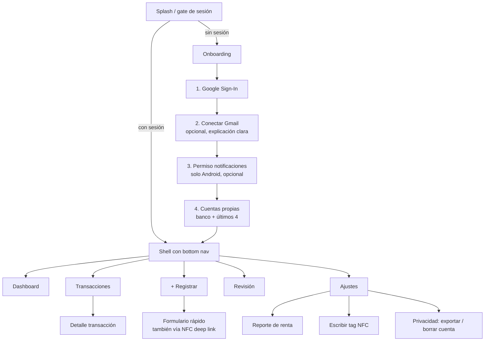

# Spec 008 — App Flutter

## 1. Estructura y stack

Arquitectura feature-first + Clean Architecture con Riverpod 3 (detalle y reglas de capas en spec 003 §3). Paquetes: `flutter_riverpod` (sin codegen, ver spec 003 §3), `freezed`/`json_serializable`, `flutter_secure_storage`, `flutter_svg`, `drift`, `dio`, `go_router`, `google_sign_in`, `nfc_manager`, `notification_listener_service`, `fl_chart` (dashboard), `intl` (formato COP).

## 2. Mapa de navegación

El shell (`HomeShell`, `StatefulShellRoute.indexedStack`) tiene las 5 pestañas fijas del diagrama con una barra inferior común. El detalle de una transacción (`/movimientos/:id`) se apila sobre el navegador raíz: se ve a pantalla completa, sin la barra, y al volver regresa a la lista. A la fecha (F4.2) solo Transacciones es real; Dashboard, Registrar, Revisión y Ajustes son marcadores ("Llega pronto") que completan F4.5–F4.8 (Registrar en F4.5). Ajustes ya adelantó el cierre de sesión, que antes vivía en el placeholder del dashboard.

## 3. Especificación por pantalla

### 3.1 Onboarding (RF-1)
- Paso Gmail: pantalla propia explicando qué se lee ("solo correos de tus bancos, nunca tu correo personal") antes del consent de Google; botón "ahora no" visible (AC-1.3). Usa autorización incremental: `google_sign_in` solicita `gmail.readonly` y envía el `serverAuthCode` a `/gmail/connect`.
  - La autorización (`authorizeServer`) usa la misma instancia de `GoogleSignIn` que el login, inicializada una sola vez con el `serverClientId` (`core/google/google_sign_in_setup.dart`). En Android pide acceso offline con consentimiento forzado, así que cada canje trae refresh token.
  - Cancelar el consentimiento no es un error. Los tres 400 de `server_auth_code` (código inválido, sin refresh token, permiso no concedido) se distinguen por el mensaje del backend; los dos primeros se arreglan volviendo a intentarlo.
  - "Ahora no" se guarda en `sync_state` con la clave `gmail_prompt_dismissed:<userId>`, así que restaurar la sesión no vuelve a preguntar. Cerrar sesión vacía `sync_state` y la invitación reaparece en el siguiente login.
- Paso notificaciones (Android): explica el uso (detectar pagos al instante), lista lo que se ignora; abre el ajuste del sistema de acceso a notificaciones. Detecta el estado al volver (AC-3.4).
- Paso cuentas: formulario simple banco + últimos 4 + alias, repetible; explica su uso (detectar transferencias propias).

### 3.2 Dashboard (RF-9)
- Mes seleccionable; tarjetas: gastos, ingresos, balance; gráfico de top 5 categorías; delta vs mes anterior. Excluye transfers. Datos de `insights` con caché local; estado offline visible (banner discreto "sin conexión — datos locales").

### 3.3 Transacciones (RF-9)
- Lista infinita (paginada de Drift), agrupada por día; cada ítem: comercio, categoría (chip editable inline), monto con signo/color, íconos de fuente (correo/notif/SMS/manual/NFC) y badge `transfer`.
- Lista (diseño B "Tarjetas por día"): una tarjeta por día con el total de gastos; chip de categoría que abre la hoja de categorías y, si hay comercio, pregunta "¿Aplicar siempre a {comercio}?"; sello "Por enviar"/"No enviado" en la fila según el outbox. Cada movimiento rechazado agrega además, encima de las tarjetas del día (y también en su detalle), un aviso para reintentar o dejar como estaba. Estados sin filas: sin movimientos nunca ("Aún no hay movimientos", CTA "Registrar un gasto"), sin movimientos en el mes pero con historial anterior ("Sin movimientos este mes" → ver mes pasado o cambiar filtros), sin resultados de un filtro o de la búsqueda ("Quitar filtros"), error al leer la base local (reintentar) y primera sincronización (esqueleto con barra de progreso); sin conexión se avisa aparte, sobre la lista ("Sin conexión · ves tus datos guardados").
- Filtros: periodo (este mes, mes pasado, este año o rango de fechas), tipo, banco y categoría filtran en SQL sobre Drift; fuente (canal) y texto (comercio, categoría o nota, sin tildes) se aplican en el cliente sobre las filas ya traídas. Cuenta: pendiente (F4.8).
- Detalle (diseño A "Monto protagonista"): monto grande con decimales, fecha y hora; campos categoría (chip que abre la hoja y pregunta "¿aplicar siempre a este comercio?" = merchant_rule AC-7.2), cuenta, tipo y "Leído con" (`parsed_by`: `rule:<banco>:*` → "Plantilla <banco>", `llm` → "Lectura automática", `manual` → "Registro manual"). Fuentes (AC-9.3) de `GET /transactions/{id}`: una tarjeta por fuente con su canal y la hora de recepción y, con dos o más, el sello dorado "1 registro con N fuentes, sin duplicados"; sin red, un aviso de que las fuentes se consultan con conexión (se reintentan al volver la red). Par de transferencia navegable ("La otra parte"); marcar/desmarcar transfer; notas que se guardan solas (pausa al escribir, al perder el foco y al salir); aviso para reintentar o dejar como estaba un cambio rechazado.

### 3.4 Registrar (RF-4)
- Formulario completo: monto (teclado numérico COP), dirección, fecha (default hoy), comercio, categoría, cuenta, nota.
- **Formulario rápido (NFC)**: solo monto grande centrado + botón confirmar; categoría/cuenta del tag. Objetivo: 2 toques + monto. Abre por deep link `finanzia://quick-add?tag=<uuid>` (Android NDEF) o desde botón NFC (iOS foreground).
- Ambos guardan primero en Drift + outbox (AC-4.2).

### 3.5 Revisión (RF-8)
- Lista de mensajes fallidos: texto fuente resaltando montos detectados, `partial_extract` prellenado.
- Acciones: "crear transacción" (abre formulario prellenado) / "descartar". Badge con conteo en la bottom nav.

### 3.6 Reporte de renta (RF-10)
- Selector de año gravable; verificación de topes (semáforo por criterio con valores UVT); cifras por cédula expandibles → lista de transacciones que las soportan (AC-10.4); advertencias (p. ej. intereses de vivienda); datos manuales (dependientes, patrimonio) editables aquí; botón exportar Excel (descarga/share). Disclaimer fijo (spec 007 §1).

### 3.7 Ajustes
- Perfil Google; estado de conexiones (Gmail: activo/error/desconectar; notificaciones Android: activo/inactivo → deep link al ajuste).
- Cuentas vinculadas (CRUD); categorías (CRUD de propias); escribir/gestionar tags NFC.
- Privacidad: política, exportar datos (RF-11.2), borrar cuenta con doble confirmación + texto de irreversibilidad (RF-11.3).

## 4. Servicios de plataforma (feature `capture`)

### 4.1 NotificationCaptureService (Android)
- Implementación con `notification_listener_service`; corre aunque la app esté cerrada (el sistema mantiene el listener).
- Pipeline local: filtro por paquete (config remota cacheada) → filtro SMS por patrón de remitente → pre-filtro de monto → persistir en Drift outbox → flush batch a `/ingest/notifications` (inmediato con red; si no, al reconectar).
- iOS: implementación no-op; la UI de onboarding/ajustes no muestra la sección.

### 4.2 NfcService
- Android: lectura NDEF por intent-filter (app cerrada) y en foreground; escritura de tags.
- iOS: lectura en foreground con sesión Core NFC iniciada por el usuario.

## 5. Sincronización offline (P4, contrato en spec 005 §9)

- `SyncCoordinator` (provider, single-flight: un ciclo a la vez; si llega otra petición mientras uno corre, encadena otro al terminar) dispara sync al autenticarse, al reconectar (connectivity_plus), al encolar una operación, al volver a primer plano y cada 15 min mientras la app sigue en primer plano.
- Cada ciclo va **push antes que pull**: primero drena el outbox FIFO (creaciones con `Idempotency-Key`; reglas de reintento/rechazo en spec 005 §9) para que el pull traiga el estado ya confirmado por el servidor. Pull: incremental por `updated_since` en transacciones (con 5 min de solape sobre el cursor, spec 005 §9); categorías, cuentas y revisión se traen completas cada vez → upsert en Drift.
- Ids locales: una creación offline nace con un UUID local; al confirmarse en el servidor, ese id se canjea en `local_transactions` y en `target_id`/`related_id` del outbox (spec 004 §5).
- Conflictos: gana `updated_at` más reciente, salvo que la fila tenga una edición local aún sin enviar (outbox pendiente), que siempre prevalece sobre el pull (spec 003 §3).
- Privacidad: la base local se borra por completo (incluido el outbox sin enviar, P6) solo cuando la sesión pasa de autenticada a cerrada por el propio usuario en caliente (transición `Authenticated → Unauthenticated(sessionExpired: false)`); una sesión que expira, o un arranque en frío sin sesión, la conserva. `claimFor` también la borra si el usuario que inicia sesión es distinto al que la dejó. Antes de borrar o de reclamar la base para un usuario nuevo, el coordinador espera a que termine cualquier ciclo de sync en curso, para que no se crucen escrituras tardías entre usuarios.
- Indicador de estado de sync: línea provisional en el placeholder del dashboard, por prioridad: "sincronizando…" / "sin conexión" / "{n} cambios no se pudieron enviar" (operaciones `rejected`) / "aún no sincronizado" (nunca hubo un ciclo completo) / "al día" o el conteo de pendientes; se traslada a Ajustes en F4.8.

## 6. Permisos y plataforma

| Permiso | Plataforma | Momento | Fallback si se niega |
|---|---|---|---|
| Google Sign-In | ambas | onboarding paso 1 | no hay app sin login |
| `gmail.readonly` (incremental) | ambas | onboarding paso 2 / Ajustes | captura manual + notificaciones |
| Acceso a notificaciones | Android | onboarding paso 3 / Ajustes | captura por Gmail + manual |
| NFC | ambas | al usar la función | registro manual normal |
| Notificaciones push propias (avisos de la app) | ambas | post-onboarding | sin recordatorios |

## 7. UX/UI

- Material 3, tema claro/oscuro del sistema; español (Colombia) único idioma MVP (arquitectura lista para i18n con `intl`; textos en `app/lib/core/l10n/arb/app_es.arb`).
- Formato de moneda: `$1.234.567` COP sin decimales en listas, con decimales en detalle. Los montos se manejan como centavos enteros (`Cop`), nunca `double`. Gasto `−$42.900` (U+2212), ingreso `+$3.500.000`, transferencia propia sin signo.
- Accesibilidad: targets ≥ 48dp, semántica en widgets custom, contraste AA.

### 7.1 Sistema de diseño "Esmeralda andina"

Canvas de referencia (logins claro/oscuro, estados, splash, sistema): https://claude.ai/artifact/ELvKWCWzSaaoVooC6dVZcZ. Se eligió la composición de login **A "Veta esmeralda"**. Los tokens viven en `app/lib/core/theme/` (`ColorScheme` explícito, sin `fromSeed`, más la extensión `FinanziaColors`).

Canvas F4.2 (lista "Tarjetas por día", detalle "Monto protagonista", filtros, hoja de categorías y estados de movimientos): https://claude.ai/artifact/FzyJNLUve7BckevVDnsnM5.

| Rol | Claro | Oscuro | Uso |
|---|---|---|---|
| primary (esmeralda) | `#0E4D3F` | `#7FD1B4` | botones, enlaces, marca |
| primaryContainer | `#CDE8DC` | `#0E4D3F` | chip activo, botón tonal |
| oro de marca | `#C9A227` | `#C9A227` | **solo** registro confirmado y relevancia fiscal; relleno o texto ≥ 24 px |
| surface | `#EEF5F1` | `#0C1512` | fondo |
| onSurface | `#10201B` | `#DCE7E1` | texto |
| expense | `#B4432B` | `#FF9A80` | montos de salida |
| income | `#17774E` | `#7BD8A6` | montos de entrada |
| transfer | `#45617A` | `#9DB8D3` | entre cuentas propias |

- Todo par texto/fondo cumple ≥ 4.5:1 y los bordes ≥ 3:1 (verificado al definir la paleta).
- Tipografía empaquetada en `assets/fonts` (sin descarga en runtime, P4; licencias OFL registradas en `LicenseRegistry`): Bricolage Grotesque para display (marca, titulares, saldos), Manrope para texto, IBM Plex Mono tabular para montos y Roboto Medium solo en el botón de Google.
- Espaciado de base 4. Radios: 8 chips, 12 filas, 16 avisos, 24 tarjetas y píldora en botones.
- Los bancos se nombran solo en texto, nunca con sus colores de marca.
- **Login** (F1.9): bloque hero esmeralda con el "ticker de captura" (una notificación y un correo de la misma compra se funden en **1 registro**; queda quieto con "reducir movimiento"), titular y botón "Continuar con Google" con la guía de marca de Google. Estados: cargando (botón bloqueado), sin conexión (reintentar), cancelado (sin aviso), 429 (cuenta regresiva con `Retry-After`) y sesión cerrada por seguridad.

### 7.2 Configuración de compilación (`--dart-define`)

| Variable | Default | Uso |
|---|---|---|
| `API_BASE_URL` | `http://localhost:8000` | base de la API; con `adb reverse tcp:8000 tcp:8000` llega al backend local desde teléfono o emulador |
| `GOOGLE_SERVER_CLIENT_ID` | client ID web del proyecto de desarrollo `finanzia-509500` | audiencia del `id_token`; otros entornos lo sobrescriben |

## 8. Criterios de aceptación específicos de la app

- **AC-APP-1** La app abre y muestra transacciones locales en modo avión; registrar manual funciona y sincroniza al reconectar (test E2E).
- **AC-APP-2** Matar la app en Android no detiene la captura de notificaciones (el listener del sistema persiste).
- **AC-APP-3** Cambio de categoría refleja en dashboard y reporte fiscal local sin esperar al servidor (optimistic update + reconciliación).
- **AC-APP-4** `flutter analyze` sin warnings; `flutter test` verde en CI para dominio y controllers de cada feature.
