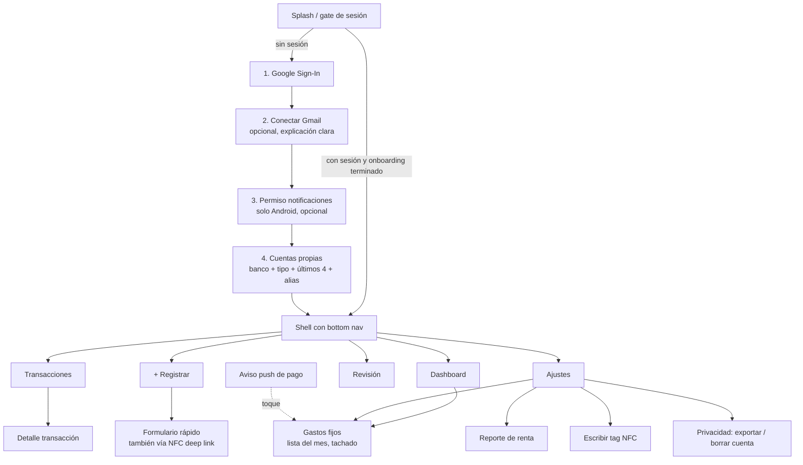

# Spec 008 — App Flutter

## 1. Estructura y stack

Arquitectura feature-first + Clean Architecture con Riverpod 3 (detalle y reglas de capas en spec 003 §3). Paquetes: `flutter_riverpod` (sin codegen, ver spec 003 §3), `freezed`/`json_serializable`, `flutter_secure_storage`, `flutter_svg`, `drift`, `dio`, `go_router`, `google_sign_in`, `nfc_manager`, `crypto` (`client_hash`), `intl` (formato COP), `firebase_core` + `firebase_messaging` (recordatorios de gastos fijos, §4.3); el listener de notificaciones es código nativo, sin plugin (§4.1).

## 2. Mapa de navegación

El shell (`HomeShell`, `StatefulShellRoute.indexedStack`) tiene las 5 pestañas fijas del diagrama con una barra inferior común. El detalle de una transacción (`/movimientos/:id`) se apila sobre el navegador raíz: se ve a pantalla completa, sin la barra, y al volver regresa a la lista. A la fecha, Inicio (F4.6), Transacciones (F4.2), Registrar (F4.5a) y Revisión (F4.7) son reales. Ajustes tiene Gmail, notificaciones, Mis categorías, Mis cuentas y el cierre de sesión (§3.7); el resto llega en F4.8b.

Session gate (`redirectFor` en `lib/app/router.dart`, función pura con tests). El onboarding (F4.4) son tres pantallas fuera del shell: `/onboarding/gmail`, `/onboarding/notificaciones` (solo Android) y `/onboarding/cuentas`.
- Sin sesión, cualquier ruta va a `/login`; mientras se restaura la sesión, a `/splash`.
- Con sesión, al salir de `/splash` o de `/login` decide `onboardingGateProvider` (feature `onboarding`, capa de aplicación). Si el usuario ya terminó el onboarding, va a Inicio. Si no, va al primer paso sin resolver: se salta Gmail si ya está activo y notificaciones si ya hay acceso o la plataforma no lo tiene (iOS). Cuentas siempre se muestra, con las que haya, y cierra el onboarding.
- La marca "terminado" es local: `onboarding_done:<userId>` en `sync_state`. Se guarda al tocar "Listo" o "Ahora no" en Cuentas; el "Ahora no" de los otros pasos solo avanza. Restaurar la sesión la conserva, así que quien ya lo terminó abre Inicio sin esperar la red. Cerrar sesión vacía `sync_state` y el onboarding vuelve a salir en el siguiente login, con los pasos resueltos saltados (decisión aceptada).
- Sin la marca, la app espera en el splash el estado de Gmail y el acceso a notificaciones, en vez de abrir Inicio y luego saltar al onboarding (sin rebote). La espera tiene un tope de 4 s contados desde que la sesión queda autenticada (no desde la primera lectura, que puede caer mientras se restaura la sesión). Con red lenta, sin red o si el estado falla, empieza en Gmail, cuya pantalla ofrece reintentar (P4). Cada sesión nueva rearma el tope. Si el estado llega después, no redirige: la pantalla de Gmail con Gmail ya activo solo ofrece "Continuar".
- En cualquier otra ruta el gate no redirige: sin bucles, avanzar de paso o desconectar Gmail en Ajustes no saca al usuario de donde está, y el deep link a un paso funciona aunque no haya nada pendiente.
- El redirect lee la sesión y el gate en el momento (no una copia), así que justo después del login ve el gate ya en espera y no el "terminado" de la sesión cerrada.

## 3. Especificación por pantalla

### 3.1 Onboarding (RF-1)
- Paso Gmail: pantalla propia explicando qué se lee ("solo correos de tus bancos, nunca tu correo personal") antes del consent de Google; botón "ahora no" visible (AC-1.3). Usa autorización incremental: `google_sign_in` solicita `gmail.readonly` y envía el `serverAuthCode` a `/gmail/connect`. En iOS el plugin toma los client IDs de `Info.plist` (`GIDClientID` y `GIDServerClientID`, desde `ios/Flutter/GoogleSignIn.xcconfig`) e ignora el `serverClientId` de Dart: sin `GIDServerClientID` no hay `serverAuthCode`. Los errores inesperados o de configuración muestran un código de soporte estable (`GmailErrorCode`), nunca texto de la plataforma ni datos de la cuenta.
  - Pantalla `/onboarding/gmail` con el lenguaje del login "Veta esmeralda" (hero café con la tarjeta "Solo alertas de tus bancos", titular Bricolage, sin amarillo): "Conecta tu Gmail"; **Lee** correos de alertas de tus bancos (Bancolombia, Nequi…); **Nunca lee** tu correo personal, contactos ni adjuntos; por qué: tus compras quedan registradas solas, sin duplicados. Botones "Conectar Gmail" y "Ahora no", y una nota: el permiso se quita cuando quieras desde Ajustes o desde la cuenta de Google.
  - Progreso (F4.4, diseño B "Puntos" del canvas https://claude.ai/artifact/D1V77pmeXXz4j7qQfoG379): un punto por paso de la plataforma y el actual más largo, en el hero junto a la marca; se lee "Paso n de m".
  - "Conectar Gmail" abre el consentimiento y, si sale bien, sigue al próximo paso. Si el backend responde 200 pero con `status` `error` o `revoked` (el watch falló, spec 005 §3), sigue con el aviso "Conectado, pero no pudimos activar la captura; reintenta desde Ajustes." en vez de ir en silencio. "Ahora no" sigue al próximo paso sin guardar nada. Con Gmail ya activo (deep link o estado que llegó tarde) la pantalla solo ofrece "Continuar".
  - Estados: conectando (botones bloqueados, "Conectando Gmail…"); consentimiento cancelado (se queda en la página, sin aviso); sin red; rechazo del servidor (código inválido o sin refresh token: "Google no aceptó la autorización. Inténtalo de nuevo."); permiso desmarcado; Google no disponible (503); demasiados intentos (429). Con un fallo el botón dice "Reintentar". Si el estado no se pudo leer (deep link sin red), "Reintentar" vuelve a leerlo.
  - Goldens claro y oscuro en `test/features/gmail/presentation/goldens/`.
  - La autorización (`authorizeServer`) usa la misma instancia de `GoogleSignIn` que el login, inicializada una sola vez con el `serverClientId` (`core/google/google_sign_in_setup.dart`). En Android pide acceso offline con consentimiento forzado, así que cada canje trae refresh token.
  - Cancelar el consentimiento no es un error. Los tres 400 de `server_auth_code` (código inválido, sin refresh token, permiso no concedido) se distinguen por el `reason` del sobre de error (`invalid_code`, `refresh_token_missing`, `scope_not_granted`, spec 005 §1/§3); si falta o es desconocido, se cae al texto del mensaje; los dos primeros se arreglan volviendo a intentarlo.
- Paso notificaciones (Android, `/onboarding/notificaciones`, diseño A "Hero como Gmail"): hero café con la marca, el progreso y un ejemplo (la notificación de una compra de Bancolombia que queda "Registrado en Mercado"); "Registra tus pagos al instante"; **Lee** solo las apps de tus bancos y los SMS que envían tus bancos; **Ignora** chats, correos y SMS de personas, que no se guardan ni salen del teléfono. "Activar acceso" abre el ajuste del sistema; la pantalla misma es la divulgación destacada previa (spec 010 §2). Al volver a primer plano el acceso se vuelve a consultar (AC-3.4): concedido, muestra "Acceso activado. Ya capturamos tus pagos." y "Continuar". "Ahora no" sigue a Cuentas.
- Paso Apple Pay (iOS, `/onboarding/apple-pay`, F4.3b, diseño A "Guía paso a paso" del canvas https://claude.ai/artifact/WzR2MPpbs6czQaGfz2kpMM), en lugar del de notificaciones: hero café con la marca, el progreso, "Registra tus pagos con Apple Pay" y por qué (iPhone no deja leer notificaciones). Tres pasos numerados: abrir Atajos → Automatización → + → Transacción; elegir las tarjetas y "Ejecutar inmediatamente"; agregar la acción "Registrar pago en luka" con Comerciante, Monto y Tarjeta. Un aviso pide escribir en Tarjeta el banco y los últimos 4 ("Bancolombia 1234") para que no se duplique con el correo, y otro explica que los pagos se envían al abrir la app. "Abrir Atajos" abre la app (si no abre, lo avisa) y "Continuar" sigue a Cuentas. Se muestra siempre en iOS: no hay forma de saber si la automatización existe.
- Paso cuentas (`/onboarding/cuentas`, diseño B "Lista + hoja"): "¿Qué cuentas tienes?" con un ejemplo de por qué (Bancolombia ···1234 → Nequi ···9876: $500.000 es una transferencia propia, no un gasto ni un ingreso), la lista de las agregadas (editar por fila) y "Agregar cuenta", que abre la misma hoja de Mis cuentas (§3.7): banco, tipo, últimos 4 y alias, repetible. Con al menos una cuenta el botón es "Listo"; sin cuentas, "Ahora no". Ambos terminan el onboarding y llevan a Inicio.

### 3.2 Dashboard (RF-9)
Diseño A "Balance protagonista" del canvas F4.6 (https://claude.ai/artifact/2stoe8zQwaXFhUPz8h1UKy).

- **Cálculo local.** Las cifras se calculan en el teléfono con SQL agregado sobre Drift (`local_transactions` + `local_categories`, `lib/features/dashboard/data/drift_insights_repository.dart`). Por eso funcionan sin red y un cambio de categoría se ve al instante (AC-APP-3). `GET /insights/monthly` (005 §8) queda diferido.
- **Mes.** Es un mes calendario en hora de Colombia (UTC−5 fija, `ColombiaMonth`), de las 00:00 del día 1 a las 00:00 del día 1 del mes siguiente. Se elige con flechas de 48 dp y no se puede ir a meses futuros.
- **Franja café (`hero`).** Muestra el saludo, la línea provisional de sync (§5), el selector de mes y el balance del mes (ingresos − gastos, con signo). Debajo lleva dos tarjetas, Gastos (−, color gasto) e Ingresos (+, color ingreso), cada una con su delta frente al mes anterior: "↓ 9 % vs agosto" o "= igual que agosto". Si el mes anterior está en 0, dice "Sin datos de {mes}" en vez de un porcentaje.
- **Captura detenida (AC-3.4, F4.4, diseño B "Franja dentro del hero").** Si la captura automática se detuvo, el hero termina con una franja ámbar tocable de 48 dp: "Captura detenida · Reactivar ›" cuando se perdió el acceso a notificaciones que estaba concedido, o "Gmail se desconectó · Reconectar ›" cuando Gmail quedó `revoked`; si pasan las dos, se muestra Gmail. Tocarla hace la acción: "Reactivar" pasa por la divulgación y abre el ajuste del sistema; "Reconectar" abre el consentimiento de Google (si falla: "No pudimos reconectar Gmail. Inténtalo desde Ajustes."). No se descarta: desaparece sola cuando se arregla. `error` de Gmail no avisa porque el backend lo reintenta solo (spec 005 §3). "Estaba concedido" es una marca local (`capture_was_granted:<userId>` en `sync_state`), así que a quien nunca activó el acceso no se le dice que "se detuvo". Mientras el Inicio está vivo, el estado de Gmail se relee al volver a primer plano, como mucho cada 15 min; el acceso a notificaciones se relee en cada vuelta.
- **"En qué se fue".** Muestra las 5 categorías con más gasto, cada una con su ícono, una barra relativa a la mayor y el % del gasto total. Los empates se ordenan por nombre. El resto se agrupa en la línea "Otras categorías $X · N %", y las 5 más "Otras" suman exactamente el gasto total. Tocar una categoría abre Movimientos filtrado por esa categoría y ese mes; el buscador de Movimientos se limpia porque el filtro se reemplaza. "Sin categoría" también se abre: el filtro por la fila `sin_categoria` incluye los movimientos con `category_id` nulo (el mismo reparto de las cifras) y Movimientos la nombra "Sin categoría" aunque no esté en la hoja de categorías.
- **Transferencias.** Las `kind = transfer` no suman en ninguna cifra (AC-6.2).
- **"Próximos pagos" (RF-12, F7.6).** Debajo de "En qué se fue", una tarjeta con las ocurrencias del mes elegido (`local_recurring_occurrences`), ordenadas por vencimiento, con los estados de spec 011 §2: las pagadas van **tachadas** (nombre y monto con `TextDecoration.lineThrough` en `onSurfaceVariant`, que conserva el contraste AA) con un check y "Pagado el 22 oct"; las pendientes muestran "Vence el 22" o el aviso ámbar. Encabezado "Próximos pagos · 2 de 5 pagados". Muestra hasta 5 y "Ver todos" abre `/gastos-fijos`. Sin gastos fijos, la tarjeta es una invitación: "¿Pagas algo cada mes? Regístralo y te avisamos antes." con "Agregar gasto fijo". No suma en el balance (AC-12.8).
- **Estados:**
  - mes sin movimientos, con "Volver a {mes actual}" si no se está en el mes actual;
  - primera sincronización;
  - sin conexión, con el banner "Sin conexión — datos locales";
  - error de la base local, con reintento.

  Al cambiar de mes se conservan las cifras (con la comparación de su propio mes) hasta que llega el mes nuevo; mientras tanto las categorías no se abren, y si el mes nuevo falla se muestra el error, no las cifras del anterior.

### 3.3 Transacciones (RF-9)
- Lista infinita (paginada de Drift), agrupada por día; cada ítem: comercio, categoría (chip editable inline), monto con signo/color, íconos de fuente (correo/notif/SMS/manual/NFC) y badge `transfer`.
- Lista (diseño B "Tarjetas por día"): una tarjeta por día con el total de gastos; chip de categoría que abre la hoja de categorías y, si hay comercio, pregunta "¿Aplicar siempre a {comercio}?"; sello "Por enviar"/"No enviado" en la fila según el outbox. Cada movimiento rechazado agrega además, encima de las tarjetas del día (y también en su detalle), un aviso para reintentar o dejar como estaba. Estados sin filas: sin movimientos nunca ("Aún no hay movimientos", CTA "Registrar un gasto"), sin movimientos en el mes pero con historial anterior ("Sin movimientos este mes" → ver mes pasado o cambiar filtros), sin resultados de un filtro o de la búsqueda ("Quitar filtros"), error al leer la base local (reintentar) y primera sincronización (esqueleto con barra de progreso); sin conexión se avisa aparte, sobre la lista ("Sin conexión · ves tus datos guardados").
- Filtros: periodo (este mes, mes pasado, este año o rango de fechas), tipo, banco y categoría filtran en SQL sobre Drift; fuente (canal) y texto (comercio, categoría o nota, sin tildes) se aplican en el cliente sobre las filas ya traídas. Cuenta (F4.8b): un chip por cuenta vinculada, con su alias o el banco, filtra en SQL por `account_id`; el grupo solo aparece si hay cuentas.
- Detalle (diseño A "Monto protagonista"): monto grande con decimales, fecha y hora; campos categoría (chip que abre la hoja y pregunta "¿aplicar siempre a este comercio?" = merchant_rule AC-7.2), cuenta, tipo y "Leído con" (`parsed_by`: `rule:<banco>:*` → "Plantilla <banco>", `llm` → "Lectura automática", `manual` → "Registro manual"). Fuentes (AC-9.3) de `GET /transactions/{id}`: una tarjeta por fuente con su canal y la hora de recepción y, con dos o más, el sello dorado "1 registro con N fuentes, sin duplicados"; sin red, un aviso de que las fuentes se consultan con conexión (se reintentan al volver la red). Par de transferencia navegable ("La otra parte"); marcar/desmarcar transfer; notas que se guardan solas (pausa al escribir, al perder el foco y al salir); aviso para reintentar o dejar como estaba un cambio rechazado.
- Eliminar (F4.5a): solo en movimientos `parsed_by=manual` (el backend responde 403 a los demás), un botón "Eliminar movimiento" de 48 dp al final del detalle pide confirmación ("¿Eliminar este movimiento? Se quita de tus movimientos y de tu reporte. No se puede deshacer."), encola `deleteTransaction` por el outbox (funciona sin red; si la creación aún no se envió, se cancela y no viaja nada), vuelve a la lista y avisa "Movimiento eliminado". Sin tombstones: otro dispositivo no se entera del borrado hasta un pull completo.

### 3.4 Registrar (RF-4)
- Formulario completo (F4.5a, diseño A "Formulario en tarjeta", el mismo `TransactionFormCard` de Revisión): monto (teclado numérico COP, único obligatorio: > $0), Gasto/Ingreso (default gasto), fecha y hora (default ahora: si no se tocan, se toma el instante de guardar), comercio, categoría (con "+ Nueva categoría", §3.7) y nota. La fila opcional "Cuenta" (F4.8b, diseño A "Fila + hoja") abre "¿De qué cuenta?": las cuentas vinculadas, "Sin cuenta" y "+ Agregar cuenta", que crea una y la deja elegida. La cuenta viaja en `account_id`, y la fila local optimista toma el banco de la cuenta, como el servidor. El tipo transferencia se marca después en el detalle. Al guardar: aviso "Movimiento guardado" (sin red: "… Se enviará cuando haya conexión.") con "Deshacer", que lo elimina (con el id vigente: el del servidor si el sync ya canjeó el local) y avisa "Movimiento deshecho"; el formulario queda limpio. Después, se elimina desde el detalle (§3.3). Sin conexión se muestra el aviso sobre el formulario.
- **Formulario rápido (NFC)** (F4.5b, diseño B "Hoja sobre la app", canvas https://claude.ai/artifact/WzR2MPpbs6czQaGfz2kpMM): ruta `/rapido?tag=<uuid>` en el navegador raíz, como hoja sobre la pantalla que había (página transparente). Encabezado con el nombre de la plantilla y "Categoría · Cuenta"; monto grande (único obligatorio: "Escribe cuánto fue.") y "Guardar gasto"; "Abrir registro completo" lleva a Registrar. Categoría, cuenta y nota vienen de la plantilla. Un tag que este teléfono no conoce se titula "Tag sin configurar", pide la categoría (opcional) y trae marcada "Guardar como plantilla de este tag" (nombre = la categoría elegida o "Tag nuevo"). Guarda por el outbox con `nfc_tag_id`, avisa como Registrar y se cierra. Objetivo: acercar + monto + 1 toque.
  - Abre por el deep link `luka://quick-add?tag=<uuid>` (Android NDEF con la app cerrada o abierta; esquema `luka` en iOS) o con "Leer tag NFC" en Registrar (solo iOS, sesión Core NFC en primer plano). El redirect del router traduce el enlace a `/rapido`; si la sesión aún no está lista (arranque en frío), guarda el destino y lo abre después del splash o del onboarding.
- Ambos guardan primero en Drift + outbox (AC-4.2).

### 3.5 Revisión (RF-8)
- Lista (`/revision`, en vivo sobre Drift, los recibidos más recientes primero): una tarjeta por mensaje con ícono del canal, banco (o el remitente si no se reconoció), fecha y hora de recepción en hora de Colombia, motivo legible y un extracto de hasta 3 líneas con los montos resaltados: sin enlaces (`[http…]` ni URLs) y empezando en la frase del primer monto, o unos 60 caracteres antes de él con "…" si la frase es más larga. Motivos: `no_template` → "No reconocimos el formato", `llm_disabled` → "Falta lectura automática", `llm_invalid_output`/`llm_low_confidence` → "La lectura no fue confiable", cualquier otro → "Necesita tu ayuda". Estados: vacío ("Nada por revisar"), error de la base local (reintentar) y, sin conexión, el mismo aviso de Movimientos sobre la lista. Badge con conteo en la bottom nav.
- Resaltado de montos: lo que lleva `$` o `COP` (antes o después) y los miles agrupados sin signo con dos grupos o más (`1.234.567`) o con centavos de dos cifras (`45.900,00`), como `looks_monetary` del backend. Los teléfonos se ignoran (se enmascaran antes de buscar montos, así un monto pegado a un teléfono sigue resaltándose): 3-3-4, 3-3-3-3 o gratuita pegada de 12 dígitos (`01[89]000` + 6), con prefijo `+57` opcional, mismo patrón que `excerpt.py`. El valor se lee con la regla de `parse_amount` del backend (con `.` y `,`, el de la derecha es el decimal; con uno solo, es decimal si aparece una vez seguido de dos cifras).
- Detalle (`/revision/:rawMessageId`, a pantalla completa sobre el navegador raíz): el texto seleccionable con los montos resaltados, recortado a 320 dp con "Ver mensaje completo" / "Ver menos" cuando es más largo (todo dentro del desplazamiento de la página); los botones de monto van en una sola fila horizontal; tocar un monto (en el texto o en su botón de 48 dp debajo, con etiqueta "Usar N pesos como monto") llena el monto del formulario. Formulario "Crear movimiento" prellenado con `partial_extract`: monto (teclado numérico, `Cop`, con puntos de miles y coma decimal), Gasto/Ingreso, fecha y hora, comercio y categoría (la hoja de categorías de Movimientos). Si no se extrajo una fecha con zona horaria, se propone la de recepción, visible y editable, con el aviso "Es la fecha en que llegó el mensaje; cámbiala si no coincide". Los errores (sin monto, sin tipo, sin fecha) se muestran en línea.
- Acciones: "Crear movimiento" y "Descartar" (con confirmación en un diálogo Material). Ambas son optimistas por el outbox (la fila sale de la lista al instante) y vuelven a la lista con un aviso ("Movimiento creado" / "Descartado"); si no se pudo encolar, se avisa y el formulario se queda.

### 3.6 Reporte de renta (RF-10)
- Selector de año gravable; verificación de topes (semáforo por criterio con valores UVT); cifras por cédula expandibles → lista de transacciones que las soportan (AC-10.4); advertencias (p. ej. intereses de vivienda); datos manuales (dependientes, patrimonio) editables aquí; botón exportar Excel (descarga/share). Disclaimer fijo (spec 007 §1).

### 3.7 Ajustes
- Fila "Gastos fijos" (F7.6) → `/gastos-fijos` (§3.8), con el conteo "N activos".
- Diseño B "Perfil arriba + lista plana" (F4.8b, canvas https://claude.ai/artifact/WzR2MPpbs6czQaGfz2kpMM): hero café con el perfil de Google (iniciales, nombre y correo) y la línea de sync tocable, que abre la hoja de sincronización. Debajo, una lista: conexiones (Gmail, notificaciones), Mis categorías, Mis cuentas, "Privacidad y datos" y cerrar sesión.
- Estado de conexiones (Gmail: activo/error/desconectar; notificaciones Android: activo/inactivo → deep link al ajuste).
  - Fila "Notificaciones del banco" (F4.3, solo Android): "Activo" ofrece "Administrar", que abre el ajuste del sistema; "Inactivo" ofrece "Activar", que primero muestra una hoja de divulgación prominente (spec 010 §2: qué se lee, qué se ignora y cómo quitar el permiso) y solo con "Ir a los ajustes" abre el ajuste del sistema. El estado se vuelve a leer al volver a primer plano (AC-3.4). En iOS la fila no existe.
  - Fila "Gmail" (F3.6, AC-1.3): conectado muestra la cuenta Gmail ("Conectado · email") y ofrece "Desconectar", que pide confirmación en un diálogo Material ("¿Desconectar Gmail?": deja de leer los correos, los movimientos se quedan); revocado o con error explica que la captura se detuvo y ofrece "Reconectar"; desconectado ofrece "Conectar"; sin poder consultar el estado, "Reintentar". Mientras corre una acción se ve un indicador en lugar del botón y un fallo se avisa bajo la fila. La acción mide 48 dp o más y su etiqueta accesible dice qué hace ("Desconectar Gmail").
- Cuentas vinculadas (CRUD); categorías (CRUD de propias); escribir/gestionar tags NFC.
  - Fila "Pagos con Apple Pay" (F4.3b, solo iOS) → `/ajustes/apple-pay`: la misma guía del onboarding, con volver en vez del progreso y sin "Continuar".
  - Fila "Tags NFC" (F4.5b, solo Android, que es donde se escriben) → `/ajustes/tags-nfc`: las plantillas con su "Categoría · Cuenta", editar por fila (48 dp) y "Nuevo tag", con la nota de que funcionan solo en este teléfono.
  - Hoja "Nuevo tag" / "Editar tag": nombre (obligatorio, ≤ 60), categoría, cuenta (el selector de Registrar) y nota. Crear ofrece "Guardar y escribir en un tag" y "Solo guardar"; editar, "Guardar", "Escribir en un tag" y "Borrar tag". No van a la API.
  - "Escribir" abre la pantalla café completa "Acerca el tag al teléfono" (diseño B), que escribe el enlace y muestra "Tag listo" o el error (NFC apagado o sin soporte, tag de solo lectura, sin espacio, fallo de lectura) con "Intentar de nuevo". Salir cancela la sesión NFC.
  - Fila "Mis categorías" (F4.8a) → `/ajustes/categorias`: las categorías propias (solo las ve su dueño, spec 005 §7) con ícono, color, etiqueta en lenguaje claro y conteo local de movimientos; editar y borrar por fila (48 dp) y "Nueva categoría". Las de luka se explican como no editables.
  - Hoja "Nueva categoría" / "Editar categoría" (diseño A "Hoja completa"): nombre (1–80), ícono de un set curado de 16 (6 por fila para conservar 48 dp) y color de 8 de la paleta (con ícono blanco AA), y "¿Para qué la usas?", que abre el selector de las 12 etiquetas fiscales agrupadas en gastos, aportes e ingresos, con nombre y pista en lenguaje claro (default "Gasto personal" = `no_deducible`; `transferencia` no se ofrece). Se abre también desde "+ Nueva categoría" del selector de categoría (no en el filtro), que deja elegida la nueva. Crear, editar y borrar van directo a la API (sin outbox): sin conexión se avisa "Necesitas conexión…"; nombre repetido (sin mayúsculas, propio o de luka) se avisa bajo el campo. Tras un éxito la copia local se actualiza al instante; editar o borrar además pide un sync para traer los movimientos que el servidor retaggeó o pasó a "Sin categoría".
  - Borrar confirma con un diálogo: "¿Borrar «X»? Sus N movimientos pasan a Sin categoría…".
  - Fila "Mis cuentas" (F4.4) → `/ajustes/cuentas`: las cuentas vinculadas (RF-6), con su alias (o el banco si no tiene) y "Banco · Tipo ···últimos 4"; editar y borrar por fila (48 dp) y "Agregar cuenta".
  - Hoja "Nueva cuenta" / "Editar cuenta" (diseño B "Lista + hoja", la misma del paso Cuentas del onboarding): banco (obligatorio, los 7 del backend), tipo (ahorros por defecto; corriente, tarjeta de crédito, billetera), últimos 4 (opcional, 1–4 dígitos) y alias (opcional, ≤ 60). El banco no se edita (el backend no lo acepta): se explica bajo el campo. Van directo a `/v1/accounts` (sin outbox); sin conexión se avisa, y una cuenta repetida (mismo banco y últimos 4, 409) se avisa bajo "últimos 4". Tras un éxito la copia local se actualiza al instante.
  - Borrar confirma: "¿Borrar «X»? Sus N movimientos quedan sin cuenta." En local se hace lo mismo que el servidor (`account_id` en NULL).
- Privacidad (hoja "Privacidad y datos", diseño B, F4.8b):
  - **Exportar mis datos** (RF-11.2) descarga `GET /me/export` y lo entrega por la hoja de compartir del sistema como `luka-AAAA-MM-DD.json` (`share_plus`), para guardarlo o mandarlo. Las exportaciones viejas del directorio temporal se borran antes de escribir una nueva.
  - **Borrar mi cuenta** (RF-11.3) lista lo que se borra: movimientos y fuentes, correos y notificaciones guardados, cuentas, categorías y reglas, y la conexión con Gmail. Ofrece "Exportar mis datos antes" y exige escribir BORRAR para habilitar "Borrar para siempre" (doble confirmación). Tras el 204 de `DELETE /me` se cierra la sesión, lo que borra la base local (P6). Sin red o con error se avisa y no se toca nada local.
  - La política de privacidad se enlaza cuando exista su URL (F6.5).

### 3.8 Gastos fijos (RF-12)
Feature `recurring` (spec 011). Ruta `/gastos-fijos`, a pantalla completa sobre el navegador raíz, desde la tarjeta del Inicio, desde Ajustes o desde el aviso push.

- **Lista del mes.** Selector de mes con flechas de 48 dp (del mes anterior al siguiente, lo que trae el sync). Arriba, el resumen "Este mes: $X pagados de $Y" (suma de `expected_amount` de las ocurrencias, sin las omitidas). Una fila por ocurrencia, en orden de vencimiento: ícono de la categoría (o uno genérico), nombre, monto esperado y la línea de estado de spec 011 §2. **Pagado** tacha nombre y monto, muestra el check y "Pagado el 22 oct · {comercio del movimiento}" y, al tocarlo, abre el detalle del movimiento (§3.3) si lo tiene. Las filas miden 48 dp o más.
- **Acciones por fila** (menú de 48 dp): Próximo o Pendiente ofrece "Marcar como pagado", "Elegir movimiento" y "Omitir este mes"; Pagado ofrece "Deshacer" y "Ver movimiento"; Omitido ofrece "Deshacer". "Elegir movimiento" abre una hoja con los gastos locales de la ventana ±5 días, primero los de monto más cercano. Cada acción va a su endpoint (spec 005 §10), avisa con un snackbar y actualiza la copia local con la respuesta.
- **Hoja "Nuevo gasto fijo" / "Editar gasto fijo".** Campos: nombre (obligatorio, ≤ 60 y al menos 2 letras, con la pista "Escríbelo como aparece en tu banco (por ejemplo Spotify o Netflix) y lo tachamos solo cuando llegue el pago"), monto exacto (teclado COP, > $0), "Día de pago" (selector 1–31, con la nota "Si el mes es más corto, usamos el último día" para 29–31), categoría (la hoja de categorías) y cuenta (la hoja "¿De qué cuenta?" de Registrar, opcional), y la nota "Te avisamos 7 días y 2 días antes a las 9 a. m., y el día antes a las 9 a. m. y a las 5 p. m., si el pago todavía no aparece" (los avisos no se configuran). Editar suma "Pausar" o "Reanudar" y "Borrar gasto fijo", que confirma: "¿Borrar «Spotify»? Se quita de tus gastos fijos; tus movimientos no cambian."
- **Atajo desde un movimiento.** En el detalle de un gasto (§3.3), "Crear gasto fijo con esto" abre la hoja prellenada con nombre (el comercio), monto, día (el de la fecha) y categoría. No hay palabra clave ni margen de monto: el nombre hace de palabra clave y el monto es exacto (spec 011 §4).
- **En línea.** Crear, editar, borrar y las acciones van directo a la API, sin outbox (como Mis categorías, §3.7). Sin conexión se avisa "Necesitas conexión para cambiar tus gastos fijos"; la lista se sigue viendo desde Drift (P4). Tras un éxito la copia local se actualiza al instante; un pago detectado por el servidor se tacha en el siguiente sync (§5).
- **Permiso de notificaciones (P6).** Al guardar el primer gasto fijo, si el permiso no se ha pedido, se muestra la hoja "¿Te avisamos antes de cada pago?" con un ejemplo del aviso ("Se acerca tu pago de Spotify…"), "Sí, avisarme" (pide el permiso del sistema) y "Ahora no". Si está negado, la pantalla muestra arriba la franja "Los avisos están apagados · Activar ›", que abre el ajuste del sistema; se relee al volver a primer plano (AC-12.6).
- **Desde el aviso.** `/gastos-fijos?ocurrencia=<id>` abre el mes de esa ocurrencia y la resalta. Si la sesión no está lista, el destino se guarda y se abre después del splash, como el deep link NFC (§3.4).
- **Estados:** sin gastos fijos ("Aún no tienes gastos fijos", con "Nuevo gasto fijo"), mes sin ocurrencias, cargando y error de la base local (reintentar). Debajo del mes, la sección **"Tus gastos fijos"** lista todos los configurados, activos y pausados (con el sello "Pausado"): nombre, "$16.900 · el 22 de cada mes" y un lápiz. Tocar uno abre su hoja para editarlo, pausarlo, reanudarlo o borrarlo.
- **Código:** `lib/features/recurring/` (dominio `recurring_models.dart`/`recurring_draft.dart`, `RecurringActions` y `RecurringSnapshot` en aplicación, `RecurringApi` y `DriftRecurringStore` en datos). Drift v5 suma `local_recurring_expenses` y `local_recurring_occurrences`, que también se borran al cerrar sesión. Como el store de categorías, `DriftRecurringStore` no tiene test: el host de tests no trae SQLite nativo.
- Textos en `app_es.arb`; montos con `formatCop`.

## 4. Servicios de plataforma (feature `capture`)

### 4.1 NotificationCaptureService (Android)
- `NotificationListenerService` nativo en Kotlin (`android/app/src/main/kotlin/co/luka/luka/capture/`), sin plugin; corre aunque la app esté cerrada (el sistema mantiene el listener).
- Pipeline nativo: filtro por paquete (config remota guardada por la app) → filtro SMS por patrón de remitente → pre-filtro de monto → cola SQLite nativa (spec 006 §3.2). Dart la ve por `MethodChannel("co.luka/capture")` como el puerto `NotificationSource`.
- Envío (`CaptureFlusher`): al entrar, al volver a primer plano, cada 15 min visible y al recuperar la red, lotes de hasta 50 a `/ingest/notifications`; con algo aceptado pide un sync a los 5 s para traer la transacción ya parseada. Sin envío en segundo plano: lo capturado con la app cerrada se envía al abrirla.
- iOS: `IosWalletNotificationSource` (F4.3b, spec 006 §3.3). La App Intent `RegistrarPagoWallet` (`ios/Runner/RegistrarPagoWallet.swift`, iOS 16+) encola tarjeta, comercio, monto e instante en `WalletQueue` (`ios/Runner/WalletCapture.swift`, JSON en Application Support); por el mismo `MethodChannel("co.luka/capture")` (`pending`, `remove`, `claimFor`, `clear`, `openShortcuts`) Dart arma el texto (`walletPaymentNotification`) y el mismo `CaptureFlusher` lo envía. Sin sesión la intent no guarda y avisa que hay que iniciar sesión. `readsNotifications` es `false`: la UI de notificaciones no aparece y en su lugar están el paso y la fila de Apple Pay.

### 4.2 NfcService
- Puerto `NfcService` (`availability`, `write(Uri)`, `readUri`, `cancel`) en `features/nfc/domain`, adaptador `NfcManagerService` con `nfc_manager` 4 + `ndef_record`.
- Android: la lectura con la app cerrada no pasa por el plugin: el intent-filter entrega el enlace como deep link a go_router (`flutter_deeplinking_enabled`). Escritura con `NdefAndroid` (o `NdefFormatableAndroid` si el tag viene sin formato).
- iOS: lectura en primer plano con una sesión Core NFC que inicia el usuario (`NdefIos`); entitlement `com.apple.developer.nfc.readersession.formats` (NDEF, TAG) y `NFCReaderUsageDescription`. No escribe.

### 4.3 PushService (feature `push`, F7.7 en Android, F7.9 en iOS)
- **Por plataforma:** en Android, `FirebasePushService` (FCM). En iOS, `LocalReminderService` sobre `flutter_local_notifications` (spec 011 §5.1): implementa el mismo `PushService` (permiso, apertura desde el aviso, `deleteToken` = cancelar todos, sin token) y además el puerto `ReminderScheduler` de `recurring`. `LocalReminderSync` (aplicación de `recurring`, vivo desde `LukaApp`) observa gastos y ocurrencias del mes actual y del siguiente en Drift y le pasa a `ReminderScheduler.replaceAll` la lista que arma `plannedReminders` (dominio puro). En Android el scheduler es `NoReminderScheduler` y no programa nada.
- Puerto `PushService` (`permission`, `requestPermission`, `token`, `onTokenRefresh`, `initialOpen`, `onOpened`, `onForeground`, `deleteToken`) en `features/push/domain`, con el adaptador `FirebasePushService` sobre `firebase_messaging`. `initFirebase()` corre en `main()` antes de `runApp` con las opciones de `firebase_options.dart` (spec 011 §6). Si no hay opciones o falla, la app usa `DisabledPushService` y funciona sin push.
- Registro (`PushRegistrar`, patrón de `CaptureFlusher`, vivo desde `LukaApp`): con sesión autenticada y el permiso concedido, `PUT /devices/push-token` al arrancar y en cada `onTokenRefresh`. Al cerrar sesión, `AuthController.signOut` corre primero los `signOutHooksProvider` (la composición pone ahí `unregister`, con tope de 4 s): `DELETE /devices/push-token` y `deleteToken` mientras la sesión sigue viva. Un fallo no impide salir ni entrar; el registro se reintenta en el siguiente arranque.
- Permiso: la hoja "¿Te avisamos antes de cada pago?" sale una sola vez, al guardar el primer gasto fijo (la marca `push_permission_asked` vive en `sync_state`). Con el permiso negado, la franja "Los avisos están apagados · Activar ›" vuelve a pedirlo. Si el sistema ya no muestra el diálogo, avisa dónde activarlo en los ajustes del teléfono.
- Apertura: `getInitialMessage` (app cerrada) y `onMessageOpenedApp` (en segundo plano) leen `data.type == "recurring_due"` y navegan a `/gastos-fijos?ocurrencia=<id>`. Con la app en primer plano el sistema no muestra el aviso: la app lo presenta como snackbar con "Ver".
- Android: `POST_NOTIFICATIONS` en el manifiesto; `MainActivity` crea el canal `recordatorios_pagos` (importancia por defecto y contenido oculto en la pantalla de bloqueo); meta-data de canal, ícono (`ic_stat_luka`, la flecha del logo en monocromo) y color por defecto de FCM. iOS: `aps-environment` en `Runner.entitlements` y `UIBackgroundModes: remote-notification`; la compilación de iOS sigue en Codemagic.

## 5. Sincronización offline (P4, contrato en spec 005 §9)

- `SyncCoordinator` (provider, single-flight: un ciclo a la vez; si llega otra petición mientras uno corre, encadena otro al terminar) dispara sync al autenticarse, al reconectar (connectivity_plus), al encolar una operación, al volver a primer plano, cada 15 min mientras la app sigue en primer plano y al deslizar hacia abajo en Inicio, Movimientos y Revisión (pull-to-refresh: el indicador espera a que termine el ciclo; también funciona sobre los estados vacíos o de error). Así un correo o una notificación que el backend procesó mientras la app estaba abierta se ve sin reiniciarla.
- Cada ciclo va **push antes que pull**: primero drena el outbox FIFO (creaciones con `Idempotency-Key`; reglas de reintento/rechazo en spec 005 §9) para que el pull traiga el estado ya confirmado por el servidor. Pull: incremental por `updated_since` en transacciones (con 5 min de solape sobre el cursor, spec 005 §9); categorías, cuentas, revisión y gastos fijos con sus ocurrencias (del mes anterior al siguiente) se traen completas cada vez → upsert en Drift. Los gastos fijos entran al pull por el puerto `SyncSnapshot` (`features/sync/domain/sync_ports.dart`): el `SyncEngine` recorre al final del pull la lista de `syncSnapshotsProvider`, que `composition.dart` llena con `RecurringSnapshot`. Así `SyncRemote` y `SyncStore` no conocen la feature.
- Ids locales: una creación offline nace con un UUID local; al confirmarse en el servidor, ese id se canjea en `local_transactions` y en `target_id`/`related_id` del outbox (spec 004 §5).
- Conflictos: gana `updated_at` más reciente, salvo que la fila tenga una edición local aún sin enviar (outbox pendiente), que siempre prevalece sobre el pull (spec 003 §3).
- Privacidad: la base local se borra por completo (incluido el outbox sin enviar, P6) solo cuando la sesión pasa de autenticada a cerrada por el propio usuario en caliente (transición `Authenticated → Unauthenticated(sessionExpired: false)`); una sesión que expira, o un arranque en frío sin sesión, la conserva. `claimFor` también la borra si el usuario que inicia sesión es distinto al que la dejó. Antes de borrar o de reclamar la base para un usuario nuevo, el coordinador espera a que termine cualquier ciclo de sync en curso, para que no se crucen escrituras tardías entre usuarios.
- Indicador de estado de sync: línea provisional en la franja del Inicio, por prioridad: "sincronizando…" / "sin conexión" / "{n} cambios no se pudieron enviar" (operaciones `rejected`) / "aún no sincronizado" (nunca hubo un ciclo completo) / "al día" o el conteo de pendientes. Se muestra en la franja del Inicio y en el hero de Ajustes (F4.8b); tocarla en Ajustes abre la hoja "Sincronización" (diseño B "Hoja compacta"):
  - "hace N min/h/días" desde la última sincronización y "Sincronizar ahora";
  - la lista de cambios rechazados (`SyncStore.watchRejected`), con el tipo de operación, el movimiento afectado si existe (comercio y monto) y el motivo en lenguaje claro: ya no existe, datos no aceptados, dependía de otro cambio u otro;
  - cada fila tiene Reintentar y Descartar (48 dp), que reusan `retryRejected`/`discardRejected` por el id del registro. Así se resuelven también los rechazados que no tienen fila visible, como un descarte de Revisión.

## 6. Permisos y plataforma

| Permiso | Plataforma | Momento | Fallback si se niega |
|---|---|---|---|
| Google Sign-In | ambas | onboarding paso 1 | no hay app sin login |
| `gmail.readonly` (incremental) | ambas | onboarding paso 2 / Ajustes | captura manual + notificaciones |
| Acceso a notificaciones | Android | onboarding paso 3 / Ajustes | captura por Gmail + manual |
| Automatización de Atajos (Apple Pay) | iOS 17+ | onboarding (guía) / Ajustes | captura por Gmail + manual |
| NFC | ambas | al usar la función (permiso de manifiesto en Android, `uses-feature` no obligatorio; en iOS la hoja del sistema al leer) | registro manual normal |
| Notificaciones push propias (recordatorios de gastos fijos, Android 13+ `POST_NOTIFICATIONS`, iOS) | ambas | al guardar el primer gasto fijo, tras la hoja explicativa (§3.8) | los gastos fijos se tachan igual; sin recordatorios (AC-12.6) |

## 7. UX/UI

- Material 3, tema claro/oscuro del sistema; español (Colombia) único idioma MVP (arquitectura lista para i18n con `intl`; textos en `app/lib/core/l10n/arb/app_es.arb`).
- Formato de moneda: `$1.234.567` COP sin decimales en listas, con decimales en detalle. Los montos se manejan como centavos enteros (`Cop`), nunca `double`. Gasto `−$42.900` (U+2212), ingreso `+$3.500.000`, transferencia propia sin signo.
- Accesibilidad: targets ≥ 48dp, semántica en widgets custom, contraste AA.

### 7.1 Sistema de diseño "Rojo tomate"

La marca es el logo "08 · Rojo tomate": un círculo tomate (`#E23D28`) con una flecha crema que sube y el wordmark "luka" en `#AA2E1E`. Sobre fondos oscuros el círculo va en amarillo (`#FFD27A`), la flecha en tomate y el wordmark en crema (`#FFF6F0`). Los SVG viven en `app/assets/brand/`: `logo_mark.svg`, `logo_mark_on_dark.svg` y `wordmark.svg`, este último teñible con `currentColor`. Los dibuja `BrandMark` (`app/lib/core/widgets/brand_mark.dart`). El ícono de la app es el símbolo sobre un cuadro amarillo; en Android es adaptativo (`mipmap-anydpi-v26`).

Los tokens viven en `app/lib/core/theme/` (`ColorScheme` explícito, sin `fromSeed`, más la extensión `LukaColors`). Los canvas de la etapa "Esmeralda andina" quedan como referencia de composición, no de color: https://claude.ai/artifact/ELvKWCWzSaaoVooC6dVZcZ (login **A "Veta esmeralda"**, estados, splash) y https://claude.ai/artifact/FzyJNLUve7BckevVDnsnM5 (F4.2: lista "Tarjetas por día", detalle "Monto protagonista", filtros, hoja de categorías y estados de movimientos).

| Rol | Claro | Oscuro | Uso |
|---|---|---|---|
| primary (tomate) | `#C8331F` | `#FFB4A6` | botones, enlaces. El tomate puro `#E23D28` solo va en el logo: con blanco da 4.3:1 |
| primaryContainer | `#FFDAD3` | `#8C2415` | chip activo, botón tonal |
| amarillo de marca | `#FFD27A` | `#FFD27A` | **solo** registro confirmado y relevancia fiscal, como relleno. Nunca texto; el borde del sello va en `tertiary` (`#9A6400` en claro) |
| hero (café) | `#5C1A10` | `#3A100A` | banda de marca en login, onboarding, inicio, ajustes, NFC y splash |
| surface | `#FFF6F0` | `#1C0F0C` | fondo |
| onSurface | `#2A1210` | `#F5DED9` | texto |
| expense (café) | `#5C1A10` | `#E8C4B0` | montos de salida (no rojo, para no confundirse con la marca) |
| income | `#17774E` | `#7BD8A6` | montos de entrada |
| transfer | `#45617A` | `#9DB8D3` | entre cuentas propias |

- Todo par texto/fondo cumple ≥ 4.5:1 y los bordes ≥ 3:1 (verificado al definir la paleta).
- Tipografía empaquetada en `assets/fonts` (sin descarga en runtime, P4; licencias OFL registradas en `LicenseRegistry`): Bricolage Grotesque para display (titulares y saldos; el wordmark es SVG), Manrope para texto, IBM Plex Mono tabular para montos y Roboto Medium solo en el botón de Google.
- Espaciado de base 4. Radios: 8 chips, 12 filas, 16 avisos, 24 tarjetas y píldora en botones.
- Los bancos se nombran solo en texto, nunca con sus colores de marca.
- **Login** (F1.9): bloque hero café con el "ticker de captura" (una notificación y un correo de la misma compra se funden en **1 registro**; queda quieto con "reducir movimiento"), titular y botón "Continuar con Google" con la guía de marca de Google. Estados: cargando (botón bloqueado), sin conexión (reintentar), cancelado (sin aviso), 429 (cuenta regresiva con `Retry-After`) y sesión cerrada por seguridad.

### 7.2 Configuración de compilación (`--dart-define`)

| Variable | Default | Uso |
|---|---|---|
| `API_BASE_URL` | `http://localhost:8000` | base de la API; con `adb reverse tcp:8000 tcp:8000` llega al backend local desde teléfono o emulador |
| `GOOGLE_SERVER_CLIENT_ID` | client ID web del proyecto de desarrollo `luka-510204` | audiencia del `id_token`; otros entornos lo sobrescriben |

## 8. Criterios de aceptación específicos de la app

- **AC-APP-1** La app abre y muestra transacciones locales en modo avión; registrar manual funciona y sincroniza al reconectar (test E2E).
- **AC-APP-2** Matar la app en Android no detiene la captura de notificaciones (el listener del sistema persiste).
- **AC-APP-3** Cambio de categoría refleja en dashboard y reporte fiscal local sin esperar al servidor (optimistic update + reconciliación).
- **AC-APP-4** `flutter analyze` sin warnings; `flutter test` verde (`just app-ci`, antes de subir) para dominio y controllers de cada feature.
- **AC-APP-5** Un pago de un gasto fijo detectado por Gmail con la app cerrada llega tachado en el primer sync al abrirla, y el recordatorio push llega aunque la app lleve días sin abrirse (F7.8).
