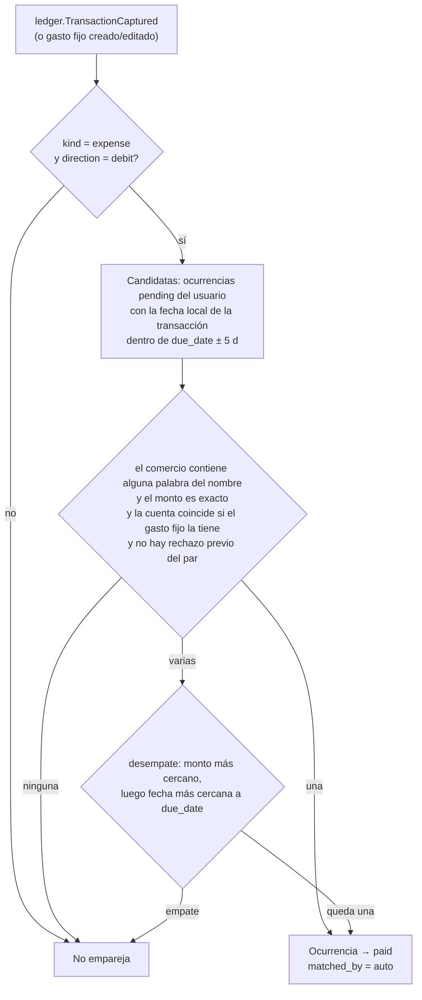

# Spec 011 — Gastos fijos y recordatorios

## 1. Alcance

El usuario registra sus **gastos fijos mensuales** (suscripciones, arriendo, servicios, cuotas): qué comercio los cobra, cuánto cuestan más o menos y qué día del mes vencen. Con eso luka:

1. Arma cada mes la lista de pagos esperados (**ocurrencias**, §3).
2. Detecta el pago cuando la captura normal lo registra (Gmail, notificación, SMS, Apple Pay, registro manual o NFC; spec 006) y marca esa ocurrencia como **pagada**. En la app se ve **tachada** (§4).
3. Envía una **notificación push** 1 o 2 días antes del vencimiento, si el pago aún no se detectó (§5): *"Se acerca tu pago de Spotify. El 22 de octubre se te descontarán $16.900 de tu cuenta."*

Requisito: RF-12 (spec 002). Módulos del backend: `recurring` y `notifications` (spec 003 §2.1). Tablas en spec 004 §2.12–2.15, API en spec 005 §10 y pantallas en spec 008 §3.8.

Un gasto fijo **no crea transacciones**: solo espera la que llega por la captura. El dinero lo sigue contando el ledger, así que un gasto fijo nunca duplica un gasto en el dashboard ni en el reporte fiscal (P2).

## 2. Conceptos

| Término | Definición |
|---|---|
| **Gasto fijo** (`recurring_expense`) | Pago que se repite cada mes. El usuario solo pone nombre ("Spotify"), monto exacto y día del mes (1–31); la cuenta, la categoría y el aviso (1 o 2 días antes) son opcionales. El nombre hace también de palabra clave del comercio (`merchant_keyword` = nombre) y el margen de monto es 0 %. La API acepta otra keyword o margen, pero la app no los pide: el usuario no los entiende |
| **Ocurrencia** (`recurring_occurrence`) | La instancia de un gasto fijo en un mes concreto (`period` = primer día del mes) con su `due_date`. Estados: `pending`, `paid` y `skipped` |
| **Ventana de detección** | `[due_date − 5 días, due_date + 5 días]` en fecha local de Colombia (America/Bogotá, UTC−5 fija). Es fija en v1 y cubre cobros adelantados, fines de semana y festivos |
| **Emparejamiento** | Vínculo ocurrencia ↔ transacción. Puede ser automático (`matched_by = auto`, §4) o manual (`matched_by = manual`, lo elige el usuario) |
| **Rechazo** | Par (ocurrencia, transacción) que el usuario desemparejó. El matcher no lo vuelve a proponer (como las exclusiones de transferencias, AC-6.3) |

Estados visibles en la app (spec 008 §3.8):

| Estado | Condición | Cómo se ve |
|---|---|---|
| Próximo | `pending` y hoy ≤ `due_date` | Normal, con "Vence el 22" |
| Pendiente | `pending`, `due_date` < hoy ≤ `due_date + 5 d` | Ámbar, "Aún no vemos el pago" |
| Sin detectar | `pending` y hoy > `due_date + 5 d` | Ámbar, con "Marcar como pagado" y "Elegir movimiento" |
| Pagado | `paid` | **Tachado**, con check y "Pagado el 22 oct" (y el movimiento si lo tiene) |
| Omitido | `skipped` | Atenuado, "Omitido este mes" |

## 3. Calendario de ocurrencias

Lógica pura en `recurring/domain/calendar.py` (P3, TDD).

- `due_date(period, day_of_month)`: usa el día pedido o, si el mes tiene menos días, el último día del mes. Ejemplos: el día 31 en febrero de 2027 es el 28; el 31 en abril es el 30; el 29 en febrero de 2028 es el 29 (año bisiesto).
- **Generación:** el cron `ensure_recurring_occurrences` (arq, diario a las **10:00 UTC = 05:00 Colombia**) crea, por cada gasto fijo `active`, la ocurrencia del mes actual y la del siguiente. Es idempotente por `UNIQUE (recurring_expense_id, period)` (`INSERT … ON CONFLICT DO NOTHING`).
- **Al crear un gasto fijo**, el caso de uso crea en la misma transacción de BD la ocurrencia del mes actual y la del siguiente, sin esperar al cron. Si el `due_date` del mes actual ya pasó hace más de 5 días, la ocurrencia de ese mes no se crea: el gasto empieza a contar el mes siguiente. El cron respeta la misma regla: para un mes en curso, solo crea la ocurrencia de un gasto fijo creado antes de `due_date + 5 d`.
- **Editar el día** recalcula `due_date` de las ocurrencias `pending` desde el mes actual; las `paid` y `skipped` no cambian.
- **Pausar** (`active = false`) borra las ocurrencias `pending` futuras (`period` > mes actual) y deja de generar nuevas. La del mes actual se conserva. **Reanudar** crea la del mes actual y la del siguiente con la misma regla de "creado hoy" y repite el barrido. **Borrar** un gasto fijo borra sus ocurrencias (CASCADE); las transacciones no se tocan.
- El historial conserva las ocurrencias pasadas para mostrar "pagado / sin detectar" por mes.

## 4. Matcher de pagos

Lógica pura en `recurring/domain/matcher.py` (P3, TDD). Recibe una transacción y las ocurrencias candidatas del usuario, y devuelve la ocurrencia elegida o ninguna.

Reglas:

1. **Tipo:** solo `kind = expense` con `direction = debit`. Ingresos, transferencias (`kind = transfer`, RF-6) y reversos no pagan un gasto fijo.
2. **Comercio:** se normalizan `transactions.merchant` y `merchant_keyword` (el nombre) igual que el matcher de titular (spec 004 §4.1): sin tildes, en mayúsculas y sin puntuación. De la keyword se toman las palabras de 3 letras o más que no sean genéricas (DE, DEL, LA, EL, LOS, LAS, Y, EN, PAGO, PLAN, MES, CUOTA, SERVICIO). Coincide si **alguna** es subcadena del comercio: "Spotify Familiar" coincide con `SPOTIFY P3A9C1` y con `PAYU*SPOTIFY`; "Plan celular Claro" coincide con `CLARO COLOMBIA`. Un nombre que el banco no muestra ("Arriendo" frente a `TRANSF INMOBILIARIA XYZ`) no se tacha solo: el usuario lo marca con un toque (§4.1). Un comercio vacío nunca coincide.
3. **Monto:** exacto, porque la app crea todo con `amount_tolerance_pct = 0`. La regla general es `|amount − expected_amount| ≤ expected_amount × amount_tolerance_pct / 100`, con aritmética `Decimal` y el borde incluido; sigue para quien use el campo por API.
4. **Fecha:** la fecha local (America/Bogotá) de `occurred_at` debe caer en la ventana de detección, con ambos bordes incluidos.
5. **Cuenta:** si el gasto fijo tiene `account_id`, la transacción debe tener esa misma cuenta. Si el gasto fijo no tiene cuenta, se acepta cualquiera (incluida ninguna).
6. **Estado:** solo ocurrencias `pending` de gastos fijos `active`, y sin un rechazo `(occurrence_id, transaction_id)`.
7. **Una transacción paga una sola ocurrencia** (`UNIQUE (transaction_id)` parcial, spec 004 §2.13). **Ambigüedad:** si hay varias candidatas, gana la de monto más cercano al esperado y, si empatan, la de `due_date` más cercano. Si sigue el empate, no se empareja sola; el usuario lo resuelve con "Elegir movimiento".
8. **Idempotencia (P2):** el consumer vuelve a leer el estado en la BD y hace un `UPDATE … WHERE status = 'pending'`. Procesar el mismo evento N veces deja el mismo estado, y dos workers en carrera no pueden emparejar la misma ocurrencia dos veces (el `WHERE` y el `UNIQUE` lo garantizan).

**Disparadores:**

- `ledger.TransactionCaptured`, el evento de toda transacción nueva, capturada o manual (spec 003 §2.3). Se amplía con `merchant` (el comercio ya normalizado de la transacción) y `account_id`, que el matcher necesita. `recurring` no lee tablas de `ledger`: usa el evento y, para el barrido retroactivo, `ledger.public`.
- **Crear o editar un gasto fijo** (nombre, monto, día o cuenta) dispara un barrido retroactivo: se piden a `ledger.public.expenses_in_window(user_id, desde, hasta)` las transacciones de la ventana de cada ocurrencia `pending` y se les aplica el mismo matcher. Así, si el usuario registra Spotify el 23 y el pago del 22 ya estaba capturado, la ocurrencia nace tachada.
- **Editar una transacción** (comercio, `kind`) no vuelve a correr el matcher en v1. Si un emparejamiento automático queda mal, el usuario lo deshace (§4.1).
- `ledger.TransactionDeleted` (evento nuevo, publicado por `DELETE /transactions/{id}` después del commit; solo aplica a transacciones manuales): la ocurrencia que esa transacción pagaba vuelve a `pending` y se limpian `transaction_id`, `paid_at` y `matched_by`. Por eso `transaction_id` no lleva FK (spec 004 §2.13): el consumer la busca por ese id después del borrado. Si el evento se pierde (el bus no respondió), la ocurrencia queda pagada con un id que ya no existe y la app la muestra "Pagado" sin movimiento; el usuario la corrige con "Deshacer".

### 4.1 Acciones del usuario

| Acción | Efecto |
|---|---|
| Marcar como pagado | `paid`, `matched_by = manual`, `paid_at = now()`, sin transacción (p. ej. pagó en efectivo o por un canal que luka no captura) |
| Elegir movimiento | `paid`, `matched_by = manual`, con esa `transaction_id`. Debe ser propia (si no, 404), un gasto (`expense` + `debit`; si no, 400) y no pagar ya otra ocurrencia (si no, 409) |
| Deshacer | Vuelve a `pending` y limpia la transacción. Si era `auto`, registra el rechazo del par para que no se reempareje solo |
| Omitir este mes | `skipped` (p. ej. no se cobró o se pausó el servicio). No se avisa ni se empareja. Deshacer lo devuelve a `pending` |

## 5. Recordatorios push

- **Cron** `send_recurring_reminders` (arq, diario a las **14:00 UTC = 09:00 Colombia**, para no avisar de madrugada). Busca ocurrencias `pending`, de gastos fijos `active`, con `due_date − remind_days_before ≤ hoy ≤ due_date` (fecha local) y `reminded_at IS NULL`. Por cada una publica `recurring.PaymentDueSoon { user_id, occurrence_id, name, expected_amount, due_date }` (`due_date` como texto `AAAA-MM-DD`, porque el codec del bus no serializa fechas). Su `event_id` es determinista por ocurrencia y día (`uuid5`), así que si el cron corre dos veces el mismo día el `IdempotentHandler` absorbe el repetido.
- Si el pago ya se detectó (`paid`) o se omitió, no hay aviso: el estado se lee en el momento del cron (AC-12.5).
- El rango, en vez de una sola fecha, cubre el caso de que el cron no haya corrido un día (caída del worker): al día siguiente manda el aviso atrasado, siempre que `hoy ≤ due_date`. Nunca avisa de un pago ya vencido. Un gasto fijo creado el día anterior al vencimiento con `remind_days_before = 2` también recibe su aviso ese día.
- **Consumer** en `notifications`: antes de enviar vuelve a consultar el estado por `recurring.public.reminder_still_due` (pendiente, sin aviso y hoy dentro del rango); si ya no toca, no envía. Luego envía el push a todos los `device_tokens` del usuario por `PushSenderPort` (adapter FCM HTTP v1, §6). Después de un envío aceptado por al menos un token, marca `reminded_at` con `UPDATE … WHERE reminded_at IS NULL`, vía `recurring.public.mark_reminded`. Así nunca hay dos avisos de la misma ocurrencia, aunque el evento se reprocese.
- Sin tokens registrados (permiso negado o nunca concedido), el evento se consume sin enviar nada, `reminded_at` queda nulo y el gasto se sigue tachando igual (AC-12.6). Si falla la red o FCM responde 5xx/429/401 para todos los tokens, se reintenta con el backoff del bus (spec 003 §2.3); tras agotarse, va a la DLQ sin marcar. Si falla para unos y llega a otros, se marca y no se reintenta: reintentar duplicaría el aviso en los teléfonos que sí lo recibieron.
- **Contenido** (textos en español, montos con el formato COP de la app, `$16.900`):
  - Título: `Se acerca tu pago de {name}`
  - Cuerpo: `El {día} de {mes} se te descontarán {monto} de tu cuenta.` Si falta un día, empieza con "Mañana, " (`Mañana, 22 de octubre, se te descontarán $16.900 de tu cuenta.`); si es un aviso atrasado del mismo día del vencimiento, `Hoy se te descontarán $16.900 de tu cuenta.`
  - `data`: `{ "type": "recurring_due", "occurrence_id": "<uuid>" }`, nada más. Tocar el aviso abre `/gastos-fijos?ocurrencia=<id>` (spec 008 §3.8).
  - Android: canal `recordatorios_pagos` ("Recordatorios de pagos"), importancia por defecto. iOS: alerta estándar sin sonido crítico.
- **Privacidad (P1, P6):** el nombre y el monto viajan dentro del push, por FCM y APNs, porque sin ellos el aviso no sirve. Se declaran como datos que recibe Firebase (spec 010 §4) y se ocultan en la pantalla de bloqueo (`visibility: private` en Android). Los logs solo registran `push_sent` y `push_failed` con conteos y el código de error de FCM, nunca el nombre, el monto ni el token (spec 009 §5).

## 5.1 iPhone: avisos locales

Apple solo entrega push (APNs) a apps firmadas con el Apple Developer Program, y hoy la app de iPhone se instala sin firmar con SideStore (F4.3b). Por eso en **iOS el recordatorio lo programa el propio teléfono** con `flutter_local_notifications`, y FCM queda solo para Android (ADR-9).

- **Qué se programa:** cada ocurrencia `pending` de un gasto fijo activo, del mes actual y del siguiente, que la app tiene en Drift (spec 004 §5). El aviso sale a las **09:00 hora de Colombia** del día `due_date − remind_days_before`, con el mismo título y cuerpo que el push de §5. El `payload` es el `occurrence_id`; tocarlo abre `/gastos-fijos?ocurrencia=<id>`.
- **Cuándo se reprograma:** cada vez que cambian las ocurrencias o los gastos fijos en Drift (sync, marcar pagado, omitir, pausar, borrar). La app cancela todos los avisos pendientes y vuelve a programar la lista, así que un pago que el sync trae tachado cancela su aviso. El id de cada aviso sale de un hash estable del `occurrence_id`.
- **No se avisa tarde:** un aviso cuya hora ya pasó no se programa (a diferencia del cron del servidor, §5). Si no, cada apertura de la app lo repetiría.
- **Limitación aceptada:** el teléfono solo se entera de un pago cuando la app sincroniza. Si el correo del banco llegó con la app cerrada desde antes del aviso, el aviso puede sonar aunque el pago ya esté hecho (AC-12.5 se cumple solo con la app sincronizada en iOS). Se corrige solo cuando la app tenga firma de Apple Developer y use FCM como Android.
- **Permiso:** el mismo flujo de §6 (hoja explicativa al guardar el primer gasto fijo), con el permiso de notificaciones de iOS. Negado, no se programa nada visible y los gastos se tachan igual (AC-12.6).
- **Cerrar sesión** cancela todos los avisos programados, igual que borrar el token en Android.
- **Privacidad:** el texto del aviso nunca sale del teléfono; en iOS no hay tercero que reciba el nombre ni el monto.

## 6. Integración con Firebase

- **Proyecto:** Firebase se agrega al proyecto GCP existente `luka-510204` (el mismo de Google Sign-In y Pub/Sub). Se registra solo la app Android `co.luka.luka`: iPhone usa avisos locales (§5.1). Si más adelante la app de iPhone se firma con Apple Developer, se registra también la iOS y se sube la llave APNs (`.p8`).
- **Configuración de la app:** las `FirebaseOptions` de Android e iOS van en Dart, en `app/lib/features/push/data/firebase_options.dart`. Se generan con `flutterfire configure --project=luka-510204`. No hacen falta `google-services.json`, `GoogleService-Info.plist` ni el plugin de Gradle, porque `Firebase.initializeApp(options:)` recibe las opciones directamente. Son identificadores públicos (no secretos) y se versionan como el client ID de OAuth. Mientras valgan `null`, la app arranca sin push (`DisabledPushService`). La app no lleva ninguna llave de servidor (P1).
- **Servidor:** FCM HTTP v1 (`POST https://fcm.googleapis.com/v1/projects/luka-510204/messages:send`), autenticado con OAuth2 de una cuenta de servicio con el rol `Firebase Cloud Messaging API Admin`. La llave JSON de esa cuenta vive solo en el env del servidor (`LUKA_FCM_CREDENTIALS_JSON`, en base64), igual que los demás secretos (spec 009 §3). Si falta, el consumer de `notifications` no se registra y el resto de la app funciona. No se usa la API heredada de FCM.
- **Tokens de dispositivo** (`device_tokens`, spec 004 §2.15):
  - La app registra el token con `PUT /devices/push-token` tras el login, en cada arranque (actualiza `last_seen_at`) y cuando FCM lo renueva (`onTokenRefresh`).
  - Al cerrar sesión, la app llama `DELETE /devices/push-token` antes de revocar la sesión y borra el token local (`FirebaseMessaging.deleteToken`). Así un teléfono compartido no recibe avisos de la cuenta anterior.
  - Si FCM responde `UNREGISTERED` o `INVALID_ARGUMENT` para un token, se borra esa fila.
  - Un mismo token solo pertenece a un usuario: registrarlo con otra cuenta lo reasigna (upsert por `token`).
- **Consentimiento (P6):** el permiso del sistema (Android 13+ `POST_NOTIFICATIONS`, iOS `requestPermission`) se pide en contexto al guardar el primer gasto fijo, después de una hoja que explica para qué sirve (spec 008 §3.8). Concederlo registra `consents.push` (spec 004 §2.1). Revocarlo en el sistema detiene los avisos sin romper nada más.

## 7. Casos de prueba obligatorios (P3)

Dominio puro, sin infraestructura:

1. `due_date`: día 31 en febrero (no bisiesto y bisiesto), día 31 en abril, día 30 en febrero y día 1.
2. Monto exacto: con margen 0 solo coincide el mismo monto ($16.900 sí; $16.901 no). La regla general con margen se sigue probando en el borde (10 % de $16.900: $15.210 y $18.590 coinciden; $18.591 no).
2b. Nombre como keyword: basta una palabra ("Spotify Familiar" contra `SPOTIFY P3A9C1`), se ignoran las genéricas y las de menos de 3 letras, y renombrar el gasto mueve la keyword.
3. Fecha en los bordes de la ventana (`due − 5 d` y `due + 5 d` coinciden; `due − 6 d` no), calculada en hora de Colombia: un pago a las 23:30 del día 16 (hora de Colombia) es el 17 en UTC y cuenta como el 16.
4. Keyword con tildes o minúsculas contra un comercio en mayúsculas; comercio vacío.
5. Transacción `income` o `transfer` con el comercio y el monto exactos: no empareja.
6. Dos gastos fijos con la misma keyword (dos planes de Spotify): gana el monto más cercano; con montos idénticos y la misma fecha, no empareja.
7. Rechazo previo del par: no se reempareja; otra transacción válida sí empareja.
8. Evento duplicado, y dos workers con la misma transacción: un solo emparejamiento.
9. Barrido retroactivo al crear el gasto fijo después de pagar.
10. Recordatorio: se publica desde el día `due − remind_days_before`, no antes; no se publica si ya está `paid` o `skipped`; no se repite si `reminded_at` ya está puesto; el aviso atrasado sale mientras `hoy ≤ due_date` y no sale después.

Integración (Postgres real): `UNIQUE (recurring_expense_id, period)`, `UNIQUE (transaction_id)` parcial, CASCADE al borrar el gasto fijo o el usuario, y el retorno a `pending` al borrar una transacción manual.

## 8. Fuera de alcance de v1

- Frecuencias distintas de mensual (semanal, quincenal, anual) y fechas del tipo "el último viernes del mes".
- Sugerir gastos fijos a partir del historial (detectar que Netflix se repite cada mes). En v1 solo existe el atajo manual "Crear gasto fijo con esto" desde el detalle de un movimiento (spec 008 §3.8).
- Avisos por correo o SMS, avisos de "pago sin detectar" después del vencimiento, y resúmenes semanales.
- Ventana de detección configurable por gasto fijo.
- Contar los gastos fijos pendientes en el balance proyectado del dashboard.
